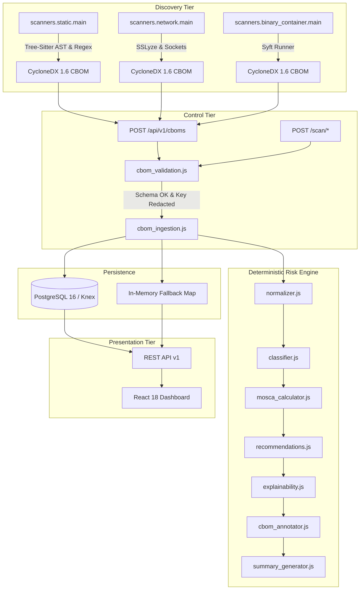

# ECDAT Current Architecture Specification

## 1. System Overview

ECDAT (Enterprise Cryptographic Discovery and Assessment Tool) is an end-to-end cryptographic posture and post-quantum readiness analysis platform.

The system is structured into four primary tiers:
1. **Cryptographic Discovery Tier (Python Scanners)**: Static code AST/regex analysis, live network TLS/SSH probing, and binary/container inventory scanning.
2. **Control & Ingestion Tier (Node.js Express 5 API)**: Schema validation, private key sanitization, rate limiting, and route orchestration.
3. **Deterministic Cryptographic Risk Engine (Node.js)**: Policy evaluation against 5 distinct regulatory profiles, Mosca quantum risk calculation, explainability tree derivation, and context-aware PQC migration recommendations.
4. **Presentation Tier (React 18 / Vite / Tailwind)**: Executive risk cards, interactive Mosca timeline calculus, filterable inventory, and multi-source scan ingestion.

---

## 2. End-to-End Data Flow

---

## 3. Tier Architecture & Component Analysis

### 3.1 Cryptographic Discovery Tier (`scanners/`)

#### A. Static Code Scanner (`scanners/static/`)
- **AST Handlers** ([`scanners/static/ast/`](file:///c:/Users/Jeevan%20c/Documents/ECDAT/scanners/static/ast/)):
  - `c_handler.py`: OpenSSL EVP, legacy MD5/SHA-1 calls, RSA/EC key generation, and hardcoded PEM literals.
  - `cpp_handler.py`: C++ bindings to crypto APIs.
  - `go_handler.py`: `crypto/md5`, `crypto/sha1`, `crypto/rsa`, `crypto/ecdsa`.
  - `javascript_handler.py`: Node.js `crypto.createHash`, `createCipheriv`, SubtleCrypto.
- **Regex Patterns** ([`scanners/static/regex_rules.py`](file:///c:/Users/Jeevan%20c/Documents/ECDAT/scanners/static/regex_rules.py)): High-confidence regex fallbacks for files without full AST coverage.
- **Sanitization & Redaction** ([`scanners/static/sanitization.py`](file:///c:/Users/Jeevan%20c/Documents/ECDAT/scanners/static/sanitization.py)): Strips private keys and secret values into `[REDACTED_SECRET SHA256:<hash>]` before snippet embedding.
- **Output**: Generates valid CycloneDX 1.6 CBOM and SARIF 2.1.0 logs.

#### B. Network & Endpoint Scanner (`scanners/network/`)
- **Plugins**:
  - `tls.py`: Connects to target hostname/port. Evaluates negotiated TLS versions (SSLv2, SSLv3, TLS 1.0, 1.1, 1.2, 1.3), cipher suites, and certificate chains.
  - `ssh.py`: Connects to port 22; extracts SSH version banner and supported key exchange algorithms.
- **Safety**: Blocks RFC1918 private IPs by default unless `--allow-private-targets` is explicitly provided.
- **Architectural Debt**: Contains test-mock bypass conditional that falls back to `_scan_direct_ssl()` in non-mocked runs, disabling TLS certificate verification.

#### C. Binary & Container Scanner (`scanners/binary_container/`)
- **Syft Wrapper** (`syft_runner.py`): Executes `syft <target> -o cyclonedx-json` in an isolated subprocess with 100MB output limit.
- **Classifier** (`component_classifier.py`): Matches extracted packages against [`rules/crypto_library_catalog.json`](file:///c:/Users/Jeevan%20c/Documents/ECDAT/rules/crypto_library_catalog.json) to identify crypto providers (OpenSSL, mbedTLS, BouncyCastle, libsodium).

---

### 3.2 Ingestion & Control Tier (`backend/src/services/`, `backend/src/middleware/`)

- **Security Headers & CORS** ([`security.js`](file:///c:/Users/Jeevan%20c/Documents/ECDAT/backend/src/middleware/security.js)): Helmet enabled; CORS restricted to explicit origin list (wildcard `*` disallowed).
- **Authentication** ([`auth.js`](file:///c:/Users/Jeevan%20c/Documents/ECDAT/backend/src/middleware/auth.js)): `crypto.timingSafeEqual` constant-time API key verification for write routes.
- **Schema Validation** ([`cbom_validation.js`](file:///c:/Users/Jeevan%20c/Documents/ECDAT/backend/src/services/cbom_validation.js)):
  - Validates `bomFormat === 'CycloneDX'` and `specVersion === '1.6'`.
  - Prototype pollution protection (rejects `__proto__`, `constructor.prototype`).
  - Strict size bounds (default 10MB payload limit).
  - Private key scanner and redaction engine.

---

### 3.3 Deterministic Risk Engine (`backend/src/risk_engine/`)

- **Rule Loader** (`rules_loader.js`): Caches and schema-validates rules at startup:
  - [`rules/algorithm_risk.json`](file:///c:/Users/Jeevan%20c/Documents/ECDAT/rules/algorithm_risk.json): Classical and quantum vulnerability profiles.
  - [`rules/mosca_config.json`](file:///c:/Users/Jeevan%20c/Documents/ECDAT/rules/mosca_config.json): Asset shelf life ($X$), migration time ($Y$), quantum collapse threshold ($Z$).
  - [`rules/policy_profiles.json`](file:///c:/Users/Jeevan%20c/Documents/ECDAT/rules/policy_profiles.json): 5 profiles (`nist_cnsa_2_0`, `regulated_bfsi`, `critical_infrastructure`, `internal_enterprise`, `permissive_legacy`).
  - [`rules/pqc_recommendations.json`](file:///c:/Users/Jeevan%20c/Documents/ECDAT/rules/pqc_recommendations.json): Context-aware migration steps (e.g. FIPS 203 ML-KEM, FIPS 204 ML-DSA, hybrid X25519+ML-KEM-768).
- **Mosca Calculator** (`mosca_calculator.js`): Computes $(X + Y) > Z$, calculating the exact quantum vulnerability gap.

---

### 3.4 Persistence Tier (`backend/src/db/`)

- **Database**: PostgreSQL 16 (via Knex query builder).
- **Migration**: Schema migration [`20260905000000_create_ecdat_schema.js`](file:///c:/Users/Jeevan%20c/Documents/ECDAT/backend/src/db/migrations/20260905000000_create_ecdat_schema.js) creating tables:
  - `scans`
  - `cboms`
  - `assets`
  - `findings`
  - `pqc_recommendations`
- **Fallback**: High-performance in-memory `Map()` store when PostgreSQL is offline.

---

## 4. Architectural Boundaries & Deficiencies

1. **Unauthenticated Demonstration Routes**:
   - `/scan/static`, `/scan/network`, `/scan/binary`, `/cbom/merge` were exempted in `auth.js`. These must be gated behind authentication to prevent unauthenticated resource exhaustion and unauthorized scanning.
2. **Filesystem Input Trust**:
   - `POST /scan/static` accepts arbitrary filesystem paths (`target_dir`). Must be constrained to a designated workspace directory or uploaded files.
3. **Subprocess Parameter Hardening**:
   - `runGitClone` must validate Git URLs to reject argument injection (e.g. strings starting with `--`).
   - Archive extraction must use safe canonical path validation to prevent Zip Slip directory traversal.
4. **TLS Verification in Network Scanner**:
   - The fake mock branch in `tls.py` must be replaced with robust SSLyze scanning, and direct socket fallbacks must document their verification posture without silently disabling TLS security.
