# WHAT “BETTER THAN IBM” MEANS FOR ECDAT
## The Defensible Open Architecture Manifesto

Commercial legacy vendors (such as IBM Guardium Cryptography Manager, IBM Quantum Safe Explorer, and SandboxAQ AQtive Guard) rely on proprietary lock-in, closed-source agent software, opaque scoring formulas, and marketing-heavy claims of "zero vulnerabilities" and "unhackable" quantum safety.

ECDAT does not attempt to beat legacy vendors by copying closed-source internals or proprietary mainframe hardware taps. 

Instead, ECDAT’s defensible superiority is founded on **7 core engineering pillars**:

---

## 1. Open Standards First (Zero Vendor Lock-In)

| Standard | Commercial Legacy Approach | The ECDAT Defensible Advantage | Implementation in ECDAT | Verification Proof |
| :--- | :--- | :--- | :--- | :--- |
| **CBOM** | Proprietary internal database schemas; export to CycloneDX is often lossy or an afterthought. | **Native CycloneDX 1.6 & 1.7 CBOM** as the primary first-class data model with `cryptoProperties` for algorithms, protocols, keys, and certificates. | [`scanners/cbom_io.py`](scanners/cbom_io.py), [`backend/src/services/cbom_validation.js`](backend/src/services/cbom_validation.js) | [`tests/test_cbom_deep_lifecycle.py`](tests/test_cbom_deep_lifecycle.py) |
| **SARIF** | Proprietary dashboard alerts requiring specialized browser consoles. | **OASIS SARIF v2.1.0 standard** emitting direct native GitHub/GitLab Code Scanning annotations. | [`scanners/sarif_engine.py`](scanners/sarif_engine.py), [`backend/src/routes/ci.js`](backend/src/routes/ci.js) | [`tests/test_sarif_engine.py`](tests/test_sarif_engine.py) |
| **SBOM** | Single-ecosystem or single-standard output requiring paid add-on modules. | **Simultaneous Dual-Standard Generation**: Generates CycloneDX 1.6 AND SPDX 2.3 JSON across Python, Node.js, and React in a single pass. | [`scripts/generate_sbom.py`](scripts/generate_sbom.py) | Verified 705 packages cataloged in [`FINAL_SBOM_SAMPLE.json`](FINAL_SBOM_SAMPLE.json). |
| **APIs** | Proprietary SOAP/RPC protocols or closed appliance interfaces. | **RESTful OpenAPI / JSON Schema Contract Architecture** with Knex abstraction for PostgreSQL/SQLite. | [`backend/src/domain/contracts.js`](backend/src/domain/contracts.js), [`docs/API_DOCUMENTATION.md`](docs/API_DOCUMENTATION.md) | [`backend/tests/api/api_contracts_comprehensive.test.js`](backend/tests/api/api_contracts_comprehensive.test.js) |

---

## 2. Evidence-First Explainability (No Black-Box Magic)

Legacy tools output arbitrary 1-to-10 risk scores and opaque "at risk" flags without showing engineers *why*. ECDAT enforces absolute evidence traceability:

1. **Every Finding Has Physical Evidence**:
   - Exact repository source file path, line number, AST call symbol, and code snippet.
   - Example: Line 48 in `hybrid_kem.js` calling `crypto.kem.encapsulate('ML-KEM-768')`.
2. **Every Correlation Has Provenance**:
   - Correlated assets maintain cryptographic provenance chains. Evidence is protected by SHA-256 Merkle tree root hashes; any tampering invalidates the evidence chain.
   - Tested by [`tests/test_evidence_integrity.py`](tests/test_evidence_integrity.py).
3. **Every Risk Score Has an Explicit Factor Breakdown**:
   $$\text{Composite Risk} = \text{Algorithm Deprecation} \times \text{Reachability} \times \text{Network Exposure} \times \text{Data Shelf-Life}$$
   - Accompanied by human-readable "Why Now" reasoning explaining Shor's algorithm threat, Harvest-Now-Decrypt-Later (HNDL) exposure, and Mosca timeline deficit.

---

## 3. Developer-First Remediation (Beyond Passive Detection)

Legacy scanners merely list vulnerabilities, leaving engineers to research migration syntaxes manually. ECDAT delivers an end-to-end remediation lifecycle:

```mermaid
flowchart LR
    Finding["1. Deprecated Finding (e.g. MD5 / RSA-1024)"] --> Context["2. Context-Aware AST Matcher"]
    Context --> Patch["3. Syntactic Unified Diff (--- a/ +++ b/)"]
    Patch --> Sandbox["4. Isolated Pre-Application Sandbox"]
    Sandbox --> TestVerify["5. Syntax & KAT Test Validation"]
    TestVerify --> DiffCBOM["6. CBOM Diff Verification"]
    DiffCBOM --> Approval["7. Four-Eyes Governance Sign-off"]
    Approval --> Applied["8. Safe Automated Rollout"]
```



- **Exact Source Location**: Targets the precise AST node, preserving surrounding variable names, comments, and non-crypto logic.
- **Safe Patch Proposal**: Generates valid unified diffs (`--- a/ +++ b/`) with automated syntax validation in an isolated temporary sandbox before touching disk.
- **Pre-Application Test Plan**: Emits NIST Known Answer Test (KAT) vectors and regression check commands (`npm test` / `pytest`).
- **CBOM Diff**: Generates differential CBOM analysis showing exact asset removal and replacement.
- **Rescan Verification**: Automatically schedules verification scans to confirm that the deprecated cryptographic primitive was eradicated.

---

## 4. Cross-Modal Correlation (Connecting the Whole Stack)

Legacy tools operate in departmental silos: SAST tools scan code, DAST tools scan networks, and SCA tools scan lockfiles, rarely correlating the three.

ECDAT provides a **single unified cryptographic knowledge graph** cross-referencing all 6 modalities:

```text
               ┌───────────────────────┐
               │    1. SOURCE CODE     │ (Tree-sitter AST in 6 languages)
               └───────────┬───────────┘
                           │ references
               ┌───────────▼───────────┐
               │    2. DEPENDENCIES    │ (Direct & transitive packages)
               └───────────┬───────────┘
                           │ imports
               ┌───────────▼───────────┐
               │ 3. BINARIES & LIBS    │ (ELF/PE headers, shared libraries)
               └───────────┬───────────┘
                           │ packaged into
               ┌───────────▼───────────┐
               │  4. CONTAINER/FS      │ (Docker image layers, local files)
               └───────────┬───────────┘
                           │ exposes
               ┌───────────▼───────────┐
               │   5. NETWORK & TLS    │ (Active TLS 1.2/1.3 listeners & certs)
               └───────────┬───────────┘
                           │ observed by
               ┌───────────▼───────────┐
               │   6. RUNTIME / eBPF   │ (Live userspace process uprobes)
               └───────────────────────┘
```

- **Reachability & Dead Code Elimination**: If code invokes `MD5` inside an unreferenced test utility or dead branch, ECDAT flags it as `TRACKED` technical debt rather than blocking a production release. If invoked on a public API gateway endpoint, it triggers an immediate release block.

---

## 5. Security-by-Design (Scanners as Hostile-Input Processors)

Legacy scanning appliances often run as root and have historically been vulnerable to remote code execution when parsing untrusted repositories.

ECDAT assumes **all scanned input is adversarial**:

- **Zip Slip & Path Traversal Neutralization**: All archive extractors strictly validate target canonical realpaths against the sandbox root; upward traversal (`../../../../etc/passwd`) is aborted.
- **Symlink Cycle Protection**: Visited inode sets prevent recursive symlink loop traps (`a -> b -> a`). Traversal depth is capped to 32 levels.
- **ReDoS Prevention**: Regular expression matching employs bounded execution timeouts and possessive quantifiers to prevent polynomial CPU backtracking.
- **Privilege Separation**: All containers run under unprivileged `appuser` (UID 10001) with read-only root filesystems and `cap_drop: ["ALL"]`.
- **eBPF Isolation**: Runtime eBPF agents are restricted to `CAP_BPF` and `CAP_PERFMON` in an isolated Kubernetes namespace (`ecdat-runtime`) with a hardware watchdog that automatically detaches probes if CPU exceeds 5%.

---

## 6. Reproducible Engineering (Public Benchmark Proofs)

Legacy vendors make marketing claims of "superior AI accuracy" without published benchmarks.

ECDAT proves its accuracy transparently using a **permanent, public Golden Corpus**:

- **Golden Corpus Manifest**: 42 ground-truth test cases covering 11 standardized categories across 6 programming languages ([`testing/corpora/golden_corpus/manifest.json`](testing/corpora/golden_corpus/manifest.json)).
- **Empirical Accuracy Metrics**:
  - **Precision:** `88.6%` (Zero false positives on clean negative examples)
  - **Recall:** `98.6%` (100% recall on deprecated algorithms)
  - **F1 Score:** `93.3%`
  - **Execution Time:** `0.1038s` across entire corpus
- **Reproducibility Command**:
  ```bash
  python testing/corpora/golden_corpus/evaluator.py
  ```
- **Performance Benchmarks**: Sustained throughput of **`584 files/second`** with sub-linear heap memory scaling (< 42MB growth over 10,000 files) proven via [`tests/test_large_repo_scaling.py`](tests/test_large_repo_scaling.py).

---

## 7. No Fake Certainty (Radical Transparency)

The most dangerous failure mode of legacy security tools is giving executive leadership a false sense of security. ECDAT establishes three ironclad transparency rules:

### Rule 1: Orthogonal Separation of Confidence and Severity
A finding can be **CRITICAL** in severity (e.g. RSA-1024), but **LOW** in confidence (heuristic filename match). ECDAT never conflates the two:
- **Severity**: Measures the cryptographic blast radius if compromised.
- **Confidence**: Measures the mathematical precision of the evidence (Runtime Trace 99%, AST Call Site 90%, Dependency Manifest 70%, Filename Heuristic 50%).

### Rule 2: "Unknown" is NOT "Safe"
When ECDAT discovers an unclassified algorithm, custom wrapper, or proprietary cryptographic provider, it explicitly classifies it as `UNKNOWN_ALGORITHM` with an elevated review priority. It **never** silently ignores unknown crypto.

### Rule 3: Scanner Crash is NOT a Clean Pass
Legacy CI scripts frequently swallow scanner exit errors or treat runtime crashes as "0 findings detected".
In ECDAT:
- Exit Code `0`: Clean scan completed without policy violations.
- Exit Code `1`: Policy violations / release-blocking vulnerabilities detected.
- Exit Code `2`: Scanner crashed or encountered an unhandled exception.
- **CI Release Gate Enforcement**: Exit code 2 is deterministically caught as an unconditional release blocker. A broken scan never silently allows insecure software into production.

### Rule 4: Rejection of "Zero Vulnerabilities"
ECDAT explicitly disclaims "zero vulnerabilities". The platform openly documents its exact empirical inventory of 19 tracked non-critical dependency advisories in [`rules/vulnerability_risk_acceptance.json`](rules/vulnerability_risk_acceptance.json), with **0 unaccepted CRITICAL blockers** and **0 unaccepted HIGH blockers**.

---

## Summary Comparison Matrix

| Architectural Principle | Legacy Commercial Suites (IBM / SandboxAQ) | ECDAT Defensible Advantage |
| :--- | :--- | :--- |
| **Data Format** | Proprietary silos with lossy export | Native CycloneDX 1.6/1.7 CBOM + SPDX 2.3 + SARIF v2.1.0 |
| **Evidence Linking** | Aggregated count metrics | 100% file, line, symbol, and Merkle-hashed evidence linking |
| **Remediation** | Advisory text or proprietary agent | Syntactic unified Git patches with sandbox pre-validation |
| **Correlation** | Single or dual modality | 6-modality correlation (Code + Dep + Binary + FS + Net + Runtime) |
| **Adversarial Resilience** | Assumes trusted codebase | Hardened against Zip Slip, symlink bombs, and ReDoS |
| **Accuracy Validation** | Closed proprietary claims | Open Golden Corpus evaluator with precision/recall/F1 metrics |
| **Failure Handling** | Often conflates crashes with clean pass | Strict exit code integrity: exit code 2 unconditionally blocks release |
| **Transparency** | Marketing claims of "Zero Vulnerabilities" | Empirical vulnerability accounting with formal risk acceptances |
