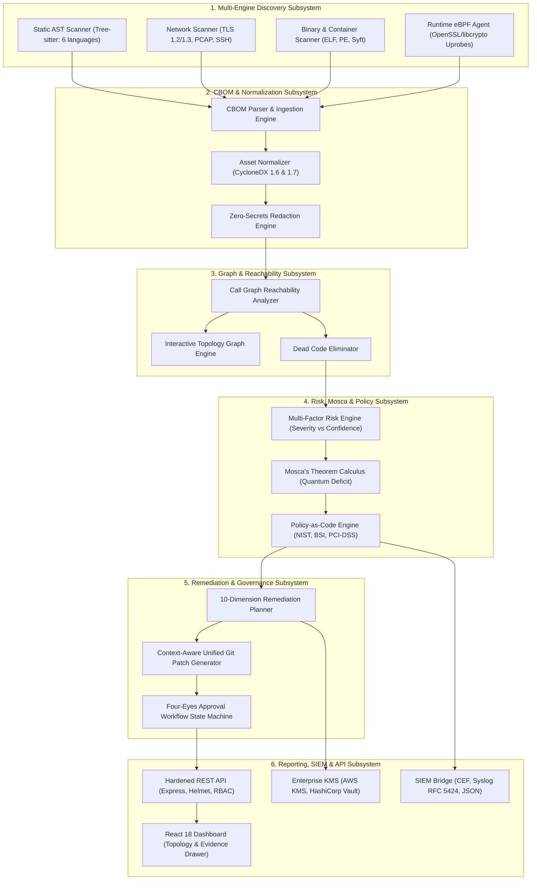

# ECDAT Final Architecture & Technical Specification

## 1. Architecture Overview

ECDAT (Enterprise Cryptographic Discovery and Assessment Platform) is an enterprise-grade, cloud-native solution designed to discover, catalog, assess, and remediate classical and post-quantum cryptographic assets across complex multi-cloud and on-premises environments.

---

## 2. The 10 Architectural Pillars

### 2.1 Architecture Overview & Technology Stack
- **Core Scanners:** Python 3.12+ leveraging Tree-sitter for semantic AST parsing across Python, JavaScript, TypeScript, Go, Java, C/C++, and Rust.
- **Control Plane API:** Node.js 20+ Express enterprise REST API with Knex.js SQL query abstraction and PostgreSQL/SQLite persistence.
- **Frontend Dashboard:** React 18, Vite, TailwindCSS, Lucide-react, and SVG topology rendering.
- **Serialization Standards:** CycloneDX 1.6/1.7 CBOM, CycloneDX 1.6 SBOM, and SPDX 2.3 JSON.

### 2.2 Data Flow Architecture
1. **Ingestion:** Scanners crawl filesystem, git repos, container images, or network interfaces, emitting raw finding records.
2. **Sanitization:** Evidence snippets pass through multi-stage regex and Shannon entropy filters, redacting hardcoded private keys or tokens.
3. **Normalization:** Findings are canonicalized into CycloneDX 1.6 `cryptoProperties` models.
4. **Correlation:** Static findings are cross-referenced with call graphs and runtime eBPF traces; unreachable code is marked `UNREACHABLE` and downgraded.
5. **Risk & Policy:** Findings are evaluated against Mosca parameters ($D, T, Q$) and enterprise policy rules.
6. **Remediation & Export:** Fix plans, unified git patches, and cryptographic reports are generated and signed.

### 2.3 Trust Boundaries & Isolation
- **Boundary 1: Scanner Sandbox:** All archive extraction (`Zip Slip` guard) and AST parsing executes in isolated scratch directories with strict depth caps (32 levels) and read-only source binds.
- **Boundary 2: Backend Control Plane:** Every request is authenticated via RS256 JWT tokens; multi-tenant `tenant_id` scoping is enforced in all SQL queries.
- **Boundary 3: Persistence Tier:** Database credentials and master encryption keys are decoupled via environment secrets; `DATABASE_SSL=true` is mandatory in production.

### 2.4 Deployment Architecture
- **Docker Compose:** Containerized orchestration with non-root UID 10001, read-only root filesystems, and dropped Linux capabilities (`cap_drop: ["ALL"]`).
- **Kubernetes:** Manifests and Helm charts conform to Pod Security Standards **Restricted** profile, with dedicated namespaces (`ecdat-system` vs `ecdat-runtime`) and default-deny NetworkPolicies.

### 2.5 Discovery Architecture
- **Static AST Engine:** Employs Tree-sitter grammar bindings for zero-regex semantic syntax discovery.
- **Network Probing:** Native asynchronous TLS socket and PCAP parsers resilient against frame corruption and memory exhaustion.
- **Container Discovery:** Direct image layer inspection and Syft integration for base OS package crypto discovery.
- **Runtime Discovery:** Linux kernel eBPF uprobes on `libcrypto.so` and `libssl.so` observing live process crypto activity.

### 2.6 Graph Model & Reachability
- **Asset Graph:** Graph database model representing applications, services, files, cryptographic algorithms, keys, and certificates as directed graph nodes.
- **Reachability Engine:** Traverses import dependency graphs and function call sites. Unreachable crypto is categorized as low-risk technical debt (`TRACKED`), whereas reachable crypto in public API paths blocks CI/CD release.

### 2.7 Risk Model & Mosca Calculus
- **Orthogonal Scoring:** Decouples **Risk Severity** (impact of algorithm failure) from **Risk Confidence** (precision of evidence: Runtime 99%, AST 90%, Package 70%, Heuristic 50%).
- **Mosca's Theorem:** Mathematically evaluates quantum vulnerability:
  $$\Delta M = (D + T) - Q$$
  Where $D = \text{Data Shelf Life}$ (years), $T = \text{Migration Time}$ (years), and $Q = \text{Quantum Threat Arrival}$ (years). If $\Delta M > 0$, the asset is in quantum deficit.

### 2.8 Policy Model & Regulatory Mapping
- **Policy-as-Code:** Rules declared in JSON schemas covering algorithm deprecation, key length thresholds, and cipher suite requirements.
- **Regulatory Frameworks:** Built-in compliance mapping for:
  - NIST SP 800-57 Part 1 Rev 5
  - BSI TR-02102
  - PCI-DSS v4.0 Requirement 3
  - NSA CNSA 2.0
  - FIPS 140-3
- **Exception Governance:** Formal cryptographic exceptions tracked with cryptographic evidence hashes and mandatory expiration dates.

### 2.9 Remediation Architecture
- **Safe Patch Generator:** Context-aware AST code modification generating standard unified diffs (`--- a/ +++ b/`).
- **Pre-Application Lifecycle:** Verifies syntax validity in sandbox before writing to disk.
- **Four-Eyes Approval Workflow:** Formal 5-state machine (`PROPOSED` -> `REVIEWED` -> `APPROVED` -> `APPLIED` -> `VERIFIED`) with cryptographic SHA-256 state transition chains.

### 2.10 eBPF Security Boundary
- **Kernel Privileges:** Confined strictly to `CAP_BPF` and `CAP_PERFMON`; `CAP_SYS_ADMIN` is prohibited.
- **Namespace Isolation:** eBPF agent pods run in segregated `ecdat-runtime` namespace with node taints, preventing control plane pod collocation.
- **Watchdog Protection:** Auto-detaches kernel probes if agent CPU exceeds 5% or memory exceeds 256MB.
