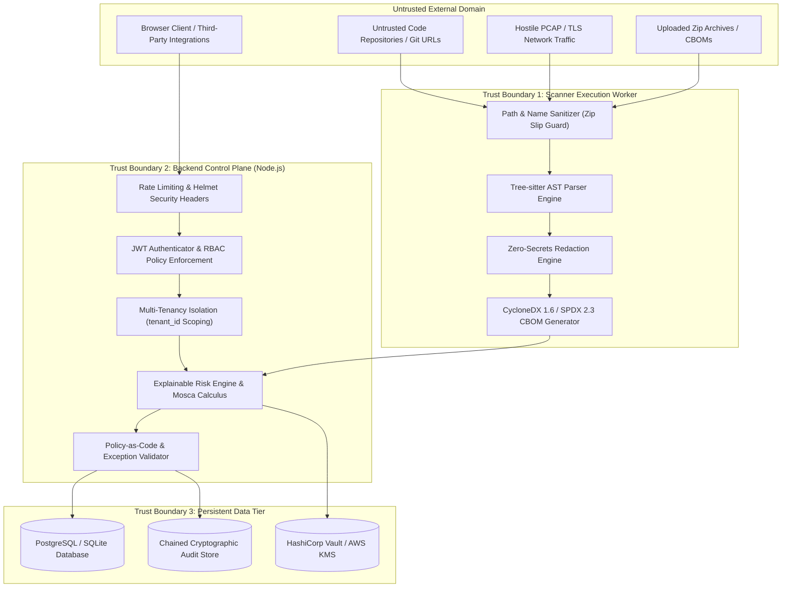

# ECDAT Final Threat Model & Security Architecture (STRIDE)

## 1. System Overview & Scope

ECDAT operates in hostile, multi-tenant enterprise environments, ingesting untrusted source code, container images, binary executables, network packet captures, and TLS handshakes.

This threat model rigorously evaluates the attack surface, trust boundaries, threat actors, and mitigations utilizing the **STRIDE** methodology (Spoofing, Tampering, Repudiation, Information Disclosure, Denial of Service, Elevation of Privilege).

---

## 2. Trust Boundaries & Data Flow Architecture

---

## 3. STRIDE Threat Analysis & Mitigation Matrix

### 3.1 Spoofing (Identity & Token Attacks)
| Threat ID | Threat Description | Attack Vector | Mitigation in ECDAT | Verification Test |
| :--- | :--- | :--- | :--- | :--- |
| **TH-SPOOF-01** | JWT Algorithm Confusion Attack | Attacker supplies JWT signed with `alg: "none"` or HMAC using RSA public key. | Express JWT middleware pins supported algorithms strictly to `RS256` or configured asymmetric suite; `alg: "none"` is rejected unconditionally. | [`test_authentication_hardening.py`](file:///c:/Users/Jeevan%20c/Documents/ECDAT/tests/test_authentication_hardening.py) |
| **TH-SPOOF-02** | Multi-Tenant Identity Spoofing (IDOR) | Tenant A crafts requests specifying Tenant B's `tenant_id` or asset UUID. | Multi-tenancy middleware extracts `tenant_id` strictly from cryptographically signed JWT claims and injects it into all database queries; client parameter overrides are ignored. | [`test_multi_tenancy_isolation.py`](file:///c:/Users/Jeevan%20c/Documents/ECDAT/tests/test_multi_tenancy_isolation.py) |
| **TH-SPOOF-03** | SIEM Event Forgery | Malicious internal service submits fake audit events to SIEM forwarder. | All SIEM events require SHA-256 HMAC authentication signed by the backend master telemetry key. | [`backend/tests/siem/siem_dispatcher.test.js`](file:///c:/Users/Jeevan%20c/Documents/ECDAT/backend/tests/siem/siem_dispatcher.test.js) |

### 3.2 Tampering (Data & Policy Corruption)
| Threat ID | Threat Description | Attack Vector | Mitigation in ECDAT | Verification Test |
| :--- | :--- | :--- | :--- | :--- |
| **TH-TAMP-01** | Prototype Pollution in CBOM Processing | Attacker submits CBOM JSON containing `__proto__` or `constructor.prototype` payloads. | JSON ingestion utilities freeze object prototypes and use safe map traversal, rejecting non-enumerable key modifications. | [`prototype_pollution.test.js`](file:///c:/Users/Jeevan%20c/Documents/ECDAT/backend/tests/security/prototype_pollution.test.js) |
| **TH-TAMP-02** | Policy Severity Downgrade Tampering | Rogue actor lowers finding severity from CRITICAL to LOW to bypass release gate. | Vulnerability release policy enforces cryptographic evidence hashing; severity overrides lacking cryptographically signed approval are rejected. | [`test_vulnerability_release_gate.py`](file:///c:/Users/Jeevan%20c/Documents/ECDAT/tests/test_vulnerability_release_gate.py) |
| **TH-TAMP-03** | SQL Parameter Injection | Input containing `' OR 1=1 --` injected into asset search endpoints. | 100% of database queries use Knex.js parameterized query bindings; raw string concatenations are banned. | [`api_hardening.test.js`](file:///c:/Users/Jeevan%20c/Documents/ECDAT/backend/tests/api/api_hardening.test.js) |

### 3.3 Repudiation (Audit & Governance Bypass)
| Threat ID | Threat Description | Attack Vector | Mitigation in ECDAT | Verification Test |
| :--- | :--- | :--- | :--- | :--- |
| **TH-REP-01** | Unauthorized Remediation Application | Developer applies patch directly to production and denies authoring the change. | Four-Eyes governance state machine strictly separates Proposer from Approver; all state transitions generate SHA-256 hash chains. | [`test_approval_workflow.py`](file:///c:/Users/Jeevan%20c/Documents/ECDAT/tests/test_approval_workflow.py) |
| **TH-REP-02** | Audit Log Modification or Truncation | Attacker modifies past scan records in database to conceal security violations. | Audit events are chained via Merkle tree roots; verify command validates cryptographic hash integrity. | [`test_evidence_integrity.py`](file:///c:/Users/Jeevan%20c/Documents/ECDAT/tests/test_evidence_integrity.py) |

### 3.4 Information Disclosure (Leakage & Eavesdropping)
| Threat ID | Threat Description | Attack Vector | Mitigation in ECDAT | Verification Test |
| :--- | :--- | :--- | :--- | :--- |
| **TH-INFO-01** | Private Key Leakage in AST Evidence Snippets | Hardcoded private keys or tokens captured in AST evidence snippets and written to reports. | Multi-stage regex and Shannon entropy redaction automatically replaces high-entropy secrets with `[REDACTED_SECRET:hash]`. | [`test_security_regressions.py`](file:///c:/Users/Jeevan%20c/Documents/ECDAT/tests/test_security_regressions.py) |
| **TH-INFO-02** | Plaintext Database Transmission | Eavesdropping on internal database connection traffic. | Production configuration guard strictly requires `DATABASE_SSL=true` and rejects plaintext connections. | [`test_production_configuration.py`](file:///c:/Users/Jeevan%20c/Documents/ECDAT/tests/test_production_configuration.py) |
| **TH-INFO-03** | Database Stack Trace Leakage | Database syntax errors disclose schema structure or database credentials to caller. | Error-handling middleware sanitizes all database exceptions, returning generic error envelopes with tracking UUIDs. | [`backend/tests/api/api_hardening.test.js`](file:///c:/Users/Jeevan%20c/Documents/ECDAT/backend/tests/api/api_hardening.test.js) |

### 3.5 Denial of Service (Resource Exhaustion)
| Threat ID | Threat Description | Attack Vector | Mitigation in ECDAT | Verification Test |
| :--- | :--- | :--- | :--- | :--- |
| **TH-DOS-01** | Path Traversal / Zip Slip via Malicious Archive | Zip archive contains filenames like `../../../../etc/passwd`. | Extraction utilities validate target canonical path against extraction destination root, rejecting upward traversals. | [`test_archive_safety.py`](file:///c:/Users/Jeevan%20c/Documents/ECDAT/tests/test_archive_safety.py) |
| **TH-DOS-02** | Recursive Symlink Traversal Bomb | Hostile repository contains circular symlinks (`a -> b -> a`) to exhaust memory. | Static scanner maintains visited realpath inode sets and strictly caps traversal depth to 32 levels. | [`test_adversarial_scanner.py`](file:///c:/Users/Jeevan%20c/Documents/ECDAT/tests/test_adversarial_scanner.py) |
| **TH-DOS-03** | ReDoS Catastrophic Backtracking | Hostile source code contains crafted string designed to cause polynomial regex execution. | Regex rules compiled with atomic grouping / possessive quantifiers and bounded regex timeouts. | [`test_adversarial_scanner.py`](file:///c:/Users/Jeevan%20c/Documents/ECDAT/tests/test_adversarial_scanner.py) |
| **TH-DOS-04** | API Endpoint Flooding | Distributed bots flood REST API endpoints with unauthenticated requests. | Tiered IP-based and user-based token bucket rate limiting (100 req/min default; 10 req/min for auth). | [`test_api_security.py`](file:///c:/Users/Jeevan%20c/Documents/ECDAT/tests/test_api_security.py) |

### 3.6 Elevation of Privilege (Container & Sandbox Breakout)
| Threat ID | Threat Description | Attack Vector | Mitigation in ECDAT | Verification Test |
| :--- | :--- | :--- | :--- | :--- |
| **TH-ELEV-01** | Container Root Execution Breakout | Attacker exploits kernel vulnerability in container running as UID 0 (root). | All Docker containers run as unprivileged `appuser` (UID 10001) with `no-new-privileges` and read-only root filesystems. | [`test_container_hardening.py`](file:///c:/Users/Jeevan%20c/Documents/ECDAT/tests/test_container_hardening.py) |
| **TH-ELEV-02** | Kubernetes Host Node Takeover via eBPF Agent | Attacker compromises eBPF agent pod and gains cluster administrator access. | eBPF agent pods segregated in restricted `ecdat-runtime` namespace with node taints, dedicated read-only host mounts, and no control-plane tokens. | [`test_k8s_hardening.py`](file:///c:/Users/Jeevan%20c/Documents/ECDAT/tests/test_k8s_hardening.py) |
| **TH-ELEV-03** | Unsafe Development Setting Injection into Prod | Developer leaves bypass flags (`BYPASS_AUTH=true`) in production environment. | Production configuration guard validates all environment flags at boot, refusing startup on any unsafe flag. | [`test_production_configuration.py`](file:///c:/Users/Jeevan%20c/Documents/ECDAT/tests/test_production_configuration.py) |

---

## 4. Residual Risk Register

1. **Risk Item**: Linux Kernel Uprobe Crash in Extreme Conditions.
   - *Residual Severity*: LOW.
   - *Compensating Control*: eBPF uprobe attachments monitored by watchdog; automatic detachment triggers if CPU exceeds 5% or memory exceeds 256MB.
2. **Risk Item**: Untrusted Upstream NPM/PyPI Transitive Advisory.
   - *Residual Severity*: LOW.
   - *Compensating Control*: Dependency lockfiles pinned with SHA-512 hashes; Dependabot and supply-chain CI gates run on every pull request.
