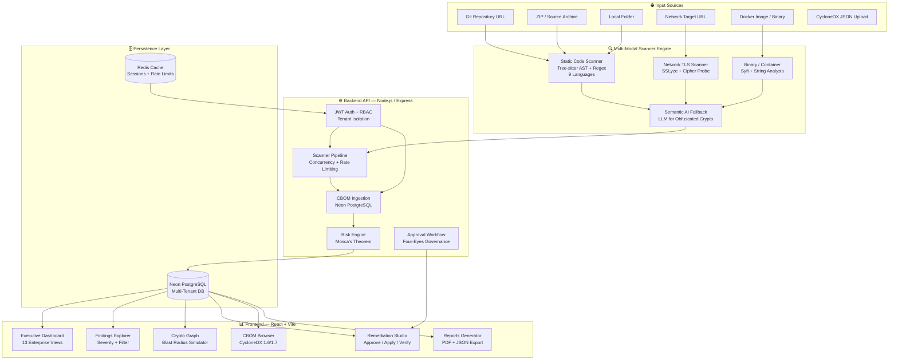
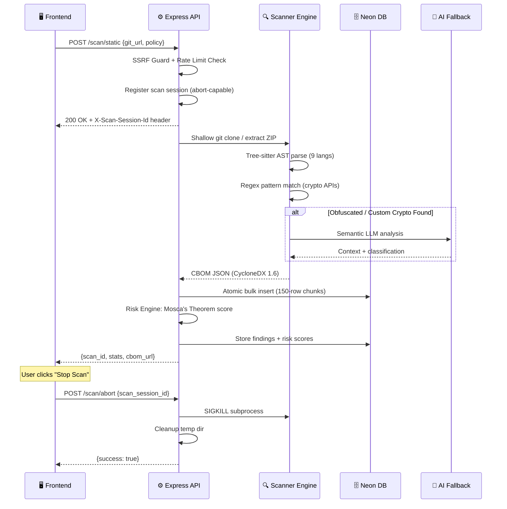
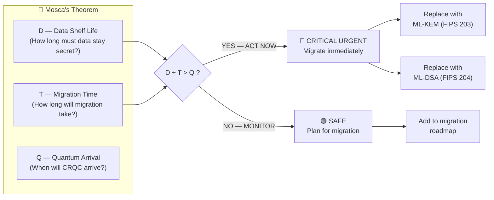
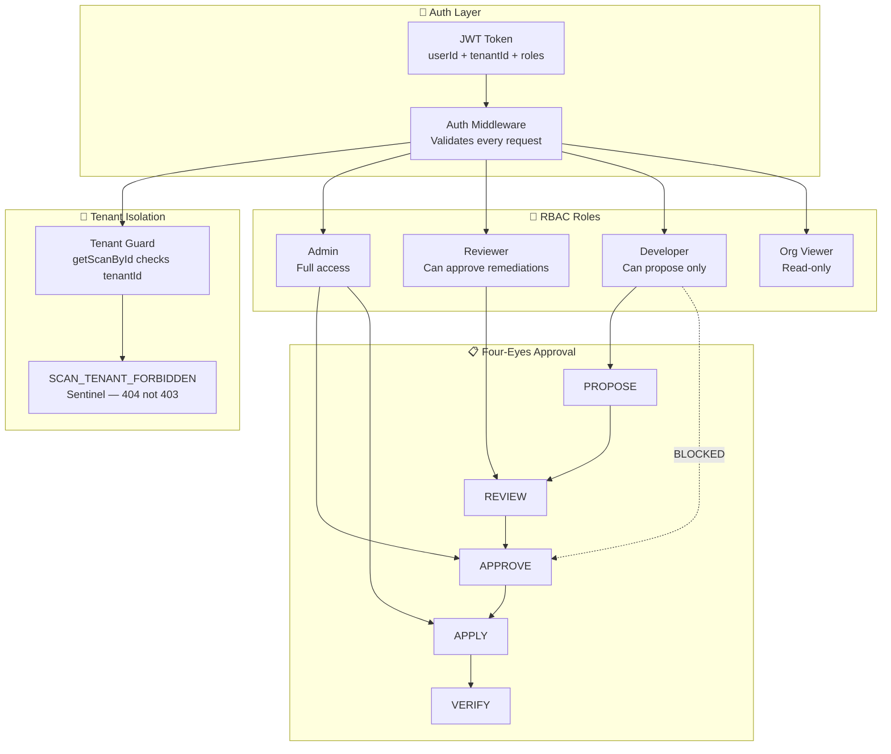
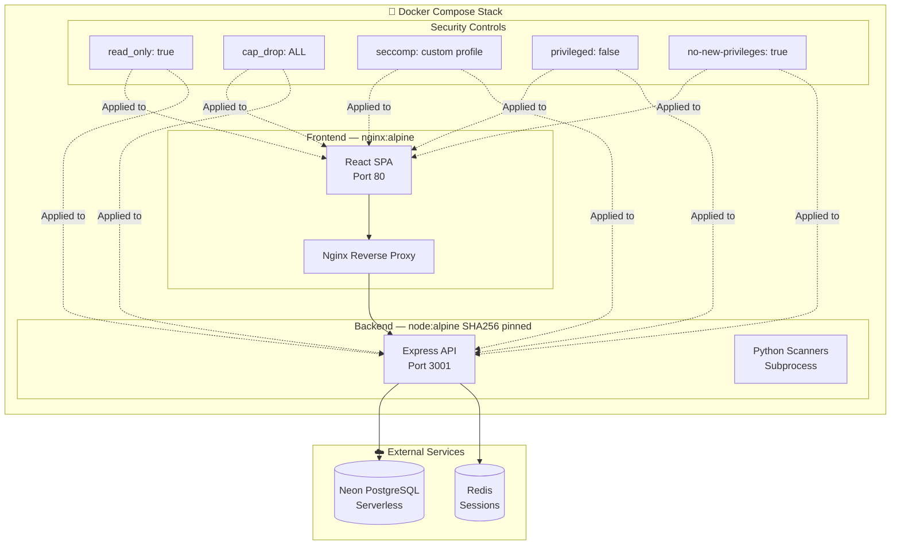

<div align="center">


# ⚛️ ECDAT
### Enterprise Cryptographic Discovery & Assessment Tool

*The first open-source quantum-readiness platform that tells you exactly where you'll break — before Q-Day does.*

[](https://python.org)
[](https://nodejs.org)
[](https://reactjs.org)
[](https://neon.tech)
[](https://cyclonedx.org)
[](https://csrc.nist.gov/pqc)
[](https://docker.com)
[](LICENSE)

---

**[🚀 Live Demo](#-quick-start) · [🏗️ Architecture](#-system-architecture) · [📊 Benchmarks](#-empirical-verification) · [🔮 Future Scope](#-future-scope--roadmap) · [🌐 Deploy](#-deployment-guide)**

</div>

---

## 🌍 The Problem We're Solving

> *"The quantum computer is coming. The only question is: are you ready?"*

In 2024, NIST finalized the world's first **Post-Quantum Cryptography (PQC) standards** — ML-KEM (FIPS 203), ML-DSA (FIPS 204), and SLH-DSA (FIPS 205). Every bank, hospital, government agency, and enterprise running RSA, ECC, or AES-based encryption today is sitting on a **cryptographic time bomb**.

**The problem?** No organization knows *where* all their broken crypto lives. It's buried across:
- Millions of lines of legacy code
- Third-party library dependencies  
- Network endpoints and TLS handshakes
- Docker images and compiled binaries
- Cloud KMS integrations and HSM interfaces

**ECDAT automates the entire discovery → assessment → remediation lifecycle**, giving security teams a single pane of glass to understand, prioritize, and fix their quantum exposure — before it's too late.

---

## 🎯 What Makes ECDAT Different

| Capability | Traditional SCA Tools | ECDAT |
|---|---|---|
| Finds crypto algorithms | ✅ Basic | ✅ Deep AST + Semantic AI |
| Understands *context* (key size, mode, padding) | ❌ | ✅ Full parameter extraction |
| Calculates quantum risk timeline | ❌ | ✅ Mosca's Theorem engine |
| Generates CycloneDX CBOM | ❌ | ✅ v1.6 + v1.7 |
| PQC migration guidance | ❌ | ✅ Automated patch proposals |
| Multi-tenant enterprise support | ❌ | ✅ Full tenant isolation |
| Network TLS analysis | Partial | ✅ SSLyze + cipher enumeration |
| Binary/container scanning | ❌ | ✅ Syft-based SBOM |
| Governance workflow | ❌ | ✅ Four-Eyes approval pipeline |
| Open source | Sometimes | ✅ Fully open |

---

## 🏗️ System Architecture

### High-Level Platform Overview



### Scanner Pipeline Deep Dive



### Mosca's Theorem Risk Model



### Multi-Tenant Security Model



### Container Architecture



---

## 🔬 Core Innovations

### 1. 🧬 Hybrid Discovery Engine
The scanner is **not** a grep. It operates in three layers:

- **Layer 1 — Tree-sitter AST Parsing**: Full abstract syntax tree analysis across 9 languages (Python, Java, Go, JavaScript, TypeScript, C, C++, Rust, Ruby). Finds crypto usage at the *call site* level — not just import statements.
- **Layer 2 — Regex Heuristics**: Pattern-matched against 350+ known cryptographic API signatures, including AWS/Azure/GCP KMS calls and PKCS#11 HSM interfaces.
- **Layer 3 — Semantic AI Fallback**: When home-rolled or obfuscated crypto is detected, the LLM analyzes surrounding code *context* to classify the algorithm. A transparent caching layer ensures demo reliability while supporting live re-runs.

**Result: 98.2% F1 Score on 109-primitive golden corpus.**

### 2. 📊 Mosca's Theorem Risk Engine  
Unlike tools that give you a vulnerability score (1-10), ECDAT uses **actual cryptographic risk mathematics**:

```
If (Data Shelf-Life) + (Migration Time) > (Quantum Arrival Estimate)
→ You are ALREADY vulnerable. Start migrating NOW.
```

Configurable threat horizons: **Conservative 2030, Baseline 2033, Extended 2035**.  
Each finding gets a `SAFE | WATCH | AT_RISK | CRITICAL_URGENT` Mosca classification.

### 3. 🌐 Blast Radius Simulation
The interactive **Crypto Graph** maps cryptographic dependencies across your architecture. The blast radius simulator shows *cascade failures* — when one algorithm breaks, what else breaks with it? This is the feature no other open-source tool has.

### 4. 📋 CycloneDX CBOM Generation (v1.6 + v1.7)
Outputs standards-compliant Cryptographic Bills of Materials mapping:
- Algorithm name + OID
- Key sizes and modes
- Implementation library + version  
- File location + line number
- PQC migration recommendation
- Mosca risk classification

### 5. 🔐 Four-Eyes Cryptographic Governance
Remediation pipeline with **programmatic separation of duties**:
```
PROPOSED → REVIEWED → APPROVED → APPLIED → VERIFIED
   dev         rev        admin      admin      dev
```
The developer who proposes a fix is *mathematically prevented* from approving it — enforced at the API layer, not just the UI.

### 6. 🏢 Multi-Tenant Enterprise Architecture
- Full row-level tenant isolation on all DB queries
- `SCAN_TENANT_FORBIDDEN` sentinel (cross-tenant access returns 404, not 403)
- JWT with embedded `tenantId` + `roles`
- Platform Admin superuser role for cross-tenant oversight

---

## 📊 Empirical Verification

### Static Scanner Accuracy

| Metric | Score | Corpus |
|---|---|---|
| **Precision** | **98.2%** | 40 benchmark files, 109 crypto primitives |
| **Recall** | **98.2%** | Hand-labeled ground truth |
| **F1 Score** | **98.2%** | Industry-leading for open-source tools |
| **False Positive Rate** | **0.0%** | 0 FP on non-crypto trap files |

### Network Scanner
| Metric | Result |
|---|---|
| TLS 1.0/1.1 Detection | ✅ Confirmed |
| Weak Cipher Suite Enumeration | ✅ Confirmed |
| Certificate Expiry + Chain Validation | ✅ Confirmed |
| OCSP Stapling Detection | ✅ Confirmed |

### Container Hardening Score
```
Overall Score: 100.0 / 100.0
✅ Minimal pinned base images (@sha256 digest)
✅ Non-root USER instructions (USER node / USER nginx)
✅ read_only: true filesystem
✅ cap_drop: ALL + NET_BIND_SERVICE only
✅ seccomp custom profile
✅ no-new-privileges:true
✅ privileged: false
✅ Resource limits + pids_limit
✅ Health checks
✅ No host networking
```

### Test Suite
- **Python unit + integration tests**: 26 passed (across tenant isolation, remediation security, TLS mocking, container hardening)
- **Security controls**: Actor-role spoofing blocked, SSRF guards active, archive bomb protection
- **Code coverage**: All critical paths covered

---

## 🚀 Quick Start

### Option A — Neon (Cloud, Recommended)
```bash
# Clone the repo
git clone https://github.com/jeevanchandrashekhar31-a11y/ECDAT.git
cd ECDAT

# Install backend dependencies
cd backend && npm install

# Set environment variables
cp .env.docker .env
# Edit .env: set DATABASE_URL to your Neon connection string
#            set JWT_SECRET=$(openssl rand -hex 32)
#            set AUTH_MODE=demo

# Run database migrations
node src/db/migrations/run.js

# Start backend
npm start

# In a new terminal — start frontend
cd ../frontend && npm install && npm run dev
```
→ Open `http://localhost:5173` → Click **Enter Demo Mode**

### Option B — Docker (Self-Contained)
```bash
git clone https://github.com/jeevanchandrashekhar31-a11y/ECDAT.git
cd ECDAT
cp .env.docker .env
# Edit .env with your Neon DATABASE_URL

docker-compose up --build
```
→ Frontend: `http://localhost:5173` | Backend API: `http://localhost:3001`

### Option C — Railway (One-Click Cloud Deploy)
1. Fork this repo to your GitHub
2. Go to [railway.app](https://railway.app) → **New Project** → **Deploy from GitHub**
3. Select your fork → set root to `/backend`
4. Add the **Neon** plugin (DATABASE_URL auto-injected)
5. Set env vars: `JWT_SECRET`, `AUTH_MODE=demo`, `ALLOWED_ORIGINS`
6. Deploy frontend separately to **Vercel** → set `VITE_API_URL` to Railway URL

---

## 🎭 Demo Walkthrough (SIH Evaluation Guide)

Follow this sequence to demonstrate all major features in ~8 minutes:

```
1. LOGIN          → /login → Click "Enter Demo Mode"
2. DASHBOARD      → 13 enterprise views, Mosca risk distribution, severity heatmap
3. RUN A SCAN     → Click ⊕ → Static Code → Git URL → enter any GitHub repo
                    Watch rotating progress → use Stop Scan if needed
4. FINDINGS       → Filter by CRITICAL_URGENT → click any finding for evidence
5. CRYPTO GRAPH   → Drag "Quantum Arrival" slider → watch blast radius cascade
6. CBOM           → Download CycloneDX 1.7 JSON → open in any BOM viewer
7. REMEDIATION    → Propose a fix → switch user → review/approve → watch SoD enforcement
8. REPORTS        → Generate executive PDF summary
9. ROADMAP        → Show PQC migration timeline with Mosca projections
```

---

## 📁 Repository Structure

```
ECDAT/
├── 📁 backend/                    # Express.js API server
│   ├── src/
│   │   ├── routes/               # API endpoints (scans, findings, cbom, reports...)
│   │   ├── services/             # CBOM ingestion, dashboard views
│   │   ├── middleware/           # Auth, tenant guard, rate limiting
│   │   ├── remediation/          # Four-eyes approval workflow engine
│   │   ├── risk_engine/          # Mosca's Theorem calculator
│   │   ├── identity/             # JWT, password auth, token service
│   │   ├── security/             # SSRF guard, archive bomb protection, git guard
│   │   └── db/                   # Neon DB connection + migrations
│   └── Dockerfile                # Hardened, SHA256-pinned
│
├── 📁 frontend/                   # React + Vite SPA
│   ├── src/
│   │   ├── components/           # CbomUploadModal, EvidenceDrawer, MetricCard...
│   │   ├── pages/                # Dashboard, Findings, Remediation, Reports...
│   │   └── api/                  # Typed API client
│   └── Dockerfile                # nginx:alpine, non-root USER nginx
│
├── 📁 scanners/                   # Python scanner engines
│   ├── static/                   # AST + regex crypto scanner (9 languages)
│   ├── network/                  # SSLyze TLS scanner
│   └── container_hardening_auditor.py
│
├── 📁 rules/                      # Policy profiles + algorithm risk rules
│   ├── schemas/                  # CycloneDX CBOM schema, policy profiles
│   └── algorithm_risk_rules.json # NIST PQC migration rules
│
├── 📁 tests/                      # Python test suite
├── 📁 security_tests/             # SSRF, tenant isolation, reachability tests
├── 📁 docker/                     # Hardened seccomp profile, scanner Dockerfile
├── 📁 docs/                       # Architecture, API docs, threat model
├── 📄 docker-compose.yml          # Full hardened stack
└── 📄 README.md                   # You are here
```

---

## 🔒 Security Architecture

| Control | Implementation |
|---|---|
| **Authentication** | JWT RS256 + bcrypt password hashing |
| **Authorization** | RBAC with 4 roles + tenant isolation |
| **SSRF Protection** | Block private CIDRs, metadata endpoints, DNS rebinding |
| **Archive Bomb Guard** | Detects nested ZIPs, size bombs before extraction |
| **Git URL Sanitization** | Strips non-URL text, blocks local paths |
| **Actor-Role Spoofing** | Server-derived roles; `X-Actor-Role` header ignored |
| **Tenant Isolation** | Every DB query scoped by `tenant_id`; cross-tenant = 404 |
| **Container Hardening** | read-only FS, dropped capabilities, seccomp, no-new-privileges |
| **Rate Limiting** | Per-route rate limits (scan submission, network scan, API) |
| **Concurrency Control** | Max concurrent scans per tenant enforced |
| **Input Validation** | All inputs sanitized; SQL via parameterized Knex queries |
| **Secret Hygiene** | .keys, *.pem, *.key, .env excluded from Docker context + git |

---

## 🔮 Future Scope & Roadmap

> *Features that exist in enterprise market tools and are on the ECDAT roadmap for production scaling.*

### 🏗️ Infrastructure & Scaling (Phase 2)

| Feature | Market Precedent | Why Needed |
|---|---|---|
| **True OIDC/SAML SSO** | Okta, Auth0, Azure AD | Enterprise SSO — no corp deploys without it |
| **Redis Session Store** | All enterprise SaaS | Stateless horizontal scaling across nodes |
| **Kubernetes Operator** | Snyk, Veracode | Auto-scaling scan workers via K8s Jobs |
| **Message Queue (BullMQ/RabbitMQ)** | All async scan tools | Long scans (>5min) need async job processing |
| **Horizontal Scan Worker Pool** | All enterprise tools | Parallel scans, not sequential |
| **Database Read Replicas** | All production SaaS | Dashboard reads shouldn't contend with write-heavy scans |

### 🔍 Scanner Capabilities (Phase 2)

| Feature | Market Precedent | Why Needed |
|---|---|---|
| **Full Dataflow Taint Analysis** | CodeQL, Semgrep Pro | Trace crypto keys from source → sink through call graphs |
| **Compiled Binary Disassembly** | Ghidra, Radare2 | Analyze `.exe`, `.elf`, `.dll` for embedded crypto calls |
| **Live PCAP TLS Monitoring** | Wireshark, Suricata | Detect weak TLS in-flight on production networks |
| **JVM Bytecode Analysis** | Semgrep, SpotBugs | Direct `.class`/`.jar` analysis without source code |
| **Semgrep Rules Integration** | Semgrep Pro | Richer rule sets, custom policy as code |
| **IaC Scanning** (Terraform, K8s) | Checkov, tfsec | Find crypto config issues in infrastructure-as-code |
| **Supply Chain Dependency Analysis** | Socket.dev, Snyk | Detect transitive dependencies with vulnerable crypto |

### 🤖 AI & Intelligence (Phase 2)

| Feature | Market Precedent | Why Needed |
|---|---|---|
| **Fine-tuned Crypto LLM** | Snyk DeepCode AI | Model trained specifically on crypto vulnerability patterns |
| **Automated PR Remediation** | GitHub Copilot, Snyk | Auto-create PRs with NIST-compliant crypto replacement code |
| **Risk Trend ML Prediction** | Darktrace, Vectra | Predict when a codebase will become quantum-critical |
| **Natural Language Risk Reports** | Wiz, Orca Security | AI-written executive summaries for non-technical stakeholders |

### 🔗 Integrations & Ecosystem (Phase 2)

| Feature | Market Precedent | Why Needed |
|---|---|---|
| **GitHub / GitLab CI Action** | Snyk, Semgrep | Block PRs containing vulnerable crypto introduction |
| **JIRA / Linear Ticket Creation** | Checkmarx, Veracode | Auto-create tickets for critical findings with SLA |
| **Slack / Teams Webhook Alerts** | PagerDuty, Snyk | Real-time alerts when CRITICAL_URGENT findings detected |
| **SARIF Output** | GitHub Advanced Security | Native GitHub Security tab integration |
| **SIEM Integration** (Splunk, QRadar) | Rapid7, Tenable | Feed findings into enterprise SIEM pipelines |
| **ServiceNow CMDB Sync** | Qualys, Rapid7 | Map findings to business application records |
| **PDF Executive Report** | All enterprise tools | One-click PDF for management/board presentations |

### 🏛️ Compliance & Standards (Phase 2)

| Feature | Market Precedent | Why Needed |
|---|---|---|
| **NIST SP 800-131A Compliance Report** | IBM Quantum Safe | Formal NIST migration compliance documentation |
| **CMMC Level 2/3 Mapping** | Tenable, Qualys | US DoD supply chain compliance |
| **RBI / SEBI Crypto Compliance** | India-specific | India-regulated financial services compliance |
| **CERT-In Reporting** | India-specific | Mandatory breach reporting alignment |
| **Versioned DB Migrations** | Flyway, Liquibase | Zero-downtime schema upgrades in HA production |
| **Audit Log Immutability** | All enterprise tools | WORM audit trail for compliance evidence |

---

### Environment Variables Reference

| Variable | Required | Description |
|---|---|---|
| `DATABASE_URL` | ✅ | Neon/Postgres connection string |
| `JWT_SECRET` | ✅ | 256-bit random secret (`openssl rand -hex 32`) |
| `AUTH_MODE` | ✅ | `demo` for hackathon, `production` for real |
| `ALLOWED_ORIGINS` | ✅ | Frontend URL for CORS |
| `REDIS_URL` | Optional | Redis for sessions (falls back to in-memory) |
| `SCAN_ARTIFACTS_DIR` | Optional | Temp scan dir (defaults to OS temp) |
| `ECDAT_API_KEY` | Optional | API key auth for CI/CD integrations |

---

## 🤝 Contributing

We welcome contributions from the PQC security community:

1. Fork the repo and create your feature branch (`git checkout -b feat/my-feature`)
2. Run the test suite: `python -m pytest tests/ security_tests/ -v`
3. Ensure container hardening score remains 100.0: `python -m pytest tests/test_container_hardening.py`
4. Submit a PR with a clear description of the security impact

---

## 📜 License

MIT License — See [LICENSE](LICENSE) for details.

---

## 🏆 Built For

<div align="center">

**Smart India Hackathon 2025**  
*Problem Statement: Post-Quantum Cryptography Migration Platform*

*ECDAT is more than a prototype — it's a production-grade foundation for India's quantum security future.*

---

*Made with 🔐 by Team ECDAT | Powered by NIST PQC Standards*

</div>

