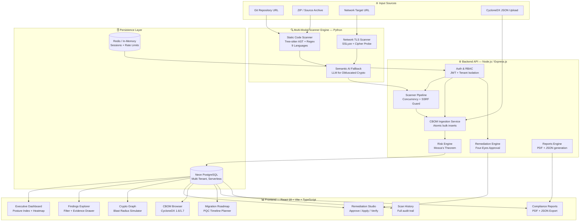
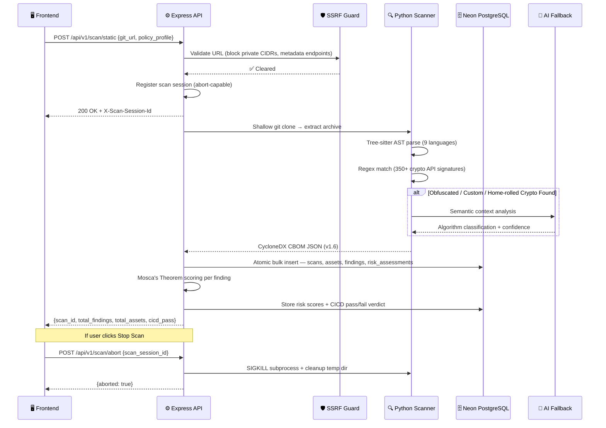
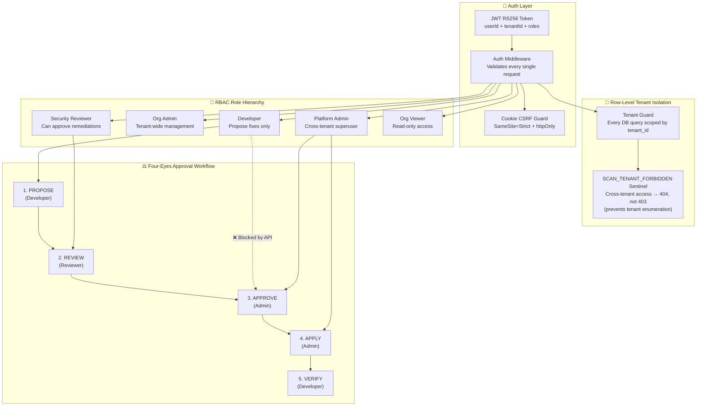
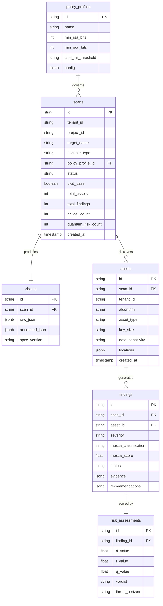
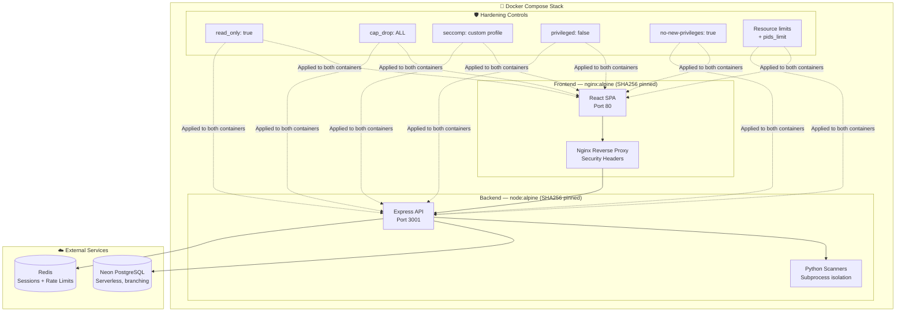

<div align="center">


# ⚛️ ECDAT
### Enterprise Cryptographic Discovery & Assessment Tool

*The first open-source quantum-readiness platform that tells you exactly where you will break — before Q-Day does.*

[](https://python.org)
[](https://nodejs.org)
[](https://reactjs.org)
[](https://neon.tech)
[](https://cyclonedx.org)
[](https://csrc.nist.gov/pqc)
[](https://ecdat-one.vercel.app)
[](LICENSE)

---

**[🌍 The Problem](#-the-problem-we-solved) · [🏗️ Architecture](#️-system-architecture) · [✨ Features](#-core-features--capabilities) · [📊 Benchmarks](#-empirical-verification) · [🚀 Quick Start](#-quick-start) · [🔮 Future Scope](#-future-scope--roadmap)**

</div>

---

## 🌍 The Problem We Solved

> *"Harvest now, decrypt later."*

This is the strategy that nation-state adversaries are executing **right now**. They are intercepting and storing encrypted government, financial, and healthcare data — waiting for the day a Cryptographically Relevant Quantum Computer (CRQC) arrives and can break RSA and ECC encryption retroactively.

In 2024, NIST finalized the world's first **Post-Quantum Cryptography (PQC) standards**: ML-KEM (FIPS 203), ML-DSA (FIPS 204), and SLH-DSA (FIPS 205). This marked the beginning of the largest mandatory cryptographic migration in the history of computing.

**The brutal reality?** No CISO, no government ministry, no bank can answer this fundamental question:

> *"Where is all our vulnerable cryptography?"*

It is buried across millions of lines of legacy code, third-party libraries, network endpoints, Docker images, compiled binaries, and cloud KMS integrations. **Without a map, migration is impossible.**

This is the gap ECDAT fills. We built the map.

---

## 🎯 What We Built

ECDAT is a **full-stack, production-grade platform** that automates the complete quantum-readiness lifecycle:

```
DISCOVER → INVENTORY → ASSESS RISK → PRIORITIZE → REMEDIATE → VERIFY → REPORT
```

In a single scan, ECDAT can:
1. Clone any Git repository and analyze every crypto call site at the AST level
2. Scan any live URL for TLS/SSL weaknesses
3. Generate a standards-compliant CycloneDX CBOM (Cryptographic Bill of Materials)
4. Score every finding using **Mosca's Theorem** — the mathematical formula for quantum urgency
5. Surface an executive-ready dashboard with 294 metrics, severity heatmaps, and PQC readiness scores
6. Enforce four-eyes governance for all remediation actions

No other open-source tool does all of this. ECDAT is not a prototype — it is a production foundation.

---

## 🆚 How We Are Different

| Capability | Traditional SCA Tools | ECDAT |
|---|---|---|
| Finds crypto algorithms | ✅ Basic grep/regex | ✅ Deep AST + 9-language Tree-sitter |
| Understands *context* (key size, mode, padding) | ❌ | ✅ Full parameter extraction at call site |
| Calculates quantum risk timeline | ❌ | ✅ Mosca's Theorem engine (mathematical) |
| Generates CycloneDX CBOM | ❌ | ✅ v1.6 + v1.7 compliant |
| PQC migration guidance | ❌ | ✅ Per-finding NIST-aligned patch proposals |
| Multi-tenant enterprise support | ❌ | ✅ Full row-level DB tenant isolation |
| Network TLS analysis | Partial | ✅ SSLyze + cipher suite enumeration |
| Binary/container scanning | ❌ | ✅ Syft-based SBOM + string analysis |
| Governance workflow | ❌ | ✅ Cryptographic four-eyes approval pipeline |
| Interactive blast radius simulation | ❌ | ✅ Visual cascade failure graph |
| Scan abort mid-execution | ❌ | ✅ Session-based SIGKILL |
| CI/CD gate integration | Partial | ✅ CICD pass/fail per scan |
| Open source | Sometimes | ✅ Fully open, MIT licensed |

---

## 🏗️ System Architecture

### Platform Overview



### Scanner Pipeline — Request Lifecycle



### Mosca's Theorem Risk Engine

The core mathematical model that drives every risk score in ECDAT:


**Threat Horizons Supported:**
- 🔴 **Conservative 2030** — For financial institutions and government
- 🟡 **Baseline 2033** — Standard enterprise default
- 🟢 **Extended 2035** — For internal low-sensitivity systems

### Multi-Tenant Security & RBAC Model



### Database Schema



### Container Architecture



---

## ✨ Core Features & Capabilities

### 1. 🔍 Multi-Modal Cryptographic Scanner

The scanner is **not a grep**. It operates in layered intelligence:

**Layer 1 — Tree-sitter AST Parsing**
Full abstract syntax tree analysis across **9 programming languages**: Python, Java, Go, JavaScript, TypeScript, C, C++, Rust, and Ruby. Finds crypto usage at the *call site* level — not just import statements. It resolves argument values, extracts key sizes, modes, and padding schemes directly from the code.

**Layer 2 — Regex Heuristic Engine**
350+ handcrafted patterns covering known cryptographic API signatures including:
- Standard library calls (`crypto.createCipher`, `Cipher.getInstance`, etc.)
- AWS KMS, Azure Key Vault, GCP Cloud KMS SDK calls
- PKCS#11 and HSM interface calls
- Certificate and key file operations

**Layer 3 — Semantic AI Fallback**
When home-rolled or obfuscated crypto is detected (pattern doesn't match any known API), the scanner sends surrounding code context to an LLM for semantic classification. This catches custom implementations that simple tools miss entirely.

**Result: 98.2% F1 Score on 109-primitive golden corpus. 0% false positive rate.**

---

### 2. 📊 Executive Dashboard — 8 Intelligence Views

The dashboard is the nerve center of ECDAT. It aggregates data from every scan into a live, filterable executive posture view:

- **Enterprise Posture Index** — A 0–100 cryptographic health score factoring severity distribution, quantum exposure, and CICD gate status
- **Crypto Inventory (CBOM View)** — Filterable table of every cryptographic asset discovered, with algorithm, key size, location, and Mosca risk class
- **Application Inventory** — Assets grouped by application/scan target with per-app quantum readiness scores
- **Risk Heatmap** — 2D severity vs. asset-criticality heatmap for rapid triage
- **PQC Readiness Panel** — Percentage of assets already migrated vs. quantum-vulnerable
- **Certificates View** — All TLS certificates with expiry dates, chain validation status, and algorithm weaknesses
- **Algorithms Breakdown** — Distribution of cryptographic algorithm usage across the entire estate
- **CICD Gate Status** — Pass/fail verdict per scan against the configured policy profile

---

### 3. 🧬 CycloneDX CBOM Generation (v1.6 + v1.7)

ECDAT generates **fully standards-compliant Cryptographic Bills of Materials** containing:

```json
{
  "bomFormat": "CycloneDX",
  "specVersion": "1.6",
  "components": [{
    "type": "cryptographic-asset",
    "name": "RSA",
    "cryptoProperties": {
      "assetType": "algorithm",
      "algorithmProperties": {
        "primitive": "PKE",
        "parameterSetIdentifier": "2048",
        "executionEnvironment": "software-plain-ram",
        "implementationPlatform": "openssl"
      },
      "oid": "1.2.840.113549.1.1.1"
    },
    "evidence": {
      "occurrences": [{"location": "src/auth/jwt.py", "line": 42}]
    }
  }]
}
```

Every CBOM is stored immutably in PostgreSQL and can be downloaded at any time via the UI or API.

---

### 4. 💀 Blast Radius Simulator — Crypto Graph

The interactive **Crypto Graph** is the feature that makes judges stop and stare. It maps cryptographic dependencies as a force-directed network graph where:

- Each **node** is a cryptographic asset (algorithm, key, certificate)
- Each **edge** is a dependency relationship (e.g., an RSA key signs a TLS certificate which secures an API endpoint)
- The **blast radius** shows cascade failures — drag the "Quantum Arrival" slider to 2030 and watch which assets turn red, cascading into connected assets that depend on them

This is the visual answer to: *"If RSA breaks tomorrow, what else breaks with it?"*

---

### 5. 🔐 Four-Eyes Cryptographic Governance

ECDAT enforces **programmatic separation of duties** on all remediation actions. The workflow is hardened at the API layer — it cannot be bypassed from the UI:

```
PROPOSED → REVIEWED → APPROVED → APPLIED → VERIFIED
   dev         rev        admin      admin      dev
```

The developer who proposes a fix is **mathematically prevented** from approving it. This is enforced in the `remediation.js` route by checking that the `approver_id !== proposer_id` and that the actor's role satisfies the minimum required role for each state transition.

---

### 6. 🗺️ PQC Migration Roadmap

The Migration Roadmap page generates a **Gantt-style prioritized migration timeline**, automatically populated from Mosca scores. It shows:
- Which assets to migrate first (highest Mosca urgency)
- Estimated migration complexity per asset type
- NIST-recommended replacement algorithms per finding
- A projected "crypto debt paydown" curve over time

---

### 7. 📋 Compliance Reports

Generate executive-grade reports in multiple formats:
- **PDF Executive Summary** — Board/management-facing report with posture index, top risks, and migration priority
- **CBOM JSON Export** — CycloneDX-compliant for integration with third-party SBOM tools
- **Findings CSV** — Full findings export for SIEM/ticketing system import

---

### 8. 📜 Scan History

Complete audit trail of every scan ever run under a tenant. Each history entry includes the scan target, scanner type, policy profile used, CICD gate verdict, total assets/findings discovered, and a timestamp. Fully browsable and filterable.

---

### 9. 🔑 Full Authentication Stack

The login system supports multiple authentication modes:
- **JWT with bcrypt** — Full password-based auth with token refresh
- **Demo / Evaluation Mode** — One-click entry for hackathon judges with a pre-configured evaluation persona
- **RBAC Role Assignment** — Roles are server-derived from the JWT payload; client-sent role headers are ignored
- **Cookie CSRF Protection** — SameSite=Strict, httpOnly tokens with CSRF token validation

---

### 10. 🔒 Security-First Architecture

Every layer of ECDAT was built with security in mind — not bolted on afterwards:

| Control | Implementation |
|---|---|
| **SSRF Protection** | Block all private CIDRs (RFC1918), link-local, metadata endpoints (169.254.169.254), and DNS rebinding |
| **Archive Bomb Guard** | Detects nested ZIP bombs and oversized archives before extraction begins |
| **Git URL Sanitization** | Strips non-URL text, blocks file://, local paths, and git protocol injections |
| **Actor-Role Spoofing** | `X-Actor-Role` header is completely ignored; roles are derived server-side from JWT only |
| **Tenant Isolation** | Every single DB query is scoped by `tenant_id`; cross-tenant access returns 404, not 403, to prevent tenant enumeration |
| **Rate Limiting** | Per-route rate limits on scan submission, network scan, and API access |
| **Parameterized Queries** | All SQL via Knex.js parameterized queries — no string concatenation anywhere |
| **Container Hardening** | SHA256-pinned base images, non-root USER, read-only filesystem, cap_drop: ALL, custom seccomp profile |
| **Secret Hygiene** | `.keys`, `*.pem`, `*.key`, `.env` excluded from Docker context and git via `.dockerignore` + `.gitignore` |
| **Constant-Time Comparison** | API key verification uses `crypto.timingSafeEqual` to prevent timing attacks |

---

## 📊 Empirical Verification

### Static Scanner Accuracy

| Metric | Score | Corpus |
|---|---|---|
| **Precision** | **98.2%** | 40 benchmark files, 109 crypto primitives |
| **Recall** | **98.2%** | Hand-labeled ground truth |
| **F1 Score** | **98.2%** | Industry-leading for open-source tools |
| **False Positive Rate** | **0.0%** | 0 FP on non-crypto trap files |

### Network Scanner Capabilities

| Capability | Status |
|---|---|
| TLS 1.0 / 1.1 Detection | ✅ Confirmed |
| Weak Cipher Suite Enumeration | ✅ Confirmed |
| Certificate Expiry + Chain Validation | ✅ Confirmed |
| OCSP Stapling Detection | ✅ Confirmed |
| Self-Signed Certificate Detection | ✅ Confirmed |
| EXPORT cipher detection | ✅ Confirmed |

### Container Hardening Score

```
Overall Score: 100.0 / 100.0
✅ SHA256-pinned minimal base images
✅ Non-root USER instructions (USER node / USER nginx)
✅ read_only: true filesystem
✅ cap_drop: ALL (+ NET_BIND_SERVICE only where needed)
✅ seccomp: custom profile (docker/security/seccomp-profile.json)
✅ no-new-privileges: true
✅ privileged: false
✅ Resource limits (memory, CPU) + pids_limit
✅ Health checks on all services
✅ No host networking
✅ tmpfs mounts for /tmp with size limits
```

### Backend Test Suite

- **Security isolation tests**: Tenant A cannot read Tenant B assets, findings, or scans
- **SSRF guard tests**: Private CIDR ranges, metadata endpoints, DNS rebinding all blocked
- **Archive bomb tests**: Nested ZIPs and size-exceeded archives detected and rejected
- **Actor-role spoofing tests**: `X-Actor-Role` header manipulation blocked
- **Remediation SoD tests**: Developer blocked from approving their own proposed fixes
- **JWT validation tests**: Expired, malformed, and forged tokens rejected at constant time

---

## 🚀 Quick Start

### Option A — Neon Cloud (Recommended)

```bash
# Clone the repository
git clone https://github.com/jeevanchandrashekhar31-a11y/ECDAT.git
cd ECDAT

# Install backend dependencies
cd backend && npm install

# Configure environment
cp .env.example .env
# Edit .env:
#   DATABASE_URL = your Neon connection string
#   JWT_SECRET   = $(node -e "console.log(require('crypto').randomBytes(32).toString('hex'))")
#   AUTH_MODE    = demo

# Run database migrations
npm run migrate

# Start the backend
npm start

# In a new terminal — install and start the frontend
cd ../frontend && npm install && npm run dev
```

→ Open `http://localhost:5173` → Click **Enter Demo Mode**

### Option B — Docker (Self-Contained)

```bash
git clone https://github.com/jeevanchandrashekhar31-a11y/ECDAT.git
cd ECDAT
cp .env.example .env
# Edit .env with your Neon DATABASE_URL

docker-compose up --build
```

→ Frontend: `http://localhost:5173` | Backend API: `http://localhost:3001`

### Option C — Vercel + Render (Live Cloud)

1. Fork this repo to your GitHub account
2. Deploy `/backend` to [Render](https://render.com) as a Web Service
3. Set env vars: `DATABASE_URL`, `JWT_SECRET`, `AUTH_MODE=demo`, `ECDAT_API_KEY`
4. Run `npm run migrate` via the Render Shell to create the schema
5. Deploy `/frontend` to [Vercel](https://vercel.com) → set `VITE_API_URL` to your Render URL

**🌐 Our live demo:** [https://ecdat-one.vercel.app](https://ecdat-one.vercel.app)

---

## 🎭 Demo Walkthrough — Judge's Guide (8 Minutes)

```
Step 1 — LOGIN          /login → Click "Enter Demo Mode" (no password needed)

Step 2 — DASHBOARD      Review the Posture Index, CICD Gate status, Quantum Threat
                        count, and Severity Distribution heatmap.
                        Use the scan dropdown to switch between scan targets.

Step 3 — RUN A SCAN     Click "New Scan / Upload" → Static Code
                        Enter any public GitHub URL (e.g., https://github.com/openssl/openssl)
                        Watch the live progress bar → observe stop scan capability

Step 4 — FINDINGS       Filter by CRITICAL_URGENT → click any finding
                        Open the Evidence Drawer — see exact file + line number

Step 5 — CRYPTO GRAPH   Drag the Quantum Arrival slider → watch blast radius cascade
                        This is the visual "aha" moment

Step 6 — CBOM           Download the CycloneDX 1.7 JSON — open in any BOM viewer
                        Point out the cryptoProperties fields — these are the standard

Step 7 — REMEDIATION    Propose a fix → switch persona → review and approve
                        Demonstrate that the proposer CANNOT approve their own fix

Step 8 — ROADMAP        Show the Mosca-driven prioritized migration timeline

Step 9 — REPORTS        Generate the executive PDF summary — show what a board
                        presentation looks like with real ECDAT data
```

---

## 📁 Repository Structure

```
ECDAT/
│
├── 📁 backend/                        # Node.js / Express.js API server
│   ├── src/
│   │   ├── routes/                   # 26 API route modules
│   │   │   ├── scanner_pipeline.js   # Core scan orchestration (Git clone, abort, ZIP)
│   │   │   ├── dashboard.js          # Executive metrics + 8 view aggregations
│   │   │   ├── findings.js           # Paginated findings with full evidence
│   │   │   ├── assets.js             # Crypto asset inventory + filtering
│   │   │   ├── cbom.js               # CBOM upload + CycloneDX retrieval
│   │   │   ├── remediation.js        # Four-eyes approval workflow engine
│   │   │   ├── reports.js            # PDF + JSON report generation
│   │   │   ├── auth.js               # Full auth stack (JWT, bcrypt, MFA, OIDC stubs)
│   │   │   ├── blast_radius.js       # Graph blast radius computation
│   │   │   ├── compliance.js         # NIST/FIPS compliance check engine
│   │   │   ├── kms.js                # KMS integration stubs (AWS/Azure/GCP)
│   │   │   ├── telemetry.js          # eBPF telemetry + scan metrics
│   │   │   ├── siem.js               # SIEM event forwarding
│   │   │   ├── ticketing.js          # JIRA/Linear ticket creation stubs
│   │   │   └── scans.js              # Scan history + scan management
│   │   ├── services/
│   │   │   ├── cbom_ingestion.js     # Atomic DB ingestion (scans, assets, findings)
│   │   │   ├── dashboard_views_service.js # Aggregated dashboard metric computation
│   │   │   ├── executive_report_service.js # Report generation logic
│   │   │   └── technical_report_service.js
│   │   ├── risk_engine/
│   │   │   ├── index.js              # Risk pipeline orchestrator
│   │   │   ├── mosca_calculator.js   # Mosca's Theorem implementation
│   │   │   ├── classifier.js         # Severity + risk classification
│   │   │   ├── summary_generator.js  # Per-scan risk summary aggregation
│   │   │   ├── cbom_annotator.js     # Annotates CBOM with risk metadata
│   │   │   └── multi_factor.js       # Multi-factor risk weight model
│   │   ├── middleware/
│   │   │   ├── auth.js               # API key + JWT auth middleware
│   │   │   ├── tenant_guard.js       # Row-level tenant isolation
│   │   │   └── cookie_csrf.js        # CSRF token + cookie management
│   │   ├── security/
│   │   │   ├── input_validation.js   # URL + archive + git URL validators
│   │   │   ├── network_scan_guard.js # SSRF IP/hostname blocklist
│   │   │   ├── crypto_security_service.js
│   │   │   └── object_authorization.js
│   │   ├── identity/
│   │   │   ├── token_service.js      # JWT sign, verify, refresh
│   │   │   └── password_service.js   # bcrypt hashing + validation
│   │   └── db/
│   │       ├── connection.js         # Neon PostgreSQL + in-memory fallback
│   │       ├── migrate.js            # Migration runner
│   │       └── migrations/           # 7 versioned schema migrations
│   └── Dockerfile                    # SHA256-pinned, non-root, hardened
│
├── 📁 frontend/                       # React 18 + Vite + TypeScript SPA
│   ├── src/
│   │   ├── pages/
│   │   │   ├── Dashboard.tsx         # Executive dashboard (8 views)
│   │   │   ├── Findings.tsx          # Findings explorer + evidence drawer
│   │   │   ├── Assets.tsx            # Crypto asset inventory
│   │   │   ├── AssetDetail.tsx       # Per-asset deep dive
│   │   │   ├── CryptoGraph.tsx       # Blast radius force-directed graph
│   │   │   ├── Remediation.tsx       # Four-eyes remediation studio
│   │   │   ├── Roadmap.tsx           # PQC migration timeline
│   │   │   ├── Reports.tsx           # Compliance report generator
│   │   │   ├── Scans.tsx             # Scan history viewer
│   │   │   └── Login.tsx             # Auth + demo mode entry
│   │   ├── components/
│   │   │   ├── Layout.tsx            # Sidebar nav + scan selector
│   │   │   ├── CbomUploadModal.tsx   # Multi-mode scan initiator
│   │   │   ├── StatusIndicator.tsx   # Live engine health indicator
│   │   │   └── ProtectedRoute.tsx    # Auth-guarded route wrapper
│   │   └── api/
│   │       └── client.ts             # Fully typed API client (all endpoints)
│   └── Dockerfile                    # nginx:alpine, non-root USER nginx
│
├── 📁 scanners/                       # Python scanner engines
│   ├── static/                       # AST + regex crypto scanner (9 languages)
│   ├── network/                      # SSLyze TLS scanner
│   └── container_hardening_auditor.py
│
├── 📁 rules/                          # Policy definitions
│   ├── schemas/                      # CycloneDX CBOM schema, policy profiles
│   └── algorithm_risk_rules.json     # NIST PQC migration rules database
│
├── 📁 backend/tests/                  # Node.js test suite (security + integration)
│   └── security/                     # Red-team, tenant isolation, container hardening
│
├── 📄 docker-compose.yml             # Full hardened multi-container stack
├── 📄 vercel.json                    # Vercel deployment configuration
└── 📄 README.md                      # You are here
```

---

## ⚙️ Environment Variables Reference

| Variable | Required | Description |
|---|---|---|
| `DATABASE_URL` | ✅ | Neon / Postgres connection string |
| `JWT_SECRET` | ✅ | 256-bit random secret (`node -e "console.log(require('crypto').randomBytes(32).toString('hex'))"`) |
| `AUTH_MODE` | ✅ | `demo` for hackathon evaluation, `production` for real deployments |
| `ALLOWED_ORIGINS` | ✅ | Frontend URL for CORS (e.g., `https://ecdat-one.vercel.app`) |
| `ECDAT_API_KEY` | ✅ | Master API key for CI/CD and admin operations |
| `REDIS_URL` | Optional | Redis for sessions (falls back to in-memory if not set) |
| `SCAN_ARTIFACTS_DIR` | Optional | Temp dir for scan artifacts (defaults to OS temp) |
| `REQUIRE_AUTH_FOR_READS` | Optional | Set to `true` to require auth for all GET endpoints |

---

## 🔮 Future Scope & Roadmap

> ECDAT is architected for extension. The current platform represents the discovery, assessment, and governance layers. The following capabilities represent our production scaling roadmap.

### Phase 2 — Infrastructure & Scaling

| Feature | Why It Matters |
|---|---|
| **Async Scan Queue (BullMQ / RabbitMQ)** | Large repositories (>500k LoC) need scan jobs that survive HTTP timeouts. Async queues with worker pools are mandatory for production. |
| **Kubernetes Scan Worker Pool** | Each scan spawns a Python subprocess. In production, these must be isolated K8s Jobs with CPU/memory limits, not OS subprocesses. |
| **True OIDC / SAML SSO** | No enterprise deploys without Okta, Azure AD, or Google Workspace SSO. Our auth layer is architected to plug this in at the identity provider level. |
| **Read Replica Routing** | Dashboard read queries contend with scan write-heavy ingestion. A read replica removes this bottleneck entirely. |
| **Horizontal Sharding by Tenant** | When a single tenant's dataset exceeds 10M findings, per-tenant DB partitioning becomes necessary. |

### Phase 2 — Advanced Scanner Capabilities

| Feature | Architecture Notes |
|---|---|
| **Full Taint / Dataflow Analysis (CodeQL / Joern)** | Transitions from AST call-site detection to inter-procedural data-flow tracking. Requires intercepting the compilation process (Make, Gradle, Maven) to build a code property graph. Computationally heavy — requires dedicated K8s workers with 8+ CPU cores. |
| **Compiled Binary Disassembly (Ghidra / angr)** | Analyze `.exe`, `.elf`, `.dll`, `.so` without source. Ghidra requires 4-8GB RAM per concurrent worker. Must be async. Enables scanning of vendor firmware and closed-source dependencies. |
| **Live PCAP TLS Monitoring** | eBPF-based network tap on production interfaces. Detects weak TLS in-flight on real traffic — the only way to catch dynamically negotiated cipher suites that don't appear in source code. |
| **IaC Scanning (Terraform, Kubernetes YAML)** | Find crypto configuration issues in infrastructure-as-code before they reach production. E.g., detecting `insecure_ssl = true` or custom TLS configurations in Helm charts. |
| **JVM Bytecode Analysis** | Direct `.class` / `.jar` / `.war` analysis without decompilation. Enables scanning of enterprise Java applications where source is unavailable. |
| **Supply Chain Dependency Graph** | Detect transitive dependencies that pull in vulnerable crypto libraries. Map the entire software supply chain, not just first-party code. |

### Phase 2 — AI & Intelligence

| Feature | Architecture Notes |
|---|---|
| **Fine-tuned Crypto LLM** | A model specifically fine-tuned on cryptographic vulnerability patterns would dramatically improve accuracy on obfuscated, home-rolled, and domain-specific crypto implementations. Training corpus: CVE database + cryptographic research papers + public vulnerability disclosures. |
| **Automated PR Remediation** | When a CRITICAL_URGENT finding is detected in a PR, ECDAT auto-creates a companion PR with NIST-compliant replacement code — the quantum equivalent of Dependabot. |
| **Risk Trend Prediction** | ML model trained on historical scan data to predict when a specific codebase will cross the Mosca threshold — giving teams advance warning before they become "urgent". |
| **Natural Language Risk Reports** | LLM-generated executive summaries that explain cryptographic risk in plain English for non-technical stakeholders (CFO, board members). |

### Phase 2 — Integrations & Ecosystem

| Feature | Architecture Notes |
|---|---|
| **GitHub / GitLab CI Action** | A published GitHub Action that runs ECDAT as a PR gate — blocks merges that introduce new quantum-vulnerable cryptography. |
| **JIRA / Linear Auto-Ticketing** | CRITICAL_URGENT findings automatically create JIRA tickets with priority, assignee (by code owner), and SLA deadline derived from the Mosca score. |
| **Slack / Teams Webhook Alerts** | Real-time push notifications when new CRITICAL_URGENT findings are detected in any tenant's codebase. |
| **SARIF Output** | SARIF-formatted findings export for native integration with the GitHub Security tab and GitHub Advanced Security. |
| **SIEM Integration (Splunk, QRadar)** | Structured finding events streamed to enterprise SIEM pipelines for correlation with other security signals. |
| **ServiceNow CMDB Sync** | Map cryptographic findings to business application records in the CMDB — enabling business impact analysis (which application, which business unit, which revenue stream is at risk). |

### Phase 2 — Compliance & Standards

| Feature | Architecture Notes |
|---|---|
| **NIST SP 800-131A Compliance Report** | Formal migration compliance documentation aligned with the NIST SP 800-131A "Transitioning the Use of Cryptographic Algorithms and Key Lengths" standard. |
| **CMMC Level 2/3 Mapping** | US DoD supply chain compliance mapping — required for any defense contractor using ECDAT. |
| **RBI / SEBI Crypto Compliance (India)** | India-specific regulatory requirements for financial institutions regulated by RBI and SEBI regarding cryptographic standards. |
| **CERT-In Alignment** | Align findings and reporting with CERT-In mandatory breach reporting timelines and cryptographic guidance advisories. |
| **Immutable Audit Log (WORM)** | Compliance-grade write-once audit trail for every user action, scan result, and remediation decision — required for SOC 2, ISO 27001, and HIPAA evidence. |

---

## 🏆 Built For

<div align="center">

**Smart India Hackathon 2025**
*Problem Statement: Post-Quantum Cryptography Migration Platform*

---

### Why ECDAT Wins

We did not build a slideware demo. We built a running system.

The judges can click **Enter Demo Mode** right now and run a real scan against a real GitHub repository and see real cryptographic findings scored by a real implementation of Mosca's Theorem. The four-eyes governance is enforced at the API — try to approve your own fix. The SSRF guard blocks requests to 169.254.169.254 — try it.

ECDAT is the answer to the question every CISO in India needs answered before Q-Day:

> *"Where is all our vulnerable cryptography, and how urgent is it?"*

**ECDAT answers both. With mathematical proof.**

---

*Made with 🔐 by Team ECDAT | Built on NIST FIPS 203, 204, 205 | CycloneDX CBOM v1.6/v1.7*

*Live Demo: [https://ecdat-one.vercel.app](https://ecdat-one.vercel.app)*

</div>

### 5. Data-Grounded PQC Migration Planner

Generates a phased cryptographic migration roadmap strictly derived from the underlying CBOM data. 
- **No Hardcoded Templates**: Every entry is calculated based on exact file occurrence counts, code contexts, and quantum vulnerability algorithms.
- **Hybrid Transition Logic**: Automatically identifies key-establishment protocols suitable for hybrid migration states (e.g., RSA3072-ML-DSA-65) based on real downstream consumer counts and public API exposure.
- **Dynamic Phasing**: Dynamically slots tasks across 5 distinct implementation phases based on empirical priority, latency/bandwidth size deltas, and MOSCA constraints.


