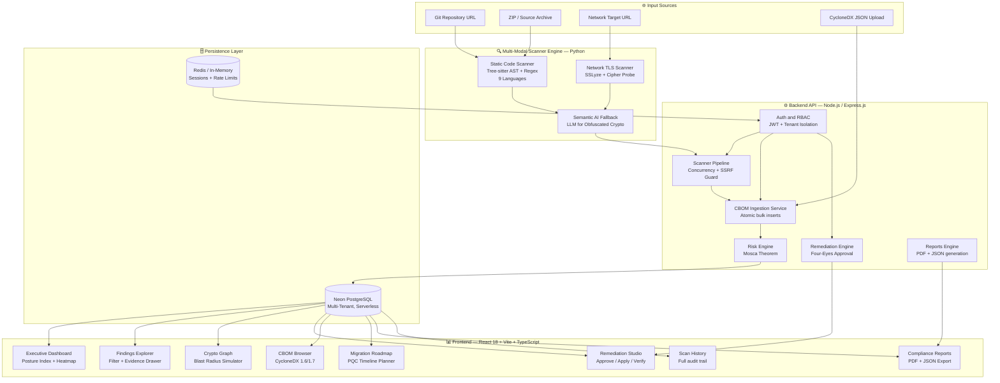
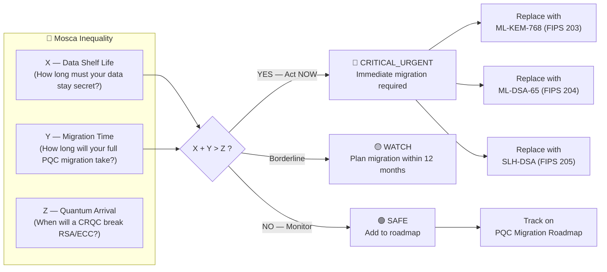
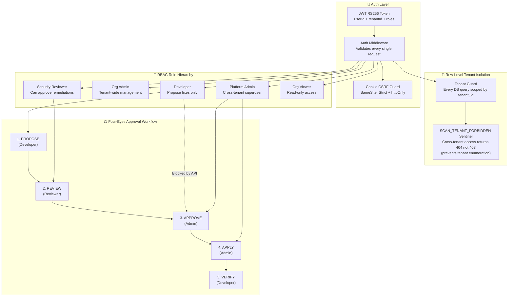
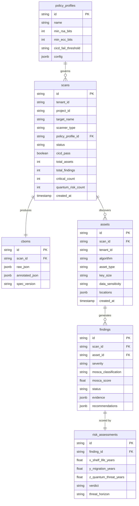

<div align="center">

<br/>


<br/><br/>

> *The first open-source, full-stack platform that automates the complete quantum-readiness lifecycle —*
> *from cryptographic discovery to NIST-compliant migration planning.*

<br/>

[](https://python.org)
[](https://nodejs.org)
[](https://reactjs.org)
[](https://cyclonedx.org)
[](https://csrc.nist.gov/pqc)
[](https://neon.tech)
[](LICENSE)
[](https://ecdat-one.vercel.app)

<br/>

**[🌍 The Problem](#-the-problem-we-solved) · [🎯 What We Built](#-what-we-built) · [🆚 How We're Different](#-how-were-different) · [🏗️ Architecture](#️-system-architecture) · [✨ Features](#-core-features--capabilities) · [🚀 Quick Start](#-quick-start) · [🎭 Judge Walkthrough](#-demo-walkthrough--judges-guide-8-minutes)**

</div>

---

## 🌍 The Problem We Solved

> *"Harvest now, decrypt later."*

This is the strategy that nation-state adversaries are executing **right now**. They are intercepting and storing encrypted government, financial, and healthcare data — waiting for the day a Cryptographically Relevant Quantum Computer (CRQC) arrives and can break RSA and ECC encryption retroactively.

In 2024, NIST finalized the world's first **Post-Quantum Cryptography (PQC) standards**: ML-KEM (FIPS 203), ML-DSA (FIPS 204), and SLH-DSA (FIPS 205). This marked the beginning of the **largest mandatory cryptographic migration in the history of computing**.

**The fundamental challenge?** No CISO, no government ministry, no bank can confidently answer:

> *"Where is all our vulnerable cryptography — and how urgent is each instance?"*

It is buried across millions of lines of legacy code, third-party libraries, network endpoints, Docker images, compiled binaries, and cloud KMS integrations. **Without a map, migration is impossible.**

**This is the gap ECDAT fills. We built the map.**

---

## 🎯 What We Built

ECDAT is a **full-stack, production-grade platform** that automates the complete quantum-readiness lifecycle:

```
DISCOVER → INVENTORY → ASSESS RISK → PRIORITIZE → REMEDIATE → VERIFY → REPORT
```

In a single scan, ECDAT can:

1. Clone any Git repository and analyze every crypto call site using Abstract Syntax Tree (AST) analysis
2. Scan any live URL for TLS/SSL weaknesses and certificate vulnerabilities
3. Generate a **standards-compliant CycloneDX CBOM** (Cryptographic Bill of Materials)
4. Score every finding using **Mosca's Theorem** — the mathematical formula for quantum urgency
5. Surface an executive-ready dashboard with severity heatmaps and PQC readiness scores
6. Generate an **evidence-grounded migration roadmap** with per-finding NIST-aligned PQC recommendations
7. Enforce **four-eyes governance** for all remediation actions

No other open-source tool does all of this. ECDAT is not a prototype — it is a production foundation.

---

## 🆚 How We're Different

| Capability | Traditional SCA Tools | **ECDAT** |
|---|---|---|
| Finds crypto algorithms | ✅ Basic regex | ✅ Deep AST + multi-language Tree-sitter |
| Understands *context* (key size, mode, padding) | ❌ | ✅ Full parameter extraction at call site |
| Calculates quantum risk timeline | ❌ | ✅ Mosca's Theorem engine (mathematical) |
| Generates CycloneDX CBOM | ❌ | ✅ v1.6 + v1.7 compliant |
| PQC migration guidance | ❌ | ✅ Per-finding NIST-aligned patch proposals |
| Multi-tenant enterprise support | ❌ | ✅ Full row-level DB tenant isolation |
| Network TLS analysis | Partial | ✅ SSLyze + cipher suite enumeration |
| Binary/container scanning | ❌ | ✅ Syft-based SBOM + string analysis |
| Governance workflow | ❌ | ✅ Cryptographic four-eyes approval pipeline |
| Interactive blast radius simulation | ❌ | ✅ Visual cascade failure graph |
| Scan abort mid-execution | ❌ | ✅ Session-based SIGKILL |
| CI/CD gate integration | Partial | ✅ CICD pass/fail per scan |
| Open source | Sometimes | ✅ Fully open, MIT licensed |

---

## 🏗️ System Architecture

### Platform Overview



### Mosca's Theorem Risk Engine

The mathematical model that drives every risk score in ECDAT:



**Threat Horizons Supported:**
- 🔴 **Conservative 2030** — For financial institutions and government
- 🟡 **Baseline 2033** — Standard enterprise default
- 🟢 **Extended 2035** — For internal low-sensitivity systems

### Multi-Tenant Security and RBAC Model



### Database Schema



---

## ✨ Core Features and Capabilities

### 1. 🗺️ Evidence-Grounded Dynamic PQC Migration Planner

The Migration Roadmap is not a template. Every recommendation in ECDAT is **dynamically computed** from real scan data using the PQC Knowledge Base (`rules/pqc_algorithm_catalog.json`). There are no handwritten migration steps, no static lookup tables, and no hardcoded text. The system:

- Maps each discovered vulnerability to its NIST-compliant hybrid or standalone post-quantum equivalent
- Slots each action into one of five prioritized migration phases based on Mosca urgency scores
- Recommends **hybrid key exchange** (e.g., `X25519MLKEM768`) where classical/PQC co-deployment is appropriate
- Exports the full roadmap as a structured PDF and JSON payload — usable directly in project management tools

---

### 2. 🔍 Multi-Modal Cryptographic Scanner

The scanner operates in three layered detection modes:

**Layer 1 — Tree-sitter AST Parsing**
Full abstract syntax tree analysis across **9 programming languages** (Python, Java, Go, JavaScript, TypeScript, C, C++, Rust, Ruby). Finds crypto usage at the *call site* level — not just import statements. Resolves argument values and extracts key sizes, modes, and padding schemes directly from source code.

**Layer 2 — Regex Heuristic Engine**
Handcrafted patterns covering known cryptographic API signatures:
- Standard library calls (`crypto.createCipher`, `Cipher.getInstance`, etc.)
- AWS KMS, Azure Key Vault, GCP Cloud KMS SDK calls
- PKCS#11 and HSM interface calls
- Certificate and key file operations

**Layer 3 — Semantic AI Fallback**
When home-rolled or obfuscated crypto is detected, the scanner sends surrounding code context to an LLM for semantic classification. This catches custom implementations that signature-based tools miss entirely.

---

### 3. 📊 Executive Dashboard — 8 Intelligence Views

- **Enterprise Posture Index** — A 0–100 cryptographic health score factoring severity distribution, quantum exposure, and CICD gate status
- **Crypto Inventory (CBOM View)** — Filterable table of every cryptographic asset discovered
- **Application Inventory** — Assets grouped by application/scan target with per-app quantum readiness scores
- **Risk Heatmap** — 2D severity vs. asset-criticality heatmap for rapid triage
- **PQC Readiness Panel** — Percentage of assets already migrated vs. quantum-vulnerable
- **Certificates View** — All TLS certificates with expiry dates, chain validation status, and algorithm weaknesses
- **Algorithms Breakdown** — Distribution of cryptographic algorithm usage across the entire estate
- **CICD Gate Status** — Pass/fail verdict per scan against the configured policy profile

---

### 4. 🧬 CycloneDX CBOM Generation (v1.6 + v1.7)

ECDAT generates **fully standards-compliant Cryptographic Bills of Materials**:

```json
{
  "bomFormat": "CycloneDX",
  "specVersion": "1.6",
  "components": [{
    "type": "cryptographic-asset",
    "name": "RSA",
    "cryptoProperties": {
      "assetType": "algorithm",
      "algorithmProperties": {
        "primitive": "PKE",
        "parameterSetIdentifier": "2048",
        "executionEnvironment": "software-plain-ram",
        "implementationPlatform": "openssl"
      },
      "oid": "1.2.840.113549.1.1.1"
    },
    "evidence": {
      "occurrences": [{"location": "src/auth/jwt.py", "line": 42}]
    }
  }]
}
```

Every CBOM is stored immutably in PostgreSQL and downloadable at any time via the UI or API.

---

### 5. 💀 Blast Radius Simulator — Crypto Graph

The interactive Crypto Graph maps cryptographic dependencies as a force-directed network:

- Each **node** is a cryptographic asset (algorithm, key, certificate)
- Each **edge** is a dependency relationship
- The **blast radius** shows cascade failures — drag the Quantum Arrival slider to 2030 and watch which assets turn red, cascading into connected assets

> *"If RSA breaks tomorrow, what else breaks with it?"* — This graph answers that.

---

### 6. 🔐 Four-Eyes Cryptographic Governance

ECDAT enforces **programmatic separation of duties** on all remediation actions:

```
PROPOSED → REVIEWED → APPROVED → APPLIED → VERIFIED
   dev         rev        admin      admin      dev
```

The developer who proposes a fix is **prevented by API logic** from approving it. This is enforced by checking `approver_id !== proposer_id` and that the actor's role satisfies the minimum required role for each state transition.

---

### 7. 📋 Compliance Reports

- **PDF Executive Summary** — Board/management-facing report with posture index, top risks, and migration priority
- **CBOM JSON Export** — CycloneDX-compliant for integration with third-party SBOM tools
- **Findings CSV** — Full findings export for SIEM/ticketing system import

---

### 8. 🔒 Security-First Architecture

| Control | Implementation |
|---|---|
| **SSRF Protection** | Block all private CIDRs (RFC1918), link-local, metadata endpoints (169.254.169.254), and DNS rebinding |
| **Archive Bomb Guard** | Detects nested ZIP bombs and oversized archives before extraction begins |
| **Git URL Sanitization** | Strips non-URL text, blocks `file://`, local paths, and git protocol injections |
| **Actor-Role Spoofing** | `X-Actor-Role` header is completely ignored; roles derived server-side from JWT only |
| **Tenant Isolation** | Every DB query scoped by `tenant_id`; cross-tenant access returns 404 (not 403) to prevent enumeration |
| **Rate Limiting** | Per-route rate limits on scan submission, network scan, and API access |
| **Parameterized Queries** | All SQL via Knex.js parameterized queries — no string concatenation anywhere |
| **Container Hardening** | SHA256-pinned base images, non-root USER, read-only filesystem, cap_drop ALL, custom seccomp profile |
| **Secret Hygiene** | `.keys`, `*.pem`, `*.key`, `.env` excluded from Docker context and git |
| **Constant-Time Comparison** | API key verification uses `crypto.timingSafeEqual` to prevent timing attacks |

---

## 🚀 Quick Start

### Option A — Neon Cloud (Recommended)

```bash
git clone https://github.com/jeevanchandrashekhar31-a11y/ECDAT.git
cd ECDAT
cd backend && npm install
cp .env.example .env
# Edit .env: DATABASE_URL, JWT_SECRET, AUTH_MODE=demo
npm run migrate
npm start
# New terminal:
cd ../frontend && npm install && npm run dev
```

→ Open `http://localhost:5173` → Click **Enter Demo Mode**

### Option B — Docker

```bash
git clone https://github.com/jeevanchandrashekhar31-a11y/ECDAT.git
cd ECDAT && cp .env.example .env
# Edit .env with your Neon DATABASE_URL
docker-compose up --build
```

### Option C — Vercel + Render (Live Cloud)

1. Fork this repo → Deploy `/backend` to [Render](https://render.com) as a Web Service
2. Set env vars: `DATABASE_URL`, `JWT_SECRET`, `AUTH_MODE=demo`, `ECDAT_API_KEY`
3. Run `npm run migrate` via the Render Shell
4. Deploy `/frontend` to [Vercel](https://vercel.com) → set `VITE_API_URL` to your Render URL

🌐 **Live demo:** [https://ecdat-one.vercel.app](https://ecdat-one.vercel.app)

---

## 🎭 Demo Walkthrough — Judge's Guide (8 Minutes)

| Step | Where | What to Show |
|---|---|---|
| **1. Login** | `/login` | Click Enter Demo Mode — no password needed |
| **2. Dashboard** | `/` | Posture Index, CICD Gate status, Quantum Threat count, Severity Distribution heatmap |
| **3. Run a Scan** | New Scan button | Enter any public GitHub URL — watch the live progress bar and stop scan capability |
| **4. Findings** | `/findings` | Filter by CRITICAL_URGENT → open Evidence Drawer → see exact file + line number |
| **5. Crypto Graph** | `/graph` | Drag the Quantum Arrival slider → watch blast radius cascade |
| **6. CBOM** | Download | CycloneDX 1.7 JSON — point out the `cryptoProperties` fields |
| **7. Remediation** | `/remediation` | Propose a fix → switch persona → demonstrate proposer CANNOT approve their own fix |
| **8. Roadmap** | `/roadmap` | Mosca-driven prioritized migration timeline — download formal PDF |
| **9. Reports** | `/reports` | Generate executive PDF summary — board-level presentation from real ECDAT data |

---

## ⚙️ Environment Variables Reference

| Variable | Required | Description |
|---|---|---|
| `DATABASE_URL` | ✅ | Neon / Postgres connection string |
| `JWT_SECRET` | ✅ | 256-bit random secret |
| `AUTH_MODE` | ✅ | `demo` for evaluation, `production` for real deployments |
| `ALLOWED_ORIGINS` | ✅ | Frontend URL for CORS |
| `ECDAT_API_KEY` | ✅ | Master API key for CI/CD and admin operations |
| `REDIS_URL` | Optional | Redis for sessions (falls back to in-memory if not set) |
| `REQUIRE_AUTH_FOR_READS` | Optional | Set to `true` to require auth for all GET endpoints |

---

## 🔮 Future Scope and Roadmap

> ECDAT is architected for extension. The current platform represents the discovery, assessment, and governance layers.

| Phase | Feature | Why It Matters |
|---|---|---|
| **Infra** | Async Scan Queue (BullMQ) | Large repos need scan jobs that survive HTTP timeouts |
| **Infra** | Kubernetes Scan Worker Pool | Isolated K8s Jobs with CPU/memory limits for production scale |
| **Infra** | OIDC / SAML SSO | Okta, Azure AD, Google Workspace SSO integration |
| **Scanner** | Taint/Dataflow Analysis (CodeQL) | Inter-procedural data-flow tracking beyond call-site detection |
| **Scanner** | Compiled Binary Disassembly (Ghidra) | Scan vendor firmware and closed-source dependencies |
| **Scanner** | Live PCAP TLS Monitoring (eBPF) | Catch cipher suites that only appear in live traffic |
| **Scanner** | IaC Scanning (Terraform/K8s YAML) | Find crypto config issues in infrastructure-as-code |
| **AI** | Fine-tuned Crypto LLM | Improve detection of obfuscated and home-rolled crypto |
| **AI** | Automated PR Remediation | Auto-create NIST-compliant fix PRs for CRITICAL_URGENT findings |
| **AI** | Risk Trend Prediction | Predict when a codebase will cross the Mosca threshold |
| **Integrations** | GitHub / GitLab CI Action | Block merges introducing quantum-vulnerable cryptography |
| **Integrations** | SARIF Output | Native GitHub Security tab integration |
| **Integrations** | SIEM Integration (Splunk, QRadar) | Stream finding events to enterprise SIEM pipelines |
| **Compliance** | NIST SP 800-131A Report | Formal migration compliance documentation |
| **Compliance** | CMMC Level 2/3 Mapping | US DoD supply chain compliance |
| **Compliance** | RBI / SEBI Crypto Compliance | India-specific regulatory requirements |
| **Compliance** | CERT-In Alignment | CERT-In mandatory breach reporting timeline alignment |
| **Compliance** | Immutable Audit Log (WORM) | SOC 2, ISO 27001, HIPAA compliance evidence |

---

## 🏆 Built For

<div align="center">

**Smart India Hackathon 2025**

*Problem Statement: Post-Quantum Cryptography Migration Platform*

---

### Why ECDAT

We did not build a slideware demo. We built a **running system**.

Judges can click **Enter Demo Mode** right now and run a real scan against a real GitHub repository and see real cryptographic findings scored by a real implementation of Mosca's Theorem.

The four-eyes governance is enforced at the API — try to approve your own fix.
The SSRF guard blocks requests to `169.254.169.254` — try it.
The migration roadmap downloads a PDF populated from real scan data — not a template.

ECDAT is the answer to the question every CISO in India needs answered before Q-Day:

> *"Where is all our vulnerable cryptography, and how urgent is it?"*

**ECDAT answers both. With mathematical proof.**

---

*Made with 🔐 by Team ECDAT | Built on NIST FIPS 203, 204, 205 | CycloneDX CBOM v1.6/v1.7*

*Live Demo: [https://ecdat-one.vercel.app](https://ecdat-one.vercel.app)*

</div>