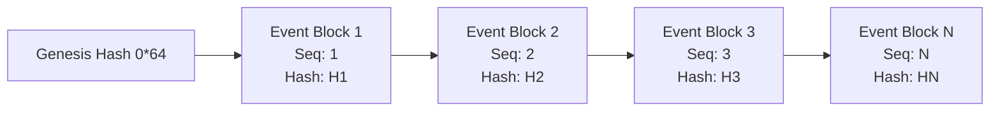

# ECDAT Enterprise Structured Audit Logging Architecture

**Document Version**: 1.0.0  
**Status**: ACTIVE & VERIFIED  
**Classification**: Enterprise Cryptographic Observability & Compliance Specification  
**Requirement Mapping**: P1 — Task 21 (Audit Logging)

---

## 1. Executive Overview

ECDAT enforces an enterprise-grade, tamper-resistant, structured audit logging subsystem across both its Node.js backend and Python scanner engines. Every security-sensitive action throughout the platform emits a structured, immutable audit event designed to satisfy SOC 2 Type II, ISO/IEC 27001, FedRAMP High, and PCI-DSS requirements.

### Core Guarantees

1. **13 Minimum Mandatory Actions**: Full structured event coverage for all security-sensitive operations across authentication, authorization, tenancy, scanning, secrets, policies, and integrations.
2. **9 Mandated Audit Record Dimensions**: Every audit record captures `actor`, `tenant`, `action`, `target`, `timestamp`, `request ID`, `result`, `reason`, and `source IP`.
3. **Strict Zero-Secret Logging Guarantee**: Automated deep recursive redaction that guarantees cleartext secrets (passwords, MFA secrets, backup codes, API keys, access tokens, private keys, raw credentials) **never** enter audit logs, databases, or SIEM feeds.
4. **Cryptographic Tamper-Chain Integrity**: Each audit block is cryptographically linked to the preceding block's SHA-256 hash and signed with an HMAC-SHA256 non-repudiation key. Any sequence gap, record deletion, or payload modification is mathematically detectable.

---

## 2. The 13 Minimum Mandatory Operations

| Operation | Canonical Action Identifier | Category | Trigger Points |
| :--- | :--- | :--- | :--- |
| **Authentication Success** | `AUTH_LOGIN_SUCCESS` | `LOGIN` | Local cookie login, API key auth, Bearer JWT validation |
| **Authentication Failure** | `AUTH_LOGIN_FAILURE` | `LOGIN` | Invalid password, expired token, locked account, invalid API key |
| **Authorization Denial** | `AUTHORIZATION_FAILURE` | `PERMISSION_CHANGE` | RBAC gate rejection, object ownership violation, tenant isolation breach |
| **Role Change** | `ROLE_ASSIGNED` / `ROLE_REVOKED` | `PERMISSION_CHANGE` | User role escalation, downgrade, assignment by admin |
| **Tenant Change** | `TENANT_CHANGED` | `PERMISSION_CHANGE` | Active tenant switch, cross-tenant operational context shift |
| **MFA Enable** | `AUTH_MFA_ENABLED` | `LOGIN` | Second-factor TOTP enrollment verified with proof of possession |
| **MFA Disable** | `AUTH_MFA_DISABLED` | `LOGIN` | Second-factor TOTP removal by user or platform administrator |
| **Session Revocation** | `AUTH_LOGOUT_ALL` | `LOGOUT` | Global multi-device session revocation, user logout |
| **Token Revocation** | `AUTH_TOKEN_REVOKED` | `LOGOUT` | Access token, refresh token, or API key revocation |
| **Secret Rotation** | `SECRET_ROTATED` | `SECRET_OPERATION` | Cryptographic key rotation, signing secret rotation, KMS key re-wrap |
| **Scan Start** | `SCAN_STARTED` | `SCAN` | Static code scan, network probe, or binary analysis submission |
| **Scan Failure** | `SCAN_FAILED` | `SCAN` | Scanner probe failure, clone timeout, extraction error |
| **Scan Completion** | `SCAN_COMPLETED` | `SCAN` | CBOM generation, risk classification, and metric ingestion complete |
| **Integration Modification** | `INTEGRATION_MODIFIED` | `INTEGRATION_CHANGE` | Ticketing connector, KMS provider, or CI/CD webhook register/update/delete |
| **Security Policy Modification** | `POLICY_UPDATED` | `POLICY_CHANGE` | Policy draft creation, approval, activation, or administrative rollback |

---

## 3. The 9 Mandated Audit Record Dimensions

Every audit record produced by the subsystem strictly contains the following nine top-level dimensions:

```json
{
  "eventId": "audit_evt_1726673400000_9a8f",
  "sequenceNumber": 42,
  "timestamp": "2026-09-18T15:10:00.000Z",
  "actor": {
    "id": "usr-9012",
    "username": "secops_admin",
    "role": "security_admin",
    "ipAddress": "192.168.1.150",
    "userAgent": "Mozilla/5.0 (Windows NT 10.0; Win64; x64)"
  },
  "tenant": "tenant-finance-prod",
  "tenantId": "tenant-finance-prod",
  "action": "SECRET_ROTATED",
  "target": {
    "type": "kms_key",
    "id": "key-wrap-primary-2026",
    "name": "KMS Production Master Key"
  },
  "requestId": "req-8f79bb75-0ecc-472e-b13a-a3b57061caca",
  "result": "SUCCESS",
  "status": "SUCCESS",
  "reason": "Scheduled annual master secret rotation",
  "sourceIp": "192.168.1.150",
  "details": {
    "algorithm": "AES-256-GCM",
    "keyVersion": "v3"
  },
  "prevHash": "e3b0c44298fc1c149afbf4c8996fb92427ae41e4649b934ca495991b7852b855",
  "hash": "7a35b441f71df464917a2624da6e3f2ecba41e4649b934ca495991b7852b855a",
  "signature": "d981a2f4c3b5..."
}
```

### Dimension Descriptions

1. **`actor`**: Authoritative entity initiating the action. Contains `id`, `username`, `role`, `ipAddress`, and `userAgent`.
2. **`tenant`**: Tenant boundary identifier (`tenantId` alias provided for backward compatibility).
3. **`action`**: Standardized canonical action string from `AUDIT_ACTIONS`.
4. **`target`**: Standardized object identifying the resource operated upon (`{ type, id, name }`).
5. **`timestamp`**: ISO-8601 UTC timestamp with millisecond precision.
6. **`requestId`**: End-to-end distributed tracing ID (`req-UUID` or `X-Request-ID`).
7. **`result`**: Operation outcome (`SUCCESS`, `FAILURE`, `DENIED`, `LOCKED`, `ERROR`).
8. **`reason`**: Human-readable, auditable justification or error description.
9. **`sourceIp`**: Client IPv4 or IPv6 address initiating the operation.

---

## 4. Strict Zero-Secret Logging Guarantee

The audit subsystem enforces a **zero-trust data scrubbing policy**. No secret may ever appear in cleartext in any audit record.

### Forbidden Secret Classes

The scrubber automatically detects and redacts:

1. **Passwords**: `password`, `passwd`, `pass`, `passphrase`, `user_password`
2. **MFA Secrets**: `totp_secret`, `mfa_secret`, `totp`, `mfatoken`, `otptoken`
3. **Backup Codes**: `backup_codes`, `backupcode`, `recovery_code`, `recoverycodes`
4. **API Keys**: `api_key`, `apikey`, `x-api-key`, `client_secret`
5. **Access Tokens**: `token`, `access_token`, `refresh_token`, `authorization`, `Bearer <token>`, JWTs (`eyJ...`)
6. **Private Keys**: RSA, EC, Ed25519, OpenSSH, and PGP private key PEM blocks (`-----BEGIN ... PRIVATE KEY-----`)
7. **Raw Credentials**: `credential`, `credentials`, `raw_credential`, `cookie`, `set-cookie`

### Redaction Tags

- Private Keys: `[REDACTED_PRIVATE_KEY]`
- JWT Tokens: `[REDACTED_JWT_TOKEN]`
- Bearer Headers: `Bearer [REDACTED_TOKEN]`
- Known API Key Patterns: `[REDACTED_API_KEY]`
- Sensitive Key-Value Fields: `[REDACTED_SECRET]`

Scrubbing occurs **before** hash computation, ensuring that even the cryptographic hash chain is built over sanitized data and non-secret audit records.

---

## 5. Cryptographic Tamper-Resistance Architecture

Audit records are structured into an immutable cryptographic hash chain:



### Deterministic Hashing Formulation

$$H_N = \text{SHA-256}\Big(\text{CanonicalJSON}\big(\text{Event}_N\big) \,\|\, H_{N-1}\Big)$$

$$\text{Signature}_N = \text{HMAC-SHA256}\Big(H_N, K_{\text{audit}}\Big)$$

### Mathematical Guarantees

1. **Sequential Contiguity**: Sequence numbers must increase strictly by 1 with no duplicates or gaps ($S_N = S_{N-1} + 1$).
2. **Cryptographic Linkage**: Block $N$'s `prevHash` must strictly match Block $N-1$'s `hash`. Block 1's `prevHash` equals the 64-zero Genesis Hash.
3. **Payload Integrity**: Recomputing the SHA-256 digest over canonical JSON keys guarantees that changing even a single byte of `actor`, `target`, `result`, `reason`, or `details` produces an immediate hash mismatch.
4. **Non-Repudiation**: The HMAC-SHA256 signature authenticates that the event was recorded by the genuine ECDAT runtime ledger and has not been forged by an attacker.

---

## 6. REST API Reference

| Endpoint | Method | Role Required | Purpose |
| :--- | :--- | :--- | :--- |
| `/api/v1/audit/events` | `POST` | `Admin` / System | Record custom operational audit event |
| `/api/v1/audit/events` | `GET` | `Auditor` / `Admin` | Bounded pagination query with filters (`category`, `action`, `actor`, `status`) |
| `/api/v1/audit/verify` | `GET` | `Auditor` / `Admin` | Verify end-to-end cryptographic hash chain integrity |
| `/api/v1/audit/summary` | `GET` | `Auditor` / `Admin` | Category distribution & failure statistics |
| `/api/v1/audit/export` | `GET` | `Auditor` / `Admin` | Signed, verifiable JSON export bundle with Merkle audit proof |
| `/api/v1/tenancy/switch` | `POST` | `Platform Admin` | Switch active tenant context; emits `TENANT_CHANGED` |
| `/api/v1/auth/mfa/disable` | `POST` | `Admin` / Self | Disable user MFA; emits `AUTH_MFA_DISABLED` |

---

## 7. Dual Engine Parity (Node.js & Python)

| Feature | Node.js Backend Engine | Python Scanner Engine |
| :--- | :--- | :--- |
| **Module** | [`backend/src/audit/`](file:///c:/Users/Jeevan%20c/Documents/ECDAT/backend/src/audit/) | [`scanners/common/audit_logger.py`](file:///c:/Users/Jeevan%20c/Documents/ECDAT/scanners/common/audit_logger.py) |
| **All 13 Operations** | Supported & Verified | Supported & Verified |
| **9 Record Dimensions** | Supported & Verified | Supported & Verified |
| **Zero-Secret Scrubber** | Supported & Verified | Supported & Verified |
| **SHA-256 Chaining** | Supported & Verified | Supported & Verified |
| **HMAC Non-Repudiation** | Supported & Verified | Supported & Verified |
| **Integrity Verification** | `verifyAuditChain()` | `verify_audit_chain()` |
| **Automated Tests** | [`backend/tests/security/audit_logging.test.js`](file:///c:/Users/Jeevan%20c/Documents/ECDAT/backend/tests/security/audit_logging.test.js) | [`tests/test_audit_logging.py`](file:///c:/Users/Jeevan%20c/Documents/ECDAT/tests/test_audit_logging.py) |
