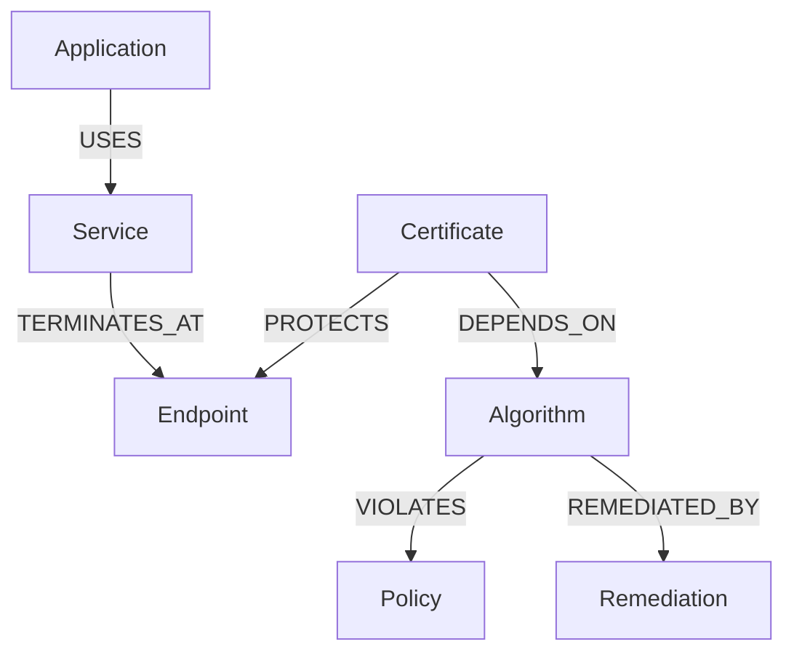

# ECDAT Phase 7.1: Canonical Crypto Asset Model & Knowledge Graph

## 1. Overview

Phase 7.1 defines ECDAT's unified, canonical cryptographic asset inventory and knowledge graph. The model eliminates fragmentation across scanners and components by defining a single ontology of **22 canonical entity types**, **deterministic collision-resistant URNs**, **strict provenance tracking**, and **first-class graph relationships**.

---

## 2. Supported Entity Types (All 22 Covered)

The canonical model covers the complete cryptographic topology across code, dependencies, infrastructure, and governance:

| Entity Type | Category | Identifier Scheme | Key Attributes |
| :--- | :--- | :--- | :--- |
| **Application** | System Layer | `urn:ecdat:v1:asset:<tenant>:<app>:application:<digest>` | Name, environment, business criticality |
| **Service** | System Layer | `urn:ecdat:v1:asset:<tenant>:<app>:service:<digest>` | Service name, API boundaries, endpoints |
| **Repository** | Code Layer | `urn:ecdat:v1:asset:<tenant>:<app>:repository:<digest>` | Git URL, default branch, commit hash |
| **File** | Code Layer | `urn:ecdat:v1:asset:<tenant>:<app>:file:<digest>` | Path, size, hash, programming language |
| **Function** | Code Layer | `urn:ecdat:v1:asset:<tenant>:<app>:function:<digest>` | Function/method name, signature, line range |
| **Dependency** | Supply Chain | `urn:ecdat:v1:asset:<tenant>:<app>:dependency:<digest>` | Package name, version, PURL, ecosystem |
| **Crypto Library** | Supply Chain | `urn:ecdat:v1:asset:<tenant>:<app>:crypto_library:<digest>` | Library name, version, capabilities, FIPS status |
| **Algorithm** | Cryptographic | `urn:ecdat:v1:asset:<tenant>:<app>:algorithm:<digest>` | Standard name, primitive type, quantum level |
| **Key Metadata** | Cryptographic | `urn:ecdat:v1:asset:<tenant>:<app>:key_metadata:<digest>` | Algorithm, key size, curve, key state, rotation |
| **Certificate** | Cryptographic | `urn:ecdat:v1:asset:<tenant>:<app>:certificate:<digest>` | Subject, issuer, validity, SAN, fingerprint |
| **Protocol** | Network | `urn:ecdat:v1:asset:<tenant>:<app>:protocol:<digest>` | Protocol name, version, cipher suites |
| **Endpoint** | Network | `urn:ecdat:v1:asset:<tenant>:<app>:endpoint:<digest>` | Host, port, protocol, network zone |
| **Container** | Infrastructure | `urn:ecdat:v1:asset:<tenant>:<app>:container:<digest>` | Image digest, container ID, layers |
| **Host** | Infrastructure | `urn:ecdat:v1:asset:<tenant>:<app>:host:<digest>` | Hostname, IP address, OS, kernel version |
| **Runtime Process** | Runtime | `urn:ecdat:v1:asset:<tenant>:<app>:runtime_process:<digest>` | PID, process name, command line, container |
| **Data Asset** | Data | `urn:ecdat:v1:asset:<tenant>:<app>:data_asset:<digest>` | Data classification, storage type, lifetime |
| **Owner** | Governance | `urn:ecdat:v1:asset:<tenant>:<app>:owner:<digest>` | Owner name, team, email, business unit |
| **Environment** | Governance | `urn:ecdat:v1:asset:<tenant>:<app>:environment:<digest>` | Tier (prod, staging, dev), network exposure |
| **Policy** | Governance | `urn:ecdat:v1:asset:<tenant>:<app>:policy:<digest>` | Policy profile, threshold, regulatory mandates |
| **Finding** | Risk & Security | `urn:ecdat:v1:finding:<tenant>:<app>:<digest>` | Rule ID, severity, confidence, evidence |
| **Risk** | Risk & Security | `urn:ecdat:v1:asset:<tenant>:<app>:risk:<digest>` | Classical score, quantum relevance, Mosca status |
| **Remediation** | Operations | `urn:ecdat:v1:asset:<tenant>:<app>:remediation:<digest>` | Action type, target algorithm, complexity, priority |

---

## 3. Supported Canonical Graph Relationships

The model supports explicit graph edges:

- `USES`: Software layer uses a lower-level service, library, or function.
- `PROTECTS`: Security mechanism (certificate, cipher) protects an endpoint, channel, or data asset.
- `PRESENT_IN`: Asset is located inside a file, container layer, or repository.
- `DEPENDS_ON`: Software or protocol mechanism depends on a library or primitive.
- `OBSERVED_BY`: Observation was made by a specific scanner, uprobe, or network probe.
- `TERMINATES_AT`: Protocol or service terminates at a specific network endpoint.
- `OWNED_BY`: Asset is owned by a specific team, custodian, or business unit.
- `VIOLATES`: Cryptographic configuration violates a defined policy profile rule.
- `REMEDIATED_BY`: Identified risk or weak mechanism is remediated by an action plan.

---

## 4. Provenance Tracking

Every object retains an immutable `ProvenanceRecord`:
- `scanner_name`: Name of discovery engine (e.g. `ecdat-ast-scanner`, `ecdat-ebpf-agent`)
- `scanner_version`: Exact semantic version
- `source_kind`: Discovery origin (e.g. `source_code`, `network_handshake`, `runtime_uprobe`)
- `locator`: Normalized locator path or URI
- `confidence`: `HIGH`, `MEDIUM`, or `LOW`
- `timestamp`: UTC ISO 8601 timestamp
- `scan_configuration`: Execution configuration parameters
- `hash_or_fingerprint`: Cryptographic SHA-256 fingerprint of backing source where safe
