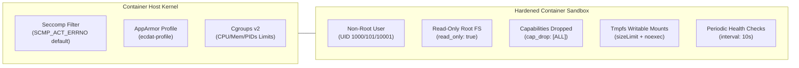

# ECDAT Production Container Hardening Specification (Phase 24.1)

## 1. Architectural Overview

Production containers in ECDAT are hardened to achieve defense-in-depth isolation, adhering to CIS Docker Benchmarks, NIST SP 800-190, and Kubernetes Restricted Pod Security Standards.



---

## 2. Hardening Invariants & Implementations

### 1. Minimal Base Images
* **Implementation**: All production Dockerfiles strictly use minimal base images (`alpine`, `slim`) pinned to immutable SHA-256 cryptographic digests:
  * `backend/Dockerfile`: `node:20-alpine@sha256:20a068eb0d0891d1e43e263c9db862ecbe6ff4ad599f6aa6a188be2849896796`
  * `frontend/Dockerfile`: Multi-stage builder (`node:20-alpine`) and runtime (`nginx:alpine@sha256:28929e7c5b6b19a0a2df3324c43ee7d76ee676b744d0c1154c1ff06a13241b44`)
  * `docker/scanner.Dockerfile`: `python:3.12-slim@sha256:606e12e753bf88a444a8fbbfd65dfae87740e53a2588eec86ad6077ff6e20796`
  * `postgres`: `postgres:16-alpine@sha256:d8b2d131f4228943799cb3638421b8fbf4c68c6a0b271d47190d7ad824a7374b`

### 2. Non-Root Users
* **Implementation**:
  * Backend runs as `USER node` (UID 1000:1000).
  * Frontend Nginx runs as `USER nginx` (UID 101:101).
  * Scanner engine runs as dedicated non-root user `USER ecdat` (UID 10001:10001).
  * Postgres runs as `user: "70:70"`.
  * Kubernetes manifests enforce `runAsNonRoot: true` at the Pod level.

### 3. Read-Only Root Filesystem
* **Implementation**:
  * `read_only: true` is configured in `docker-compose.yml` across all services.
  * In Kubernetes: `securityContext.readOnlyRootFilesystem: true`.
  * Ephemeral runtime data is confined to isolated `tmpfs` mounts with `noexec,nosuid,nodev` flags:
    * Backend: `/tmp` (64MB)
    * Frontend Nginx: `/tmp` (32MB), `/var/cache/nginx` (32MB), `/var/run` (8MB)
    * Scanner: `/tmp` (128MB)

### 4. Dropped Linux Capabilities
* **Implementation**:
  * Every container drops **all** Linux capabilities unconditionally:
    ```yaml
    cap_drop:
      - ALL
    ```
  * In Kubernetes:
    ```yaml
    securityContext:
      capabilities:
        drop:
          - ALL
    ```
  * Frontend Nginx binds to port `8080` (unprivileged), eliminating any requirement for `CAP_NET_BIND_SERVICE`.

### 5. Seccomp Syscall Filtering
* **Implementation**:
  * Production seccomp profile: [`docker/security/seccomp-profile.json`](docker/security/seccomp-profile.json)
  * Default action: `SCMP_ACT_ERRNO` (blocks all unwhitelisted system calls).
  * Blocked dangerous syscalls include: `ptrace`, `sys_admin`, `bpf`, `reboot`, `mount`, `kexec_load`, `open_by_handle_at`, `process_vm_readv`, `process_vm_writev`.
  * Docker Compose configures `seccomp=docker/security/seccomp-profile.json`; `seccomp:unconfined` is strictly forbidden.
  * Kubernetes enforces `seccompProfile.type: RuntimeDefault`.

### 6. AppArmor & SELinux Hardening
* **Implementation**:
  * Custom AppArmor profile: [`docker/security/apparmor-ecdat.profile`](docker/security/apparmor-ecdat.profile)
  * Denies raw network socket creation (`deny network raw`).
  * Denies write operations to system binary and library paths (`/bin/**`, `/sbin/**`, `/usr/**`, `/etc/**`).
  * Enforces `security_opt: [no-new-privileges:true]` across all containers to block setuid/setgid binary escalation.

### 7. Resource Limits & Fork Bomb Protection
* **Implementation**:
  * Strict CPU and Memory limits + reservations on all containers:
    * `backend`: CPU limit 1.0 (250m request), Memory limit 512MB (128MB reservation).
    * `frontend`: CPU limit 0.5 (100m request), Memory limit 128MB (64MB reservation).
    * `scanner`: CPU limit 1.5 (500m request), Memory limit 1024MB (256MB reservation).
    * `postgres`: CPU limit 1.0, Memory limit 512MB.
  * PIDs limits: `pids_limit: 50-150` on every Compose service to prevent thread/process exhaustion fork bombs.

### 8. Health Checks & Probes
* **Implementation**:
  * Dockerfiles define built-in `HEALTHCHECK` instructions.
  * `docker-compose.yml` configures `interval: 5-10s`, `timeout: 3-5s`, `retries: 3-20`, and `start_period`.
  * Kubernetes manifests declare `livenessProbe` and `readinessProbe` with HTTP endpoints.

### 9. No Privileged Mode
* **Implementation**:
  * `privileged: false` explicitly declared on all services.
  * In Kubernetes: `allowPrivilegeEscalation: false` and `privileged: false`.
  * Audited automatically by `ContainerHardeningAuditor`.

### 10. No Host Networking
* **Implementation**:
  * All services run in isolated software-defined bridge networks (`edge` and `data`).
  * The database network is internal (`internal: true`), completely unreachable from the external host network.
  * The offline scanner operates with `network_mode: none` for zero network access.
  * In Kubernetes: `hostNetwork: false`, `hostPID: false`, and `hostIPC: false`.

---

## 3. Automated Container Hardening Auditor

The programmatic audit tool [`scanners/container_hardening_auditor.py`](scanners/container_hardening_auditor.py) continuously inspects all container artifacts:

```bash
python scanners/container_hardening_auditor.py
```

### Audit Output:
```text
==========================================================
  ECDAT PRODUCTION CONTAINER HARDENING AUDIT (PHASE 24.1)
==========================================================
Overall Compliance Score : 100.0%
Status                   : ALL HARDENED (PASS)

[PASS] DOCKERFILE: backend/Dockerfile (100.0%)
[PASS] DOCKERFILE: frontend/Dockerfile (100.0%)
[PASS] DOCKERFILE: docker/scanner.Dockerfile (100.0%)
[PASS] COMPOSE: docker-compose.yml (100.0%)
[PASS] KUBERNETES: deploy/k8s/backend.yaml (100.0%)
[PASS] KUBERNETES: deploy/k8s/frontend.yaml (100.0%)
[PASS] KUBERNETES: deploy/k8s/scanner-cronjob.yaml (100.0%)
```

---

## 4. Verification Matrix

| Test Suite | Focus Area | Tests | Result |
|---|---|---|---|
| **Python Pytest** | [`tests/test_container_hardening.py`](tests/test_container_hardening.py) | **7 / 7** | **PASS** (0.06s) |
| **Node.js Test** | [`backend/tests/security/container_hardening.test.js`](backend/tests/security/container_hardening.test.js) | **9 / 9** | **PASS** (86ms) |
| **Release Gate** | [`scripts/release_gate.py`](scripts/release_gate.py) | **All 6 Gates** | **PASS** (code 0) |
