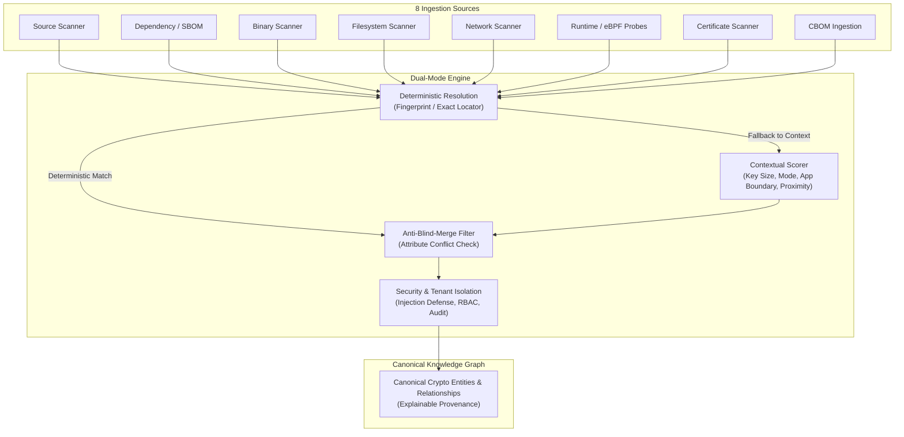

# ECDAT Phase 7.2: Evidence Correlation Engine

## 1. Overview

The **ECDAT Evidence Correlation Engine** connects disparate cryptographic signals discovered across 8 distinct layers of the software supply chain, infrastructure, and runtime into a unified, high-fidelity knowledge graph.

It solves the fundamental challenge of multi-scanner crypto discovery: **evidence fragmentation without false conflation**.



---

## 2. Ingestion from 8 Discovery Origins

The correlation engine natively ingests and normalizes findings from all 8 evidence sources:

| Origin | Typical Signal Ingested | Deterministic Key | Contextual Attributes |
| :--- | :--- | :--- | :--- |
| **`source`** | AST & pattern detections in code | Exact file locator | Key size, algorithm, mode, function |
| **`dependency`** | SBOM package declarations & PURLs | PURL, package hash | Library version, crypto capability |
| **`binary`** | Symbol table & string fingerprinting | Binary SHA-256 | Exported symbols, crypto provider |
| **`filesystem`** | Discovered keys, keystores, configs | File SHA-256, path | Key format, permissions, owner |
| **`network`** | TLS handshakes, cipher suites, SSH | Endpoint (host:port) | Certificate fingerprint, protocol |
| **`runtime`** | Live uprobe/kprobe crypto execution | PID + loaded lib | Active algorithm, key size, call count |
| **`certificate`** | X.509 / PKI certificate parsing | Certificate SHA-256 | Subject, SAN, issuer, validity |
| **`cbom`** | CycloneDX 1.6 CBOM imports | CBOM bom-ref, PURL | Cryptographic properties, dependencies |

---

## 3. Anti-Blind-Merge Rules

A major anti-pattern in security asset management is **blind merging**: collapsing two findings together simply because they share a common name (e.g., merging all findings named `RSA` or `AES`). This creates catastrophic blind spots—such as masking an insecure RSA-1024 key behind an approved RSA-2048 implementation.

### Invariants:
1. **Attribute Conflict Rejection**:
   - If an existing entity and incoming evidence have conflicting key lengths (e.g., 1024 vs 2048), merge is **strictly forbidden**.
   - If cipher modes or curves conflict (e.g., AES-ECB vs AES-GCM, P-256 vs P-384), merge is rejected.
2. **Application Boundary Guard**:
   - Entities belonging to distinct applications or tenants cannot be merged contextually unless an explicit shared service or dependency relationship exists.
3. **Threshold Gate**:
   - Contextual score must meet or exceed `min_correlation_confidence` (default: `0.65`).

---

## 4. Dual-Mode Resolution: Deterministic vs Confidence-Scored

### 4.1 Deterministic Resolution
When cryptographic assets possess immutable identifiers, correlation is resolved deterministically with `confidence = 1.0`:
- **Cryptographic Fingerprints**: Exact matching on SHA-256 certificate thumbprint, binary hash, or key fingerprint.
- **Exact Canonical Locators**: Matching identical file path and entity type within the same application boundary.

### 4.2 Confidence-Scored Contextual Correlation
When deterministic anchors are absent, the engine applies weighted multi-attribute contextual scoring:

$$\text{Confidence Score} = w_{\text{keysize}} + w_{\text{mode}} + w_{\text{app}} + w_{\text{locator}}$$

- **Matching Key Size**: $+0.30$ (conflicting key size immediately sets score to $0.0$)
- **Matching Mode / Curve**: $+0.25$
- **Shared Application Boundary**: $+0.25$
- **Locator Proximity / Co-location**: $+0.20$

If the resulting score $\ge 0.65$, the evidence is merged into the canonical entity and the rationale is appended to the entity's provenance.

---

## 5. Explainable Provenance: "Why does ECDAT believe this relationship exists?"

Every relationship edge in the graph and every merged evidence item maintains an explicit, human- and machine-readable explanation.

### Example Relationship Justification
```json
{
  "source_id": "urn:ecdat:v1:asset:bank_corp:payment_svc:runtime_process:pid_4321",
  "target_id": "urn:ecdat:v1:asset:bank_corp:payment_svc:algorithm:b966741427a20b51",
  "relationship_type": "USES",
  "confidence": "HIGH",
  "properties": {
    "why_ecdat_believes_this_exists": "Live eBPF uprobe observed PID 4321 executing cryptographic operation for ChaCha20-Poly1305.",
    "evidence_source": "runtime"
  }
}
```

### Example Evidence Correlation Rationale
```json
{
  "why_ecdat_believes_this_exists": "Correlated evidence from binary with AES. Justification: Matching key size (256 bits); Matching mode/curve (GCM); Shared application boundary (checkout_service); Co-located source artifact (confidence: 1.00).",
  "evidence_origin": "binary",
  "correlation_confidence": 1.0,
  "matched_at": 1773482340000
}
```

---

## 6. Graph Security & Governance

### 6.1 Graph Injection Prevention
- **Illegal Character Filtering**: Entity names containing delimiter injections, script tags, control characters, or path escapes (e.g. `<script>`, `;`, `\x00-\x1f`) are rejected immediately with `GraphSecurityViolation`.
- **Self-Referential Loop Prevention**: Edges where `source_id == target_id` are rejected to prevent cyclic traversal attacks.

### 6.2 Tenant Isolation
- Graph data is strictly partitioned by `tenant_id`.
- Attempts to ingest entities with a foreign tenant ID or query graph elements across tenants trigger a security breach exception and are recorded in the audit log.

### 6.3 Query Authorization & Audit Trail
- Sensitive queries (such as `sensitive_inspect`, `export_secrets`, `query_private_keys`, `query_certificates`) require authorized roles: `security_analyst`, `admin`, or `auditor`.
- Every query attempt—authorized or unauthorized—is logged to the structured audit log with actor ID, action, timestamp, target, and authorization status.

---

## 7. Verification & Parity

Implemented in both Python (`scanners/domain/correlation_engine.py`) and Node.js (`backend/src/domain/correlation_engine.js`).

- **Python Tests**: [tests/domain/test_correlation_engine.py](file:///c:/Users/Jeevan%20c/Documents/ECDAT/tests/domain/test_correlation_engine.py) (7 passing tests)
- **Node.js Tests**: [backend/tests/domain/correlation_engine.test.js](file:///c:/Users/Jeevan%20c/Documents/ECDAT/backend/tests/domain/correlation_engine.test.js) (8 passing tests)
- **Full Python Suite**: 225 passing tests
- **Full Node.js Suite**: 160 passing tests
- **Total Passing Tests**: 385 passing tests across ECDAT
