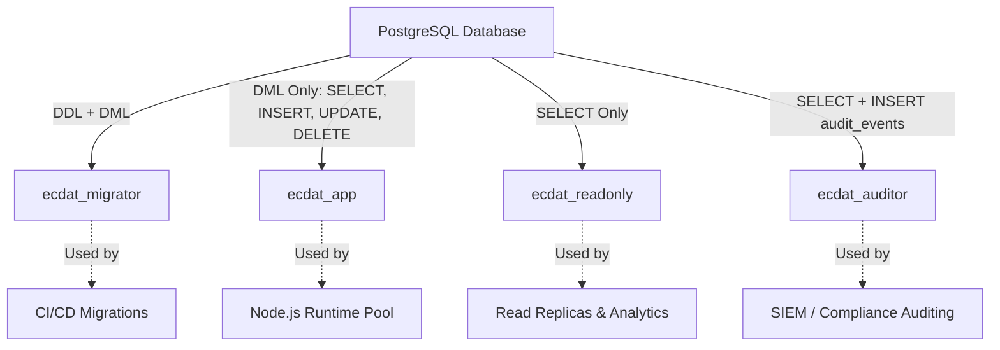

# ECDAT Database Security & Access Hardening (Phase 16.2)

## 1. Executive Summary & Security Objectives

ECDAT stores critical cryptographic posture data, bills of materials (CBOM/SBOM), vulnerability findings, and external integration configurations. Phase 16.2 establishes comprehensive database security hardening to defend against SQL injection, unauthorized cross-tenant data access, privilege escalation, and database resource exhaustion.

### Core Security Controls
1. **Parameterized Queries**: All database queries strictly utilize parameter binding. Raw string interpolation is prohibited.
2. **Least-Privilege Database Roles**: Separation of migration DDL privileges (`ecdat_migrator`) from runtime application DML (`ecdat_app`), read-only replicas (`ecdat_readonly`), and audit collectors (`ecdat_auditor`).
3. **Automated Migration Lifecycle**: Versioned schema migrations in [`backend/src/db/migrations/`](backend/src/db/migrations/) with programmatic rollback and verification.
4. **Encrypted Backups**: Logical database snapshots encrypted using AES-256-GCM with SHA-256 cryptographic checksums.
5. **Data Retention & Batched Pruning**: Configurable lifecycle retention windows with chunked deletions to prevent table locking.
6. **Audit Event Logging**: Tamper-resistant database audit trails with automated secret scrubbing.
7. **Security & Performance Indexes**: Composite indexes on `(project_id, created_at)`, `(scan_id, highest_severity)`, and `(scan_id, at_quantum_risk)`.
8. **Query Limits & Statement Timeouts**: Hardened query bounding (default limit: 50, maximum limit: 500) and connection statement timeouts (10s) preventing denial of service.
9. **Safe Connection Handling**: Connection pooling with eviction bounds and sanitization of database errors to prevent credential or topology leakage.

---

## 2. Parameterized Queries & Injection Defense

### Mandatory Parameter Binding
All queries constructed via Knex automatically generate parameterized statements with parameter placeholders (`$1`, `$2`, etc. in PostgreSQL) and isolated binding vectors:

```javascript
// SAFE: Parameterized Query
const rows = await db("scans")
  .where({ target_name: userInput })
  .select("id", "target_name", "status");
// Generates: SELECT id, target_name, status FROM scans WHERE target_name = $1 [userInput]
```

### Safe Raw Query Execution (`safeRaw`)
When raw SQL queries are required, [`backend/src/db/secure_query.js`](backend/src/db/secure_query.js) enforces strict parameterization:
- Validates that the number of `?` placeholders matches the parameter bindings array.
- Disallows semicolon-separated multi-statement executions (`ERR_MULTIPLE_STATEMENTS`).

### Injection Detection Engine
`detectSqlInjection()` scans inputs for classic and advanced SQL injection patterns (e.g. `' OR '1'='1`, `UNION SELECT`, comment injection `--`, and administrative commands `DROP`, `ALTER`, `TRUNCATE`).

---

## 3. Least-Privilege Database Roles

ECDAT implements role-based access control at the database engine level. Production deployments must not run as `postgres` or `superuser`.

### Role Architecture


| Role Name | Scope | Permitted SQL Commands | Denied Operations |
|---|---|---|---|
| `ecdat_migrator` | Schema Migrations | `CREATE`, `ALTER`, `DROP`, `CREATE INDEX`, `SELECT`, `INSERT`, `UPDATE`, `DELETE` | Superuser privileges |
| `ecdat_app` | Backend Application Pool | `SELECT`, `INSERT`, `UPDATE`, `DELETE` | `DROP`, `ALTER`, `TRUNCATE`, `CREATE TABLE` (No DDL) |
| `ecdat_readonly` | Reporting & Analytics | `SELECT` | `INSERT`, `UPDATE`, `DELETE`, `DROP` |
| `ecdat_auditor` | Security & Audit | `SELECT` on all tables, `INSERT` on `database_audit_events` | DDL, `UPDATE`, `DELETE` |

### Role Provisioning Script
ECDAT generates a ready-to-run PostgreSQL provisioning script via `generateLeastPrivilegeSql()` or via `GET /api/v1/security/database/least-privilege-roles`.

---

## 4. Database Migrations & Security Indexing

Schema evolution is tracked using Knex migrations under [`backend/src/db/migrations/`](backend/src/db/migrations/):

- **`20260905000000_create_ecdat_schema.js`**: Core tables (`scans`, `cboms`, `assets`, `components`, `findings`, `risk_assessments`, `recommendations`, `scan_errors`, `policy_profiles`, `rule_versions`).
- **`20260914000001_database_security_hardening.js`**: Security audit log table and composite indexes.

### Security & Performance Index Matrix
To eliminate unindexed full table scans and speed up tenant-isolated queries:

| Index Name | Table | Columns | Purpose |
|---|---|---|---|
| `idx_scans_project_created` | `scans` | `(project_id, created_at)` | Fast project/tenant scan history & pagination |
| `idx_assets_scan_severity` | `assets` | `(scan_id, highest_severity)` | Rapid critical finding filtering per scan |
| `idx_assets_scan_quantum` | `assets` | `(scan_id, at_quantum_risk)` | Mosca quantum risk filtering |
| `idx_findings_scan_algo_keysize` | `findings` | `(scan_id, algorithm, key_size)` | Cryptographic inventory discovery lookups |
| `idx_cboms_created_at` | `cboms` | `(created_at)` | Retention policy cutoff pruning |
| `idx_scan_errors_created_at` | `scan_errors` | `(created_at)` | Diagnostic error log pruning |
| `idx_audit_event_created` | `database_audit_events` | `(event_type, created_at)` | Audit trail query and event filtering |
| `idx_audit_actor_created` | `database_audit_events` | `(actor, created_at)` | Forensic actor investigation |

---

## 5. Encrypted Database Backups

Database backups are managed by [`backend/src/db/backup_service.js`](backend/src/db/backup_service.js):

### Backup Lifecycle
1. **Extraction**: Collects application tables into a structured logical snapshot.
2. **Encryption**: Encrypts the snapshot using AES-256-GCM (`enc:v1:<kid>:<iv>:<tag>:<ciphertext>`) with Additional Authenticated Data (AAD) bound to the backup ID.
3. **Integrity Checksum**: Generates a SHA-256 cryptographic digest over the ciphertext.
4. **Verification**: `verifyBackupIntegrity(backupId)` validates the SHA-256 digest and tests authenticated decryption before any restore attempt.
5. **Restoration**: `restoreFromBackup(client, backupId)` executes in an atomic transaction; if any table restoration fails, the entire transaction rolls back.

---

## 6. Data Retention Policy & Automated Pruning

To comply with data privacy regulations (GDPR, SOC 2, HIPAA) and prevent unbounded database growth, ECDAT defines automated retention windows:

| Entity | Default Retention | Environment Variable |
|---|---|---|
| `scans` | 90 days | `RETENTION_SCANS_DAYS` |
| `cboms` | 90 days | Follows scan retention (cascade delete) |
| `scan_errors` | 30 days | `RETENTION_SCAN_ERRORS_DAYS` |
| `database_audit_events` | 365 days | `RETENTION_AUDIT_LOGS_DAYS` |
| `vulnerability_correlations` | 180 days | Configurable |

### Batched Deletion Mechanism
To prevent transaction locks on large tables:
- Pruning runs in configurable chunks (`batchSize: 500`).
- Supports `dryRun: true` mode to preview eligible records without deleting data.
- Emits a `DATA_PRUNED` audit event logging the cutoff date and record count.

---

## 7. Database Audit Event Logging

Every critical database mutation is logged to `database_audit_events`:

### Event Taxonomy
- `SCAN_INGESTED`: New scan and CBOM persisted.
- `SCAN_DELETED`: Specific scan removed.
- `ALL_SCANS_CLEARED`: Administrative bulk scan deletion.
- `DATA_PRUNED`: Scheduled retention cleanup.
- `BACKUP_CREATED` / `BACKUP_RESTORED` / `BACKUP_VERIFIED`: Backup lifecycle events.
- `SECURITY_VIOLATION`: Injection attempt or unauthorized query detected.

### Automated Secret Scrubbing
Before any event is recorded, `details` is automatically processed through `scrubSecrets()`. Private key headers, raw key fields, and passwords are permanently redacted from the audit trail (`[REDACTED_PROHIBITED_PRIVATE_KEY]`).

---

## 8. Query Limits & Safe Connection Handling

### Query Bounding (`applyQueryBounds`)
- **Default Limit**: 50 records.
- **Maximum Limit**: 500 records.
- Query bounds are applied to all listing endpoints to prevent memory exhaustion and DoS.

### Safe Connection Configuration
- `acquireConnectionTimeout: 10000` (10 seconds)
- `idleTimeoutMillis: 30000` (30 seconds)
- `statement_timeout: 10000` (10-second statement limit per query)
- `sanitizeDbError()` masks connection strings, passwords, and internal IP/port combinations from error messages.

---

## 9. REST API Reference

ECDAT exposes dedicated database security endpoints under `/api/v1/security/database/`:

| Method | Endpoint | Description |
|---|---|---|
| `GET` | `/api/v1/security/database/least-privilege-roles` | Returns role definitions and SQL provisioning script |
| `GET` | `/api/v1/security/database/audit-logs` | Queries database audit events with bounded pagination |
| `GET` | `/api/v1/security/database/retention-policy` | Returns configured retention windows |
| `POST` | `/api/v1/security/database/prune` | Triggers retention pruning (supports `dryRun: true`) |
| `POST` | `/api/v1/security/database/backups` | Creates an AES-256-GCM encrypted database backup |
| `GET` | `/api/v1/security/database/backups` | Lists all available backup manifests |
| `POST` | `/api/v1/security/database/backups/:id/verify` | Verifies backup archive checksum and authenticity |
| `POST` | `/api/v1/security/database/test-query` | Tests parameterized query execution against SQL injection |
