# ECDAT Evidence Integrity & Audit Attestation (Phase 26.3)

## 1. Executive Summary & Core Philosophy

Phase 26.3 establishes the **Evidence Integrity and Audit Attestation Subsystem** across all ECDAT reporting engines (Node.js backend and Python scanning core).

In enterprise cryptographic governance, reports are frequently submitted to external auditors, regulatory examiners, and executive risk boards. To eliminate tampering, ambiguity, or false assurances, ECDAT enforces two foundational pillars:

1. **Cryptographic Provenance**: Every report embeds canonical SHA-256 fingerprints, configuration digests, policy hashes, CBOM references, and chained evidence Merkle roots.
2. **The Anti-Deception Mandate**: **Never imply independent audit/certification unless actually obtained.** Reports are explicitly designated as internal automated scanner evaluations by default, backed by mandatory disclaimer banners and automated anti-misrepresentation filters.

```mermaid
graph TD
    REPORT[ECDAT Cryptographic Report]

    subgraph "Mandatory Identification"
        P1["1. Scan Timestamp<br/>(ISO-8601 UTC)"]
        P2["2. ECDAT Version<br/>(Semantic Version)"]
        P3["3. Scanner Versions<br/>(AST, Uprobe, TLS, SBOM)"]
        P4["4. Configuration<br/>(Config Snapshot + SHA-256 Hash)"]
        P5["5. Policy Version<br/>(Profile + Rules + SHA-256 Hash)"]
        P6["6. CBOM Version<br/>(Spec Version + SHA-256 Hash)"]
    end

    subgraph "Cryptographic Fingerprinting"
        H1["Report Payload SHA-256"]
        H2["Evidence Chained Merkle Root"]
        H3["Canonical Fingerprint (SHA256:...)"]
    end

    subgraph "Anti-Deception Guard"
        AD1["Status: UNATTESTED_AUTOMATED_EVALUATION"]
        AD2["Independent Audit: false (default)"]
        AD3["Scan Prohibited Claim Filter"]
        AD4["Mandatory Disclaimer Notice Banner"]
    end

    REPORT --> P1 & P2 & P3 & P4 & P5 & P6
    REPORT --> H1 & H2 & H3
    REPORT --> AD1 & AD2 & AD3 & AD4
```



---

## 2. The Six Mandated Metadata Dimensions

Every executive report (`/api/v1/reports/executive`) and technical drill-down report (`/api/v1/reports/technical`) strictly includes the `evidence_integrity` block containing:

### 1. Scan Timestamp (`scan_timestamp`)
- **Format**: ISO-8601 UTC formatted string (e.g. `2026-09-17T02:13:04.120Z`).
- **Purpose**: Establishes temporal anchoring and chronological ordering for compliance audits.

### 2. ECDAT Version (`ecdat_version`)
- **Format**: Semantic version string (e.g. `1.0.0`).
- **Purpose**: Identifies the exact platform build and risk calculus heuristics used during discovery.

### 3. Scanner Versions (`scanner_versions`)
- **Format**: Key-value map of all active detection engines:
  ```json
  {
    "static_tree_sitter_ast": "1.0.0",
    "network_tls_prober": "1.0.0",
    "ebpf_runtime_tracer": "1.0.0",
    "syft_sbom_scanner": "1.0.0",
    "cbom_generator": "1.0.0"
  }
  ```
- **Purpose**: Ensures reproducibility across heterogeneous modalities (static AST parsing, dynamic eBPF kernel hooks, socket probing).

### 4. Configuration & Digest (`configuration`)
- **Components**:
  - `config_hash_sha256`: 64-character lowercase SHA-256 hex digest of the canonical active configuration.
  - `environment`: Operating environment (`production`, `staging`).
  - `strict_enforcement`: Boolean flag indicating whether failing policies block CI/CD.
  - `zero_secrets_redaction`: Boolean verifying automated token and key redaction.
  - `pqc_migration_target_year`: Year parameter for Mosca quantum deficit calculus (`2033`).

### 5. Policy Version & Digest (`policy_version`)
- **Components**:
  - `profile_id`: Evaluated governance profile (e.g. `regulated_bfsi`, `cnsa_strict`).
  - `version`: Policy semantic version (e.g. `1.0.0`).
  - `policy_hash_sha256`: 64-character SHA-256 digest of active policy rules and constraints.
  - `frameworks`: List of referenced compliance standards (`NIST SP 800-131A Rev 2`, `PCI-DSS v4.0`, `BSI TR-02102-1`, `FIPS 140-3`).

### 6. CBOM Version & Digest (`cbom_version`)
- **Components**:
  - `spec_version`: Standard CBOM specification (e.g. `CycloneDX 1.6`).
  - `cbom_schema_version`: Active schema specification (`1.6`).
  - `cbom_serial_number`: Unique URN identifier (`urn:uuid:3e671687-395b-41f5-a30f-a58921a69b79`).
  - `cbom_sha256`: 64-character SHA-256 hash of the generated or ingested Cryptographic Bill of Materials.

---

## 3. Cryptographic Hashes & Fingerprints

To prevent undetectable report tampering:
- **`report_payload_sha256`**: Deterministic canonical SHA-256 digest calculated over the serialized content of the report.
- **`evidence_merkle_root`**: Merkle root tree digest calculated recursively across all individual finding evidence items and code snippets.
- **`canonical_fingerprint`**: Prefixed fingerprint (`SHA256:<hash>`) suitable for physical report header printing and digital verification.

---

## 4. Anti-Deception Policy: Independent Audit & Certification Guard

### The Core Rule
> **"Never imply independent audit/certification unless actually obtained."**

Organizations must not mislead stakeholders into believing an automated internal tool output is an official third-party audit, Common Criteria certificate, or accredited laboratory evaluation.

### Policy Enforcement Mechanics

1. **Default Attestation State**:
   All reports automatically set:
   ```json
   "independent_attestation": {
     "independent_audit_obtained": false,
     "certification_status": "UNATTESTED_AUTOMATED_EVALUATION",
     "attestation_statement": "AUTOMATED SCANNER EVALUATION ONLY: This report is generated automatically by ECDAT and reflects automated scanner outputs, heuristic static analysis, and dynamic observation. It does NOT constitute an independent third-party audit, formal certification, or accredited Common Criteria / FIPS 140-3 laboratory evaluation. No independent external certification has been obtained for this assessment.",
     "auditor_identity": null,
     "accreditation_body": null,
     "attestation_valid_until": null,
     "disclaimer_mandatory": true
   }
   ```

2. **Automated Prohibited Claim Filter**:
   When `independent_audit_obtained` is `false`, the validator recursively inspects all text fields, banners, titles, and headers in the report. If any prohibited phrase is detected, validation **immediately fails**:
   - `"third-party certified"`
   - `"independently audited"`
   - `"fips 140-3 certified"`
   - `"common criteria certified"`
   - `"accredited audit complete"`
   - `"official third-party certification"`

3. **Mandatory Disclaimer Notice**:
   Every HTML and PDF report renders a prominent amber alert box:
   > ⚠️ **Notice of Automated Evaluation**: This report is generated automatically by ECDAT and reflects automated scanner outputs and heuristic cryptographic analysis. It does **not** constitute an independent third-party audit, formal certification, or accredited Common Criteria / FIPS 140-3 laboratory evaluation. No independent external certification has been obtained.

---

## 5. REST API Interface

| Method | Endpoint | Description |
| :--- | :--- | :--- |
| `POST` | `/api/v1/reports/integrity/verify` | Accepts `{ report }` or `{ scanId }` in request body and validates all 6 dimensions, hashes, and audit disclaimers. |
| `GET` | `/api/v1/reports/integrity/status` | Returns active system cryptographic baseline integrity parameters, scanner versions, and attestation status. |

### Sample Request: `POST /api/v1/reports/integrity/verify`
```bash
curl -X POST http://localhost:4000/api/v1/reports/integrity/verify \
  -H "Content-Type: application/json" \
  -H "X-API-Key: ecdat-demo-admin-key-2026" \
  -d '{"scanId": "scan_enterprise_core"}'
```

Response:
```json
{
  "verified": true,
  "violations": [],
  "details": {
    "ecdat_version": "1.0.0",
    "scan_timestamp": "2026-09-17T02:13:04.000Z",
    "report_fingerprint": "SHA256:6759dbfb20b0aa95079f8a2ce8d0878b5f4b304a1b9f086344d02a5291291e3e",
    "independent_audit_obtained": false,
    "certification_status": "UNATTESTED_AUTOMATED_EVALUATION"
  }
}
```

---

## 6. Python Engine & CLI

The Python reporting module includes verification commands:

```bash
# Print a canonical demonstration evidence integrity block
python scanners/reporting/evidence_integrity.py --demo

# Validate an existing JSON report against Phase 26.3 mandates
python scanners/reporting/evidence_integrity.py --verify-file report.json
```

---

## 7. CI/CD & Supply-Chain Release Gate Integration

Evidence integrity is enforced continuously by `scripts/release_gate.py` (Gate 3: Critical Security Tests):
- `tests/test_evidence_integrity.py` (9 Pytest tests verifying hash determinism, 6 dimensions, and anti-deception guards).
- `backend/tests/reporting/evidence_integrity.test.js` (8 Node.js tests verifying HTTP endpoints, schemas, and HTML notices).

Failure to identify all 6 metadata fields or attempting to imply unobtained third-party certifications strictly blocks software releases.
