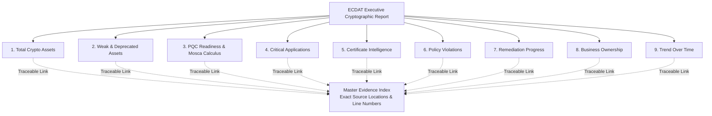

# ECDAT Enterprise Executive Reporting & Evidence Traceability (Phase 26.1)

## 1. Executive Summary & Philosophy

The **ECDAT Executive Reporting Subsystem** provides C-level executives, CISOs, and enterprise risk committees with an authoritative, holistic evaluation of organizational cryptographic health, quantum migration readiness, and compliance posture.

### The Traceability Mandate
> **"Every metric must be traceable to underlying evidence."**

Unlike traditional dashboards that display opaque aggregate counters, ECDAT enforces **100% cryptographic evidence linkage**. Every number, chart element, and trend trajectory in the executive report is backed by an explicit array of immutable `evidence_items` containing:
- Discovered finding ID (`finding_id`) or cryptographic asset ID (`asset_id`)
- Scan identifier (`scan_id`) and component reference (`component_id`)
- Precise source code location (`location:line_number`) or network endpoint URI
- Concrete code or configuration context (`evidence_context`)
- SHA-256 certificate fingerprint or artifact checksum (`fingerprint`)
- Detection modality (`detected_by`: AST parser, regex, network socket probe, Syft runner, or eBPF uprobe)

---

## 2. The Nine Core Report Domains



### Domain 1: Total Cryptographic Assets
- **Scope**: Comprehensive inventory of all cryptographic assets across software repositories, containers, and network endpoints.
- **Categorization**: Breakdown by `algorithms`, `keys`, `certificates`, `protocols`, and linked `libraries`.
- **Traceability**: Contains `evidence_items` mapping every single discovered asset to its source component.

### Domain 2: Weak & Deprecated Assets
- **Broken Primitives**: Algorithms with known theoretical or practical collision/pre-image attacks (`MD5`, `DES`, `RC4`, `SHA-0`).
- **Deprecated Primitives**: Algorithms retired by NIST/BSI standards (`SHA-1`, `3DES`, `Blowfish`).
- **Insufficient Key Lengths**: Asymmetric or symmetric keys failing minimum bit strength standards (`RSA < 2048`, `ECC < 224`, `DH < 2048`).
- **Legacy Protocols**: Obsolete transport security versions (`SSLv2`, `SSLv3`, `TLS 1.0`, `TLS 1.1`).
- **Traceability**: Granular list of findings including exact file path, line number, and code snippet.

### Domain 3: Post-Quantum Cryptography (PQC) Readiness
- **Primitive Classification**:
  - `quantum_vulnerable`: Public key algorithms broken by Shor's algorithm (RSA, ECDSA, ECDH, DSA).
  - `quantum_safe`: NIST-standardized post-quantum algorithms (ML-KEM, ML-DSA, SLH-DSA) and high-entropy symmetric ciphers (AES-256).
  - `hybrid`: Transitional dual-use algorithms (e.g. `X25519 + ML-KEM-768`).
- **Mosca's Theorem Calculus**:
  - Evaluates "Store Now, Decrypt Later" (SNDL) exposure:
    $$\Delta M = (T_{current} + T_{shelf} + T_{migrate}) - T_{collapse}$$
  - Default parameters: $T_{collapse} = 2033$, $T_{shelf} = 10 \text{ years}$, $T_{migrate} = 3 \text{ years}$.
  - Flags whether the enterprise is in **Quantum Deficit** ($\Delta M > 0$).

### Domain 4: Critical Business Applications
- **Application Tiers**:
  - `tier_0_mission_critical`: Payment processing, core banking, identity providers.
  - `tier_1_business_critical`: Order management, customer portals.
  - `tier_2_operational`: Internal analytics, reporting tools.
  - `tier_3_internal`: Staging, development utilities.
- **Blast Radius**: Calculates the count of dependent endpoints, data sensitivity classification, and business owner.

### Domain 5: Certificate Intelligence
- **Tracking**: X.509 certificate chains, Subject DN, Issuer DN, validity windows.
- **Anomalies**: Certificates expiring within 30 days, expired certificates, self-signed certificates, and weak signature algorithms (e.g., `SHA-1withRSA`).
- **Evidence**: SHA-256 fingerprints with verification links.

### Domain 6: Policy Violations
- **Compliance Frameworks**: Evaluates against five primary regulatory profiles:
  1. `NIST SP 800-131A Rev 2` (Disallowed algorithms & key sizes)
  2. `BSI TR-02102-1` (German Federal Office for Information Security cryptographic recommendations)
  3. `PCI-DSS v4.0` (Requirement 12.3.3 strong cryptography mandate)
  4. `CNSA 2.0` (US National Security Agency quantum-resistant algorithm timeline)
  5. `FIPS 140-3` (Approved cryptographic modes and modules)
- **Traceability**: Direct mapping between rule violations and source findings.

### Domain 7: Remediation Progress
- **Status Lifecycle**:
  - `open`: Identified, awaiting prioritization.
  - `planned`: Staged rollout roadmap defined.
  - `patch_generated`: Syntactic diff (`patch_diff`) produced by AST engine.
  - `under_review`: Submitted to approval workflow.
  - `risk_accepted`: Formal, cryptographically signed exception granted.
  - `verified`: Rescan confirmed remediation.
- **Metrics**: Overall remediation rate percentage, Mean Time to Remediate (MTTR in days).

### Domain 8: Business Ownership
- **Accountability**: Maps cryptographic risk to business units, application owners, and cost centers.
- **KPIs per Owner**: Total assets, critical/high findings, PQC readiness percentage, and SLA compliance.

### Domain 9: Trend Over Time
- **Historical Trajectory**: Multi-period historical posture tracking (total assets, weak assets, quantum-safe adoption, aggregate risk score).
- **Velocity Metrics**: Percentage reductions in weak assets and rate of PQC adoption.

---

## 3. API Reference

### 3.1 Get Executive Report (JSON)
```http
GET /api/v1/reports/executive?policyProfile=regulated_bfsi&scenario=baseline
```
- **Response**: Full structured JSON document with all 9 domains and the `evidence_index`.

### 3.2 Get Executive Report (Presentation HTML)
```http
GET /api/v1/reports/executive/html
```
- **Response**: Standalone, dark-mode, printable HTML dashboard featuring KPI scorecards, visual badges, and expandable evidence tables.

### 3.3 Download Executive Report (Attachment Export)
```http
GET /api/v1/reports/executive/export
```
- **Response**: Formatted JSON file attachment with header:
  `Content-Disposition: attachment; filename="ecdat_executive_report_<scan_id>.json"`

---

## 4. Python CLI Tool

The Python reporting module allows offline generation and programmatic verification of evidence traceability:

```bash
# Generate report and verify 100% evidence linkage
python scanners/reporting/executive_reporter.py --out executive_report.json
```

### CLI Verification Output
```text
>> [EXECUTIVE REPORTER] Status: SUCCESS
   Total Crypto Assets : 4
   Weak Assets         : 2
   PQC Readiness       : 50.0%
   Evidence Index      : 5 entries (100% Traceable)
   Report written to   : executive_report.json
```
