# ECDAT Final Quality Gate & Enterprise Release Qualification (Phase 27.2)

## 1. Executive Summary & Qualification Scope

Phase 27.2 defines and executes the **Final Quality Gate** for ECDAT, representing the formal release qualification across **17 mandatory verification domains**:

1. **Unit tests**: Cryptographic primitives, configuration schemas, and normalization algorithms.
2. **Integration tests**: KMS connectors (AWS, Azure, Vault), ticketing systems (Jira, ServiceNow), and CI scanners.
3. **E2E tests**: Discovery through multi-domain reporting (Executive, Technical, Evidence Integrity).
4. **Fuzz tests**: Parser resilience against corrupted, malformed, and out-of-boundary inputs.
5. **Adversarial tests**: Defensive resistance against hostile scanner attacks (Zip Slip, symlink loops, ReDoS).
6. **SAST**: Static AST semantic code analysis across 6 programming languages evaluated against the golden corpus.
7. **Dependency scan**: Multi-ecosystem software bill-of-materials and vulnerability auditing (OSV.dev, npm audit).
8. **Secret scan**: Deep codebase and artifact scanning ensuring zero hardcoded credentials or unredacted keys.
9. **Container scan**: Container hardening verification (non-root, read-only rootfs, dropped Linux capabilities).
10. **IaC scan**: Infrastructure-as-code Kubernetes manifests and Helm charts conforming to Pod Security Standards 'Restricted'.
11. **API security tests**: HTTP API hardening, rate limiting, authentication headers, and input validation.
12. **Authorization tests**: Strict RBAC role enforcement and tenant isolation (`tenant_id` query scoping).
13. **Performance benchmarks**: Scalability benchmarks confirming sub-linear memory and high throughput on large repositories.
14. **CBOM validation**: Complete lifecycle validation against the official CycloneDX 1.6 `cryptoProperties` schema.
15. **SBOM generation**: Automated dual generation of CycloneDX 1.6 and SPDX 2.3 SBOM artifacts.
16. **Reproducibility/provenance checks**: Cryptographic artifact signing with Ed25519 and SLSA v1.0 provenance generation.
17. **Documentation validation**: Comprehensive validation of all architecture, API, runbook, and audit documentation.

```mermaid
graph TD
    GATE[ECDAT Final Quality Gate - 17 Domains]

    subgraph "Testing & Verification"
        D1[1. Unit Tests]
        D2[2. Integration Tests]
        D3[3. E2E Tests]
        D4[4. Fuzz Tests]
        D5[5. Adversarial Tests]
        D6[6. SAST Golden Corpus]
    end

    subgraph "Security & Hardening"
        D7[7. Dependency Scan]
        D8[8. Secret Scan]
        D9[9. Container Hardening]
        D10[10. IaC K8s Standards]
        D11[11. API Security]
        D12[12. Authorization RBAC]
    end

    subgraph "Supply Chain & Governance"
        D13[13. Performance Benchmarks]
        D14[14. CBOM Lifecycle]
        D15[15. Dual SBOM Generation]
        D16[16. Provenance & Ed25519]
        D17[17. Documentation]
    end

    GATE --> D1 & D2 & D3 & D4 & D5 & D6
    GATE --> D7 & D8 & D9 & D10 & D11 & D12
    GATE --> D13 & D14 & D15 & D16 & D17

    D7 --> VULN[Vulnerability Declaration:<br/>19 Tracked Advisories<br/>0 Unaccepted Blockers<br/>NO Zero-Vuln Claims]
    D16 --> VERDICT[QUALIFIED FOR ENTERPRISE PRODUCTION]
```



---

## 2. Vulnerability Policy & Transparency Mandate

### The Core Mandates
> 1. **"No critical known vulnerability may remain without explicit documented risk acceptance."**
> 2. **"Do not claim 'zero vulnerabilities.'"**

ECDAT rejects security-through-obscurity and disingenuous "zero vulnerability" marketing claims. A real-world enterprise software stack incorporating development utilities, AST parsers, and multi-ecosystem runtimes contains known advisory findings that must be transparently managed.

### Empirical Vulnerability Inventory
- **Total Advisory Findings Identified**: `19`
- **Unaccepted CRITICAL Blockers**: `0`
- **Unaccepted HIGH Blockers**: `0`
- **Accepted HIGHs**: `0`
- **Tracked Remediations (Medium)**: `19` (development-only dependencies, mock redirect handlers, test harness tooling; exploitability in production runtime containers is zero)
- **Tracked Improvements (Low)**: `0`
- **Tampering Violations**: `0`

Every single finding item is formally tracked with CVE/GHSA identifiers, ecosystem mappings, exploitability assessments, and patch targets in `artifacts/security/ecdat_vulnerability_report.json`.

---

## 3. The 17 Qualification Domains

| # | Domain | Verification Tool / Script | Pass Criteria | Result |
| :-: | :--- | :--- | :--- | :-: |
| **1** | **Unit Tests** | `pytest tests/test_security_units.py ...` | All unit assertions pass with 0 errors | **PASS** |
| **2** | **Integration Tests** | `pytest tests/test_kms_connectors.py ...` | KMS, ticketing, and CI integrations succeed | **PASS** |
| **3** | **E2E Tests** | `node --test backend/tests/reporting/*.test.js` | Complete scan-to-report pipelines pass | **PASS** |
| **4** | **Fuzz Tests** | `pytest tests/test_fuzz_parsers.py ...` | Zero crash/panic on malformed inputs | **PASS** |
| **5** | **Adversarial Tests** | `pytest tests/test_adversarial_scanner.py ...` | Neutralizes Zip Slip, symlinks, ReDoS attacks | **PASS** |
| **6** | **SAST** | `pytest tests/test_golden_corpus.py ...` | 100% golden corpus recall on deprecated algorithms fixture | **PASS** |
| **7** | **Dependency Scan** | `python scripts/scan_vulnerabilities.py` | 0 unaccepted CRITICAL blockers | **PASS** |
| **8** | **Secret Scan** | `SupplyChainSecurityGatePipeline` Gate 2 | 0 unredacted secrets or private keys | **PASS** |
| **9** | **Container Scan** | `pytest tests/test_container_hardening.py` | Non-root, read-only rootfs, dropped caps | **PASS** |
| **10** | **IaC Scan** | `pytest tests/test_k8s_hardening.py` | Kubernetes Pod Security 'Restricted' | **PASS** |
| **11** | **API Security Tests** | `pytest tests/test_api_security.py` | Rate limits, security headers, validation | **PASS** |
| **12** | **Authorization Tests** | `pytest tests/test_rbac_authorization.py ...` | RBAC least privilege, tenant isolation | **PASS** |
| **13** | **Performance Benchmarks** | `pytest tests/test_large_repo_scaling.py` | >500 files/sec, sub-linear memory footprint | **PASS** |
| **14** | **CBOM Validation** | `pytest tests/test_cbom_deep_lifecycle.py` | Full CycloneDX 1.6 `cryptoProperties` schema | **PASS** |
| **15** | **SBOM Generation** | `python scripts/generate_sbom.py` | Dual CycloneDX 1.6 + SPDX 2.3 generated | **PASS** |
| **16** | **Reproducibility / Provenance** | `generate_provenance.py` + `sign_artifacts.py` | Valid Ed25519 signatures & SLSA provenance | **PASS** |
| **17** | **Documentation Validation** | `FinalQualityGateOrchestrator` Doc Checker | All 13 core architecture & runbook docs valid | **PASS** |

---

## 4. Execution Commands

To execute the complete 17-point quality gate:

```bash
# Run the complete automated release qualification orchestrator
python scripts/final_quality_gate.py

# Run the Pytest quality gate verification suite
pytest tests/test_final_quality_gate.py
```

### Artifact Outputs
- `artifacts/security/final_quality_gate_report.json`: Machine-readable qualification verdict and domain-by-domain results.
- `artifacts/security/FINAL_QUALITY_GATE_REPORT.md`: Executive sign-off document.
