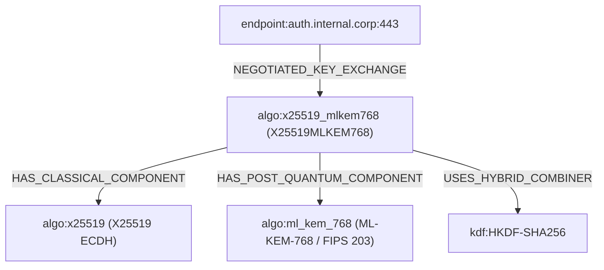

# ECDAT Phase 5.3: TLS / PQC / Hybrid Analysis

## Overview

The TLS / PQC / Hybrid Analysis engine models classical, post-quantum (PQC), and hybrid handshakes as explicit, first-class entities within ECDAT. It ensures strict adherence to cryptographic realities, enforces non-negotiable security invariants, differentiates evidence origins, and maintains a versioned algorithm catalog for long-term standards agility.

---

## Core Invariants & Cryptographic Principles

### 1. Packet Capture Plaintext Non-Disclosure Invariant
> **Cryptographic Reality:** Passive packet capture alone CANNOT reveal application plaintext for sessions utilizing forward-secret (PFS) or hybrid ephemeral key exchange (e.g., ECDHE, `X25519MLKEM768`, `SecP256r1MLKEM768`).
> Compromise of the long-term private signing or identity key does not permit retroactive decryption of ephemeral sessions without per-session ephemeral pre-master secret key logs (such as `SSLKEYLOGFILE`).

- **Enforcement:**
  - `TlsHandshakeProperties.packet_capture_can_reveal_plaintext` is strictly boolean `False`.
  - Attempts to instantiate handshake properties with `packet_capture_can_reveal_plaintext = True` immediately trigger a `PlaintextExposureError`.
  - The security guard `assert_no_pcap_plaintext_claim(finding)` scans finding outputs and disallows false claims such as *"packet capture reveals plaintext"*, *"pcap decrypts traffic"*, or *"plaintext exposed in packet capture"*.

---

## Evidence Source Differentiation

To prevent confusing static configuration intent with active network negotiation or process execution, observations are explicitly typed into one of three distinct sources:

| Evidence Source | Enumeration Value | Description | Example |
| :--- | :--- | :--- | :--- |
| **Static Configuration** | `STATIC_CONFIGURATION` | Discovered in configuration files, web server directives, or environment settings. | `ssl_ecdh_curve X25519MLKEM768:prime256v1` in `nginx.conf` |
| **Network Handshake** | `NETWORK_HANDSHAKE` | Actively negotiated across the network wire during TLS / SSH protocol negotiation. | Observed `KeyShare` extension with group `0x11ec` |
| **Runtime** | `RUNTIME` | Confirmed from running process memory, dynamic library hooks, or process execution tracing. | OpenSSL 3.5 process memory confirming active session context |

---

## First-Class Hybrid Relationships

Hybrid mechanisms are not treated as opaque algorithm strings. They are decomposed into first-class composite graph structures:

### Relationship Types
- `NEGOTIATED_KEY_EXCHANGE`: Binds an endpoint asset to the negotiated key exchange mechanism.
- `HAS_CLASSICAL_COMPONENT`: Links the composite hybrid algorithm to its classical component (e.g. `X25519`, `P-256`).
- `HAS_POST_QUANTUM_COMPONENT`: Links the composite hybrid algorithm to its PQC component (e.g. `ML-KEM-768`, `sntrup761`).
- `USES_HYBRID_COMBINER`: Links the composite hybrid algorithm to its key combination KDF (e.g. `HKDF-SHA256`).
- `AUTHENTICATED_BY_SIGNATURE`: Explicitly separates authentication signature algorithms from key exchange.

---

## Versioned PQC Algorithm Catalog (`rules/pqc_algorithm_catalog.json`)

To prevent hardcoded logic and avoid code rewrites when IETF/NIST finalize or revise PQC drafts, all algorithm definitions are externalized in a versioned declarative registry validated against JSON Schema:

- **Catalog Schema**: `rules/schemas/pqc_algorithm_catalog.schema.json`
- **Catalog Registry**: `rules/pqc_algorithm_catalog.json` (Catalog Version 1.0.0)
- **Supported Hybrid Groups**:
  - `X25519MLKEM768` (IANA Group ID `0x11ec` / 4588)
  - `SecP256r1MLKEM768` (IANA Group ID `0x11ed` / 4589)
  - `X25519Kyber768Draft00` (IANA Group ID `0x6399` / 25497)
  - `X25519MLKEM1024` (IANA Group ID `0x11ee` / 4590)
  - `SecP384r1MLKEM1024` (IANA Group ID `0x11ef` / 4591)
- **Supported SSH Hybrid KEX**:
  - `sntrup761x25519-sha512@openssh.com`
  - `mlkem768x25519-sha512@openssh.com`
- **Pure PQC Standards**:
  - NIST FIPS 203: `ML-KEM-512`, `ML-KEM-768`, `ML-KEM-1024`
  - NIST FIPS 204: `ML-DSA-44`, `ML-DSA-65`, `ML-DSA-87`
  - NIST FIPS 205: `SLH-DSA-SHA2-128s`, `SLH-DSA-SHAKE-256f`
