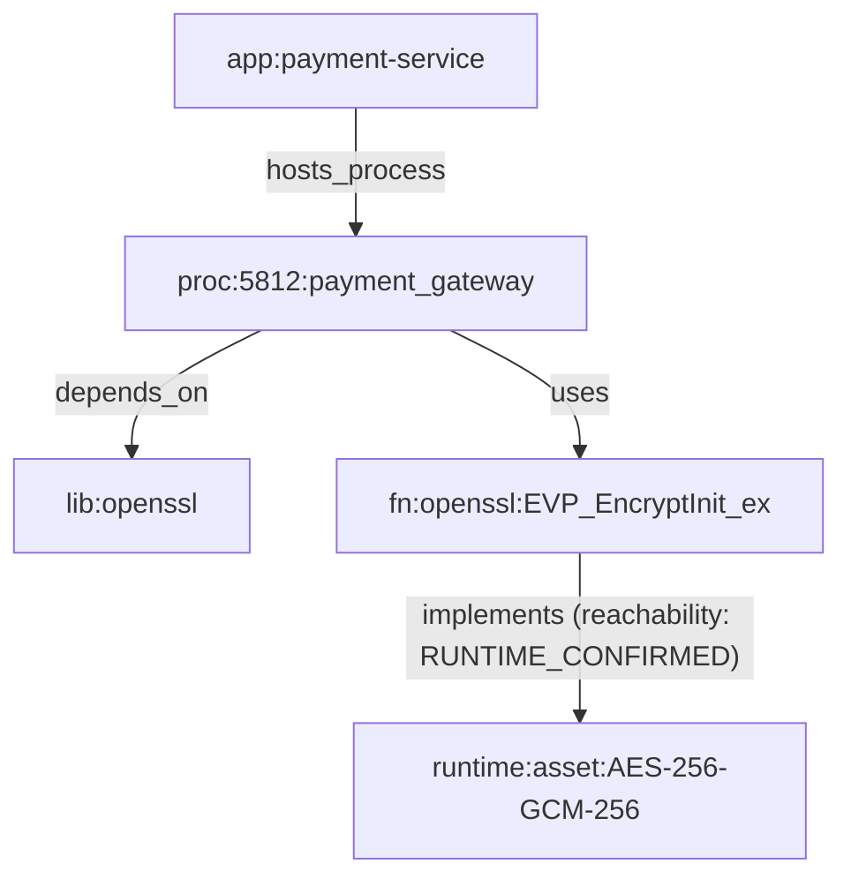
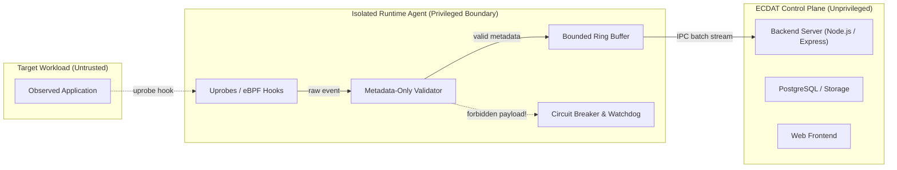

# ECDAT Phase 6.1: Runtime & eBPF Discovery Architecture

## 1. Overview

The ECDAT Runtime & eBPF Discovery Subsystem provides real-time, non-invasive observation of cryptographic operations across running processes and containers. Operating optionally, it hooks cryptographic entrypoints via user-space probes (uprobes) and library wrappers, tracing operations through the full causal chain:

$$\text{Process} \longrightarrow \text{Library / Function} \longrightarrow \text{Crypto Operation} \longrightarrow \text{Parameters} \longrightarrow \text{Application / Service} \longrightarrow \text{Crypto Asset}$$

---

## 2. Core Architectural Guarantees & Invariants

### A. Optional Subsystem & Graceful Degradation
Runtime tracing requires specialized host privileges (eBPF capabilities, root user / `CAP_BPF` / `CAP_SYS_ADMIN`, and the Linux BPF virtual filesystem). When running in constrained environments (containers without elevated capabilities, non-Linux OS such as Windows/macOS, or when disabled by policy configuration), the subsystem **gracefully degrades** without halting application execution or causing pipeline crashes:
- Status reports explicit degradation state:
  - `DISABLED_BY_CONFIG`: Runtime discovery intentionally turned off in configuration.
  - `UNAVAILABLE_NON_LINUX`: Host OS does not support Linux eBPF kernel uprobes.
  - `UNAVAILABLE_NO_ROOT_OR_CAP_BPF`: Process lacks required tracing capabilities.
  - `UNAVAILABLE_NO_EBPF_SUPPORT`: Kernel does not mount `/sys/fs/bpf`.

### B. Strict Metadata-Only Invariant
Under no circumstances does ECDAT capture, buffer, or record sensitive payload material:
- **Strictly Prohibited**:
  - Private keys (asymmetric private keys, PEM blocks, DER buffers)
  - Plaintext data (application payloads, decrypted buffers)
  - Passwords and passphrases
  - Authentication tokens, API keys, session secrets
  - Arbitrary payload buffers
- **Permitted Operational Metadata Only**:
  - Process ID, process name, container ID
  - Cryptographic library name and version
  - Hooked function symbol (e.g., `EVP_EncryptInit_ex`, `SSL_do_handshake`)
  - Operation type (e.g., `symmetric_encryption_init`, `tls_handshake`)
  - Algorithm name (e.g., `AES-256-GCM`, `ML-KEM-768`)
  - Key size / parameter set (e.g., `256`, `384`)
  - Cipher mode, curve name, TLS version, cipher suite identifier
  - Timestamp and execution duration
- **Enforcement Mechanism**:
  - Validated by [assert_metadata_only()](file:///c:/Users/Jeevan%20c/Documents/ECDAT/scanners/runtime/engine.py#L65) and [assertMetadataOnly()](file:///c:/Users/Jeevan%20c/Documents/ECDAT/backend/src/domain/runtime_discovery.js#L55).
  - Triggers immediate `SensitiveDataExposureError` if forbidden field names or key content patterns are detected.

---

## 3. Probe Catalog (`rules/runtime_probes_catalog.json`)

Instrumentation targets are declaratively cataloged across major cryptographic libraries:

| Library | Function Hook | Operation | Captured Metadata |
| :--- | :--- | :--- | :--- |
| **OpenSSL** | `EVP_EncryptInit_ex` | `symmetric_encryption_init` | `cipher_name`, `key_length`, `mode` |
| **OpenSSL** | `EVP_DigestInit_ex` | `hash_init` | `digest_name` |
| **OpenSSL** | `SSL_do_handshake` | `tls_handshake` | `tls_version`, `cipher_suite`, `kex_group` |
| **BoringSSL** | `SSL_do_handshake` | `tls_handshake` | `tls_version`, `cipher_suite`, `kex_group` |
| **LibreSSL** | `tls_handshake` | `tls_handshake` | `tls_version`, `cipher_suite` |
| **mbedTLS** | `mbedtls_ssl_handshake` | `tls_handshake` | `tls_version`, `ciphersuite_id` |
| **wolfSSL** | `wolfSSL_negotiate` | `tls_handshake` | `tls_version`, `cipher_suite` |

---

## 4. First-Class Domain Correlation Graph

Live observations produce structured domain relationships:

---

## 5. CycloneDX 1.6 CBOM Mapping

Runtime observations map to CycloneDX 1.6 CBOM via `runtime_event_to_cbom()`:
- `application` component for container and process root.
- `library` component for cryptographic engine.
- `cryptographic-asset` component with `ecdat:reachabilityLevel = "RUNTIME_CONFIRMED"` and `ecdat:evidenceSource = "runtime"`.

---

## 6. eBPF Security Boundary & Component Privileges (Phase 6.2)

### A. Dedicated Runtime Agent vs Control Plane Isolation
> **Core Architectural Rule:** The entire ECDAT server (Node.js API, database, SCA, static scanners) **NEVER** runs with eBPF privileges.

### B. Component Privilege Specifications
The following table documents exactly which component requires elevated privileges and why:

| Component | Privilege Level | Specific Linux Capabilities | Technical Rationale |
| :--- | :--- | :--- | :--- |
| **ECDAT Backend / Control Plane** | **Unprivileged** (`node` / `appuser`) | None | Web API, reporting, risk analysis, and CBOM storage do NOT need kernel access. Running the control plane unprivileged prevents arbitrary code execution vulnerabilities from gaining kernel capabilities. |
| **Dedicated Runtime Agent (`RuntimeSecurityAgent`)** | **Minimized Privileged** | `CAP_BPF`, `CAP_PERFMON` (Kernel $\ge 5.8$) | Required strictly to load BPF uprobe programs and attach to user-space tracepoints. **Full `CAP_SYS_ADMIN` is explicitly prohibited and unneeded.** |
| **Observed Application / Service** | **Unchanged** | Unchanged | Target applications are monitored without modifying their privileges or injecting rogue code. |

### C. Acceptance Invariant: Compromised Observed Application Isolation
- **Threat Model**: An observed application is compromised by an adversary attempting to attack the ECDAT monitoring infrastructure (e.g. sending malicious payloads or leaking secrets).
- **Defense Mechanism**:
  1. The runtime agent processes metadata only.
  2. If the observed application attempts to emit raw private keys, passwords, or oversized payloads, the agent's input validation immediately catches the violation.
  3. The **circuit breaker trips instantly**, detaching all active uprobes and isolating the agent.
  4. The ECDAT control plane remains unprivileged and unaffected.
