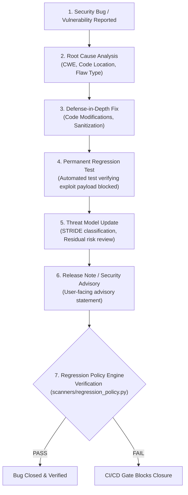

# ECDAT Security Regression & Bug Closure Policy (Phase 22.4)

## 1. Executive Mandate

> [!IMPORTANT]
> **Zero Unverified Closures**: Every previously fixed security vulnerability gets a permanent automated regression test.
> 
> **Never close a security bug without:**
> 1. **Root cause**
> 2. **Fix**
> 3. **Test**
> 4. **Threat model update**
> 5. **Release note if applicable**

No security issue, vulnerability report, or CVE remediation may be marked resolved or merged into release branches without strict verification against these five mandatory elements.

---

## 2. The 5-Point Security Bug Closure Standard

Every security bug closure must be recorded in [`rules/security_regressions.json`](file:///c:/Users/Jeevan%20c/Documents/ECDAT/rules/security_regressions.json) adhering to [`rules/schemas/security_regression.schema.json`](file:///c:/Users/Jeevan%20c/Documents/ECDAT/rules/schemas/security_regression.schema.json).



### 2.1 Root Cause (`root_cause`)
- **Technical Summary**: Detailed technical analysis of the underlying vulnerability (why the bug existed, what assumption failed).
- **CWE Identifier**: Standard Common Weakness Enumeration classification (e.g., `CWE-611`, `CWE-209`, `CWE-1321`, `CWE-1333`).
- **Flaw Type**: Category of flaw (e.g., XML External Entity Reference, Memory Exhaustion, Cleartext Secret Storage).
- **Vulnerable Code Location**: Precise file path, function, or line where the vulnerability originated.

### 2.2 Fix Implementation (`fix`)
- **Fix Summary**: Concrete explanation of how the bug was remediated.
- **Mitigation Strategy**: Architectural defense-in-depth approach (e.g., pre-parse input sanitization, token redaction, bounded recursion).
- **Modified Files**: Complete list of all source files updated as part of the remediation.

### 2.3 Permanent Regression Test (`test`)
- **Physical Test File**: Absolute or repo-relative path to the permanent automated test file (e.g., [`tests/test_security_regressions.py`](file:///c:/Users/Jeevan%20c/Documents/ECDAT/tests/test_security_regressions.py)).
- **Test Function Name**: Specific test function executing the regression verification. The policy engine verifies that this function physically exists within the target file.
- **Assertion Type**: What the test asserts (e.g., `rejects_xml_bomb_without_uncontrolled_recursion_or_memory_blowup`, `asserts_canary_tokens_never_present_in_error_message`).
- **Automated**: Strictly `true`. Manual or non-automated tests do not qualify for security bug closure.

### 2.4 Threat Model Update (`threat_model_update`)
- **STRIDE Classification**: Minimum one STRIDE category (`Spoofing`, `Tampering`, `Repudiation`, `Information Disclosure`, `Denial of Service`, `Elevation of Privilege`).
- **Threat Model Section**: Reference to the affected trust boundary or mitigation section in [`docs/THREAT_MODEL.md`](file:///c:/Users/Jeevan%20c/Documents/ECDAT/docs/THREAT_MODEL.md).
- **Residual Risk Impact**: Explicit documentation of how the fix alters the system's residual risk profile.
- **Threat Model Doc Updated**: Flag confirming [`docs/THREAT_MODEL.md`](file:///c:/Users/Jeevan%20c/Documents/ECDAT/docs/THREAT_MODEL.md) was updated.

### 2.5 Release Note / Security Advisory (`release_note`)
- **Applicable**: Boolean indicating whether this fix affects public-facing APIs, CLI users, or deployment configurations.
- **Advisory Summary**: Clear, professional security advisory describing the vulnerability and fix without exposing sensitive exploit code.
- **Version Fixed**: Target release version or phase (e.g., `Phase 22.2`, `v1.1.0`).

---

## 3. Automated Enforcement Engine

The regression policy is automated and enforced by [`scanners/regression_policy.py`](file:///c:/Users/Jeevan%20c/Documents/ECDAT/scanners/regression_policy.py).

### Verification CLI
```bash
python scanners/regression_policy.py
```

### Programmatic Integration
```python
from scanners.regression_policy import SecurityRegressionPolicyEngine

engine = SecurityRegressionPolicyEngine()
verdict = engine.enforce_policy()
if not verdict.passed:
    raise SystemExit(f"Security regression policy failed: {verdict.summary}")
```

The engine verifies:
1. Complete schema compliance of [`rules/security_regressions.json`](file:///c:/Users/Jeevan%20c/Documents/ECDAT/rules/security_regressions.json).
2. Presence and validity of all 5 mandatory sections for every registered bug.
3. Physical existence of every referenced test file and test function on disk.

---

## 4. Current Regression Registry Index

| ID | Title | Severity | CWE | Primary Test Function | Status |
|---|---|:---:|:---:|---|:---:|
| **SEC-REG-001** | Billion Laughs XML Bomb & XXE Entity Resolution in CBOM Parser | Critical | CWE-611 | `test_regression_sec_reg_001_xml_bomb_rejection` | Verified |
| **SEC-REG-002** | Raw Canary Secrets and Private Keys Echoed in Crash Diagnostics | Critical | CWE-209 | `test_regression_sec_reg_002_canary_secret_sanitization` | Verified |
| **SEC-REG-003** | Prototype Pollution via Malicious CBOM & Policy JSON Payloads | High | CWE-1321 | `test_regression_sec_reg_003_prototype_pollution_blocked` | Verified |
| **SEC-REG-004** | Catastrophic ReDoS Backtracking in Cryptographic Regex Matcher | High | CWE-1333 | `test_regression_sec_reg_004_redos_line_bounded` | Verified |
| **SEC-REG-005** | Uncontrolled Recursion and Memory Exhaustion in Network PCAP Parser | High | CWE-674 | `test_regression_sec_reg_005_pcap_deep_recursion_bounded` | Verified |
| **SEC-REG-006** | Private Key Ingestion in Certificate Parser | Critical | CWE-312 | `test_regression_sec_reg_006_cert_parser_private_key_rejection` | Verified |
| **SEC-REG-007** | Path Traversal & Zip Slip in Archive Decompression | Critical | CWE-22 | `test_regression_sec_reg_007_zip_slip_path_traversal_blocked` | Verified |
| **SEC-REG-008** | Cross-Tenant Cryptographic Asset Access & Isolation Leakage | High | CWE-639 | `test_regression_sec_reg_008_cross_tenant_idor_blocked` | Verified |
| **SEC-REG-009** | Policy Engine Schema Error Message Secret Leakage | Medium | CWE-209 | `test_regression_sec_reg_009_policy_validation_error_redaction` | Verified |
| **SEC-REG-010** | JWT Algorithm Confusion & 'none' Algorithm Bypass | Critical | CWE-327 | `test_regression_sec_reg_010_jwt_algorithm_pinning_and_none_rejection` | Verified |
