# ECDAT Technical Drill-Down Reporting & Cryptographic Forensics (Phase 26.2)

## 1. Executive Summary & Objective

Phase 26.2 mandates **developer- and auditor-grade technical drill-down reports** for every cryptographic asset and vulnerability identified across the enterprise.

While executive reports (Phase 26.1) provide high-level aggregations, risk curves, and Mosca calculus, **technical drill-down reports provide immutable, reproducible, code-level forensics**. Every finding item strictly encapsulates all **12 required technical dimensions**, leaving zero room for ambiguity or missing context:

1. **Exact Source Location**
2. **Scanner & Modality**
3. **Confidence & Verification**
4. **Cryptographic Evidence**
5. **Algorithm Identity & Lifecycle**
6. **Parameters & Key Specifications**
7. **Software Dependency & PURL**
8. **Certificate Metadata & Validation**
9. **Network Endpoint & TLS Configuration**
10. **Runtime Kernel / eBPF Evidence**
11. **Risk Calculus & Blast Radius**
12. **Remediation & Syntactic Patch Diff**

```mermaid
graph TD
    FINDING[ECDAT Discovered Finding]

    FINDING --> D1["1. Exact Source Location<br/>(file_path, line, col, func, git_ref)"]
    FINDING --> D2["2. Scanner<br/>(scanner_id, modality, version)"]
    FINDING --> D3["3. Confidence<br/>(score, level, verification_method)"]
    FINDING --> D4["4. Evidence<br/>(raw_snippet, sha256_hash, redaction)"]
    FINDING --> D5["5. Algorithm<br/>(name, family, OID, standard, status)"]
    FINDING --> D6["6. Parameters<br/>(key_size, block_size, mode, padding, curve)"]
    FINDING --> D7["7. Dependency<br/>(package, version, ecosystem, purl)"]
    FINDING --> D8["8. Certificate<br/>(subject_dn, serial, fingerprint, validity)"]
    FINDING --> D9["9. Network Endpoint<br/>(host, port, TLS version, cipher_suite)"]
    FINDING --> D10["10. Runtime Evidence<br/>(PID, process_name, uprobe, frequency)"]
    FINDING --> D11["11. Risk<br/>(severity, risk_score, CWE, blast_radius)"]
    FINDING --> D12["12. Remediation<br/>(target_pqc, unified_patch_diff, rollout)"]

    D1 & D2 & D3 & D4 & D5 & D6 & D7 & D8 & D9 & D10 & D11 & D12 --> REPORT[12-Dimension Technical Report JSON / HTML]
```



---

## 2. Specification of the 12 Technical Dimensions

### Dimension 1: Exact Source Location (`exact_source_location`)
Identifies the exact origin of the cryptographic call within source code repositories:
- `file_path`: Canonical workspace-relative path (e.g. `services/auth/token_signer.go`).
- `line_number`: 1-based source code line number.
- `column_number`: Column index of the cryptographic invocation or configuration.
- `function_scope`: Enclosing method, function, or class symbol (e.g. `GenerateTokenSigningKey`).
- `repository_url`: Canonical Git repository remote URL.
- `git_ref`: Immutable commit SHA or pinned tag (e.g. `main@c3b4a5d`).

### Dimension 2: Scanner (`scanner`)
Provides provenance on the discovery mechanism:
- `scanner_id`: Identifies the detection engine (`static_tree_sitter_ast`, `ebpf_runtime_tracer`, `network_tls_prober`).
- `scanner_version`: Semantic engine version (e.g. `1.0.0`).
- `modality`: Categorized ingestion modality:
  - `STATIC_AST_PARSER`: Tree-sitter semantic Abstract Syntax Tree traversal.
  - `RUNTIME_KERNEL_UPROBE`: eBPF uprobe attached to OpenSSL/BoringSSL userspace symbols.
  - `NETWORK_SOCKET_PROBE`: Dynamic TLS handshake and certificate chain inspection.

### Dimension 3: Confidence (`confidence`)
Quantifies detection fidelity and empirical certainty:
- `confidence_level`: Categorical rating (`HIGH`, `MEDIUM`, `LOW`).
- `confidence_score`: Normalized numerical confidence between `0.00` and `1.00` (e.g. `0.98`).
- `validation_method`: Formal verification methodology (e.g. `TREE_SITTER_AST_SYNTAX_CONFIRMED`, `DYNAMIC_KERNEL_UPROBE_VERIFIED`, `SOCKET_HANDSHAKE_CERT_CHAIN_VERIFIED`).

### Dimension 4: Evidence (`evidence`)
Cryptographic proof of existence:
- `raw_evidence`: Sanitized code snippet or raw AST invocation showing the algorithm usage.
- `evidence_context`: Surrounding semantic context (e.g. variable assignments, function calls).
- `sha256_hash`: Immutable SHA-256 cryptographic digest of the evidence snippet, guaranteeing data integrity.
- `redaction_verified`: Boolean confirming automated zero-secrets redaction has been enforced.

### Dimension 5: Algorithm (`algorithm`)
Cryptographic taxonomy and standardization status:
- `name`: Canonical algorithm identifier (e.g. `RSA-1024`, `MD5`, `AES-256-GCM`, `ML-KEM-768`).
- `family`: Mathematical family (`Asymmetric Signature & Key Exchange`, `Cryptographic Hash`, `Symmetric Cipher`, `Post-Quantum KEM`).
- `oid`: Official ITU-T / ISO Object Identifier (e.g. `1.2.840.113549.1.1.1` for RSA).
- `standard_reference`: Authoritative standards document (e.g. `NIST FIPS 186-5`, `IETF RFC 1321`, `NIST FIPS 203`).
- `lifecycle_status`: Current regulatory status:
  - `BROKEN_OR_DISALLOWED`
  - `DEPRECATED`
  - `QUANTUM_VULNERABLE`
  - `QUANTUM_SAFE`

### Dimension 6: Parameters (`parameters`)
Operational cryptographic configuration:
- `key_size_bits`: Effective key length in bits (e.g. `1024`, `2048`, `256`).
- `block_size_bits`: Cipher block size (e.g. `128` for AES, `64` for 3DES).
- `mode_of_operation`: Block cipher mode (e.g. `GCM`, `CBC`, `CTR`).
- `padding_scheme`: Asymmetric or symmetric padding (e.g. `PKCS#1 v1.5`, `OAEP`, `PSS`).
- `elliptic_curve`: Designated curve identifier (`secp256r1`, `x25519`, `ed25519`).
- `iv_length_bytes`: Initialization vector length (e.g. `12` bytes for GCM).

### Dimension 7: Dependency (`dependency`)
Supply chain and bill-of-materials traceability:
- `package_name`: Software package delivering the primitive (e.g. `crypto/rsa`, `cryptography`, `openssl`).
- `package_version`: Installed semantic version (e.g. `3.0.13`).
- `ecosystem`: Package registry ecosystem (`go_stdlib`, `pypi`, `npm`, `system_library`).
- `direct_or_transitive`: Dependency graph classification (`direct` vs `transitive`).
- `purl`: Canonical Package URL (e.g. `pkg:golang/crypto/rsa`, `pkg:deb/debian/openssl@3.0.13`).

### Dimension 8: Certificate (`certificate`)
X.509 Public Key Infrastructure state:
- `is_certificate_asset`: Boolean indicating certificate asset status.
- `subject_dn`: Distinguished Name of the subject (e.g. `CN=api.ecdat.corp, O=Enterprise Financial`).
- `issuer_dn`: Distinguished Name of issuing CA (e.g. `CN=Let's Encrypt Authority X3`).
- `serial_number`: Hex-encoded certificate serial number.
- `fingerprint_sha256`: 64-character SHA-256 certificate fingerprint.
- `valid_from` & `valid_to`: ISO-8601 validity timeframe.
- `days_remaining`: Integer countdown to certificate expiration.
- `is_self_signed`: Boolean warning flag.
- `san_domains`: Array of Subject Alternative Names.

### Dimension 9: Network Endpoint (`network_endpoint`)
Transport-layer exposure:
- `hostname`: Fully qualified domain name (`api.ecdat.corp`).
- `ip_address`: Target IPv4/IPv6 address.
- `port`: Destination TCP port (`443`).
- `protocol`: Transport protocol (`https`, `tls`, `grpc`).
- `tls_version`: Negotiated protocol version (`TLS 1.2`, `TLS 1.3`).
- `cipher_suite`: IANA cipher suite identifier (`TLS_ECDHE_RSA_WITH_AES_128_GCM_SHA256`).
- `alpn_protocols`: Supported Application-Layer Protocol Negotiation values (`h2`, `http/1.1`).

### Dimension 10: Runtime Evidence (`runtime_evidence`)
Dynamic kernel and process observations:
- `is_runtime_observed`: Boolean indicating live process execution.
- `process_id`: Host OS process identifier (PID).
- `process_name`: Executable binary name (`payment_auth_service`).
- `user_id`: Executing system UID.
- `container_id`: OCI / Containerd runtime container URI.
- `kernel_probe`: Active eBPF probe target (e.g. `uprobe:/usr/lib/x86_64-linux-gnu/libcrypto.so.3:EVP_EncryptInit_ex`).
- `timestamp`: ISO-8601 observation event timestamp.
- `observation_frequency_per_min`: Operational invocation count per minute.

### Dimension 11: Risk (`risk`)
Composite risk assessment:
- `severity`: Normalized tier (`CRITICAL`, `HIGH`, `MEDIUM`, `LOW`).
- `risk_score`: 0–100 composite risk rating.
- `cwe_id` & `cwe_name`: Formal CWE taxonomy mapping (e.g. `CWE-327: Use of a Broken or Risky Cryptographic Algorithm`, `CWE-328: Use of Weak Hash`).
- `quantum_vulnerable`: Boolean indicating vulnerability to quantum polynomial-time factoring or discrete logarithm attacks (Shor's Algorithm).
- `mosca_status`: Status according to Mosca's Theorem (`AT_RISK` vs `SAFE`).
- `mosca_margin_years`: Numerical delta $\Delta M$ before quantum collapse.
- `regulatory_violations`: Array of non-compliance references (e.g. `NIST SP 800-131A Rev 2`, `PCI-DSS v4.0 Requirement 12.3.3`).
- `blast_radius`: Structured impact radius covering affected applications, exposed endpoints, and data sensitivity.

### Dimension 12: Remediation (`remediation`)
Actionable developer instructions and code fixes:
- `recommended_action`: High-level operational directive (e.g. `MIGRATE_TO_POST_QUANTUM_KEM`, `UPGRADE_TO_SHA256_OR_SHA3`).
- `target_algorithm`: Recommended cryptographic replacement (e.g. `ML-KEM-768 / RSA-3072`).
- `target_nist_standard`: Authoritative target specification (e.g. `NIST FIPS 203 (ML-KEM)`).
- `patch_diff`: Unified format Git patch diff ready for automated application (`git apply`).
- `staged_rollout`: Three-phase deployment strategy (Dual-verification $\rightarrow$ Telemetry warning $\rightarrow$ Strict disallowance).
- `rollback_plan`: Verified rollback procedure with configuration flags.
- `effort_estimate`: Development effort sizing (e.g. `medium (1-2 sprints)`).

---

## 3. REST API Interface

All endpoints are mounted under `/api/v1/reports` and protected by authentication (`X-API-Key` or Bearer JWT).

| Method | Endpoint | Query Parameters | Description |
| :--- | :--- | :--- | :--- |
| `GET` | `/api/v1/reports/technical` | `scanId`, `severity`, `algorithm`, `limit`, `offset` | Returns paginated JSON drill-down findings with all 12 dimensions. |
| `GET` | `/api/v1/reports/technical/:findingId` | `scanId` | Returns the complete 12-dimension technical object for a single finding. |
| `GET` | `/api/v1/reports/technical/html` | `scanId`, `severity`, `algorithm`, `limit` | Serves an interactive standalone dark-mode HTML report with code diffs. |

### Sample Response: `GET /api/v1/reports/technical/find_rsa_1024_auth`
```json
{
  "finding_id": "find_rsa_1024_auth",
  "exact_source_location": {
    "file_path": "services/auth/token_signer.go",
    "line_number": 42,
    "column_number": 14,
    "function_scope": "GenerateTokenSigningKey",
    "repository_url": "git@github.com:ecdat-corp/core-banking.git",
    "git_ref": "main@c3b4a5d"
  },
  "scanner": {
    "scanner_id": "static_tree_sitter_ast",
    "scanner_version": "1.0.0",
    "modality": "STATIC_AST_PARSER"
  },
  "confidence": {
    "confidence_level": "HIGH",
    "confidence_score": 0.98,
    "validation_method": "TREE_SITTER_AST_SYNTAX_CONFIRMED"
  },
  "evidence": {
    "raw_evidence": "rsa.GenerateKey(rand.Reader, 1024)",
    "evidence_context": "AST node context: rsa.GenerateKey(rand.Reader, 1024)",
    "sha256_hash": "e3b0c44298fc1c149afbf4c8996fb92427ae41e4649b934ca495991b7852b855",
    "redaction_verified": true
  },
  "algorithm": {
    "name": "RSA-1024",
    "family": "Asymmetric Signature & Key Exchange",
    "oid": "1.2.840.113549.1.1.1",
    "standard_reference": "NIST FIPS 186-5",
    "lifecycle_status": "BROKEN_OR_DISALLOWED"
  },
  "parameters": {
    "key_size_bits": 1024,
    "block_size_bits": null,
    "mode_of_operation": null,
    "padding_scheme": "PKCS#1 v1.5",
    "elliptic_curve": null,
    "iv_length_bytes": null
  },
  "dependency": {
    "package_name": "crypto/rsa",
    "package_version": "1.22.0",
    "ecosystem": "go_stdlib",
    "direct_or_transitive": "direct",
    "purl": "pkg:golang/crypto/rsa"
  },
  "certificate": {
    "is_certificate_asset": true,
    "subject_dn": "CN=api.ecdat.corp, O=Enterprise Financial",
    "issuer_dn": "CN=Let's Encrypt Authority X3",
    "serial_number": "04:3A:8B:9C:1D:2E:3F",
    "fingerprint_sha256": "3a8b9c1d2e3f4a5b6c7d8e9f0a1b2c3d4e5f6a7b8c9d0e1f2a3b4c5d6e7f8a9b",
    "valid_from": "2026-01-01T00:00:00Z",
    "valid_to": "2026-10-15T00:00:00Z",
    "days_remaining": 28,
    "is_self_signed": false,
    "san_domains": ["api.ecdat.corp", "auth.ecdat.corp"]
  },
  "network_endpoint": {
    "hostname": "api.ecdat.corp",
    "ip_address": "198.51.100.24",
    "port": 443,
    "protocol": "https",
    "tls_version": "TLS 1.2",
    "cipher_suite": "TLS_ECDHE_RSA_WITH_AES_128_GCM_SHA256",
    "alpn_protocols": ["h2", "http/1.1"]
  },
  "runtime_evidence": {
    "is_runtime_observed": true,
    "process_id": 18492,
    "process_name": "payment_auth_service",
    "user_id": 10001,
    "container_id": "containerd://89a1b2c3d4e5f6a7b8c9d0e1f2a3b4c5d6e7f8a9",
    "kernel_probe": "uprobe:/usr/lib/x86_64-linux-gnu/libcrypto.so.3:EVP_EncryptInit_ex",
    "timestamp": "2026-09-17T01:30:15.120Z",
    "observation_frequency_per_min": 452
  },
  "risk": {
    "severity": "CRITICAL",
    "risk_score": 94.0,
    "cwe_id": "CWE-327",
    "cwe_name": "Use of a Broken or Risky Cryptographic Algorithm",
    "quantum_vulnerable": true,
    "mosca_status": "AT_RISK",
    "mosca_margin_years": -4.5,
    "regulatory_violations": [
      "NIST SP 800-131A Rev 2 Section 1.2 (Disallowed Key Size)",
      "PCI-DSS v4.0 Requirement 12.3.3 (Strong Cryptography Mandate)"
    ],
    "blast_radius": {
      "affected_applications": ["Customer Identity Portal", "Payment Gateway"],
      "exposed_endpoints_count": 2,
      "data_sensitivity": "auth_credentials"
    }
  },
  "remediation": {
    "recommended_action": "MIGRATE_TO_POST_QUANTUM_KEM",
    "target_algorithm": "ML-KEM-768 / RSA-3072",
    "target_nist_standard": "NIST FIPS 203 (ML-KEM)",
    "patch_diff": "--- a/services/auth/token_signer.go\n+++ b/services/auth/token_signer.go\n@@ -42,3 +42,3 @@\n-   rsa.GenerateKey(rand.Reader, 1024)\n+   rsa.GenerateKey(rand.Reader, 3072)\n",
    "staged_rollout": {
      "phase1": "Deploy dual-verification with transitional hybrid X25519+ML-KEM-768",
      "phase2": "Log telemetry warnings when legacy clients negotiate RSA-1024",
      "phase3": "Strictly disallow key generation below 3072 bits or non-PQC ciphers"
    },
    "rollback_plan": "Re-enable fallback parameter via dynamic configuration flag",
    "effort_estimate": "medium (1-2 sprints)"
  }
}
```

---

## 4. Completeness Validation Engine

The reporting subsystem includes a strict validator:
- `validateTechnicalReportCompleteness(report)` (JavaScript: `backend/src/services/technical_report_service.js`)
- `validate_completeness(report)` (Python: `scanners/reporting/technical_reporter.py`)

If any finding lacks any of the 12 required dimensions, or if crucial subfields (e.g., `file_path`, `line_number`, `sha256_hash`, `target_algorithm`, `patch_diff`) are missing, the validator returns a failure verdict with item-level violation details.

---

## 5. Automated CI/CD and Release Gate Integration

Technical reporting verification is integrated into the ECDAT Release Gate Pipeline (`scripts/release_gate.py` Gate 3: Critical Security Tests):
- `tests/test_technical_reporting.py` (14 Pytest assertions verifying CLI, JSON export, HTML formatting, and 12-dimension completeness).
- `backend/tests/reporting/technical_reports.test.js` (7 Node.js assertions testing the REST API, parameter validation, and HTML generation).

Release builds fail automatically if any technical report omits required dimensions or produces non-reproducible evidence.
