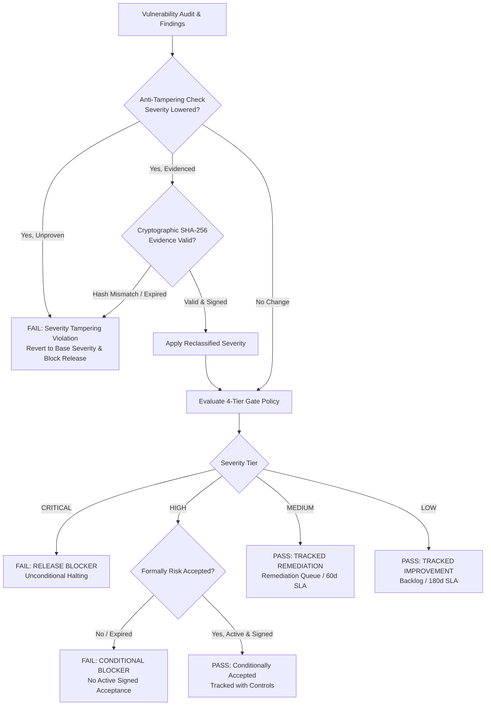

# ECDAT Vulnerability Release Gate Policy & Enforcement Standard (Phase 23.3)

## 1. Executive Overview

The **ECDAT Vulnerability Release Gate** enforces a deterministic four-tier vulnerability management and release gating standard. It guarantees that release candidates meet enterprise security baselines prior to deployment, while strictly prohibiting the obscuring or hiding of vulnerabilities through undocumented severity downgrades.



---

## 2. The 4-Tier Release Gating Standard

| Severity Tier | Release Action | Gating Mandate | Formal Risk Acceptance Allowed? | Default SLA | Tracking Destination |
|---|---|---|---|---|---|
| **CRITICAL** | `RELEASE_BLOCKER` | **Immediate Release Blocker**. Halts deployment unconditionally. Zero critical unmitigated vulnerabilities permitted in release bundles. | **No** (Strict blocker) | 0 Days | Emergency Incident Workflow |
| **HIGH** | `CONDITIONAL_BLOCKER` | **Release Blocker Unless Formally Risk Accepted**. Deployment halted unless an active, unexpired risk acceptance record signed by an authorized Security Architect is present. | **Yes** (Requires formal sign-off) | 14 Days | Security Exceptions Ledger (`rules/security_exceptions.json`) |
| **MEDIUM** | `TRACKED_REMEDIATION` | **Tracked Remediation**. Non-blocking at release. Automatically routed into remediation queue with tracking ID and SLA. | N/A (Non-blocking) | 60 Days | Remediation Queue (`REM-xxxxx`) |
| **LOW** | `TRACKED_IMPROVEMENT` | **Tracked Improvement**. Non-blocking. Logged in continuous improvement and engineering debt backlog. | N/A (Non-blocking) | 180 Days | Improvement Backlog (`IMP-xxxxx`) |

---

## 3. Anti-Tampering Mandate: Evidence-Based Severity Reclassification

> [!CAUTION]
> **Anti-Tampering Rule**: *Do not hide vulnerabilities by lowering severity without documented evidence.*  
> Arbitrarily downgrading vulnerability severities to bypass release gates is classified as a critical integrity violation (`SEVERITY_TAMPERING_VIOLATION`).

### Documented Evidence Requirements
Any severity reclassification from base upstream advisories (e.g., CVSS or OSV) MUST satisfy all 9 cryptographic and procedural evidence criteria:

1. **`finding_id` / `package`**: Advisory ID (e.g. `GHSA-82fw-gwwq-j7x9`) and package name.
2. **`base_severity`**: Original unadjusted severity from the upstream vulnerability catalog.
3. **`overridden_severity`**: The adjusted target severity.
4. **`evidence_type`**: Objective rationale category (e.g., `reachability_analysis`, `compensating_control_validation`, `environment_isolation_proof`).
5. **`evidence_document_uri`**: Persistent relative path to the signed technical proof document (e.g., `docs/security/evidence/vitest_reachability_evidence.md`).
6. **`evidence_sha256`**: Exact SHA-256 cryptographic digest of the evidence file. If the file is modified or altered, the gate aborts with an integrity failure.
7. **`justification`**: Technical explanation detailing why the vulnerability is not exploitable in production (minimum 30 characters).
8. **`approved_by`**: Identity and title of the reviewing Security Architect.
9. **`approved_at` & `expires_at`**: Formal approval timestamp and expiration deadline (must be in the future).

### Enforcement Engine Behavior
When an input scan finding claims a lower severity than its catalog baseline without satisfying all 9 criteria:
* The override is **rejected immediately**.
* The finding **reverts to its base severity**.
* A `SEVERITY_TAMPERING_VIOLATION` is logged.
* The release gate **fails with exit code 1**.

---

## 4. Formal Risk Acceptance Format

Formal risk acceptances for **HIGH** severity findings are registered in [`rules/security_exceptions.json`](rules/security_exceptions.json):

```json
{
  "advisory_id": "GHSA-wrjc-x8rr-h8h6",
  "package_name": "react-router",
  "ecosystem": "npm",
  "severity": "HIGH",
  "reason": "Open redirect bypass in backslash navigation. In ECDAT, all routes are statically configured Single Page Application paths; user input is never directed into external navigation.",
  "mitigation_summary": "Client-side route sanitize check in React router wrapper.",
  "approved_by": "ECDAT Security Architecture Team",
  "approved_at": "2026-09-15T00:00:00Z",
  "expires_at": "2027-12-31T23:59:59Z"
}
```

If `expires_at` is in the past, the acceptance is expired and the finding reverts to a **blocking** release failure.

---

## 5. Architectural Implementation

### Python Engine
* **Engine**: [`scanners/vulnerability_release_gate.py`](scanners/vulnerability_release_gate.py)
* **CLI Runner**:
  ```bash
  python -m scanners.vulnerability_release_gate --report artifacts/security/ecdat_vulnerability_report.json
  ```
* **Exit Codes**:
  * `0` = PASS (All blockers resolved, all HIGHs accepted, evidence verified)
  * `1` = RELEASE_BLOCKER / TAMPERING_VIOLATION
  * `2` = RUNNER_ERROR (Internal I/O or scanner execution failure)

### Node.js Backend Service
* **Service**: [`backend/src/security/vulnerability_release_gate.js`](backend/src/security/vulnerability_release_gate.js)
* **API Route**: `POST /api/v1/ci/vulnerability-release-gate` in [`backend/src/routes/ci.js`](backend/src/routes/ci.js)
* **Returns**: HTTP 200 on `PASS`, HTTP 422 on `FAIL` with full breakdown of blockers, accepted findings, tracked remediations, and tampering violations.

### CI/CD Supply-Chain Release Gate Integration
Integrated into Gate 1 of [`scripts/release_gate.py`](scripts/release_gate.py).

---

## 6. Verification & Test Coverage

| Test Suite | File | Tests | Result |
|---|---|---|---|
| **Python Pytest** | [`tests/test_vulnerability_release_gate.py`](tests/test_vulnerability_release_gate.py) | **10 / 10** | **PASS** (0.28s) |
| **Node.js Test** | [`backend/tests/security/vulnerability_release_gate.test.js`](backend/tests/security/vulnerability_release_gate.test.js) | **8 / 8** | **PASS** (84ms) |
| **Release Gate** | [`scripts/release_gate.py`](scripts/release_gate.py) | **All 6 Gates** | **PASS** (0 code) |
